[](https://classroom.github.com/a/tPVgLsdF)

| Name | NRP | Class |
| ---- | --- | ----- |
| Bintang Ilhan Pabeta  | 5025241152 | A |

## Task 1

- Flag

  `JARKOM25{Ja0G_Bbbb4ng3t_S1_0JTLU9EXAL2VN1PH1P3P72UXFWW1J80xl0vel1c9zu02f775hvfi6ze7dpbb6_b1c2ae37c40961eb49341a2debfa9795}`

  **Spoiler alert**
  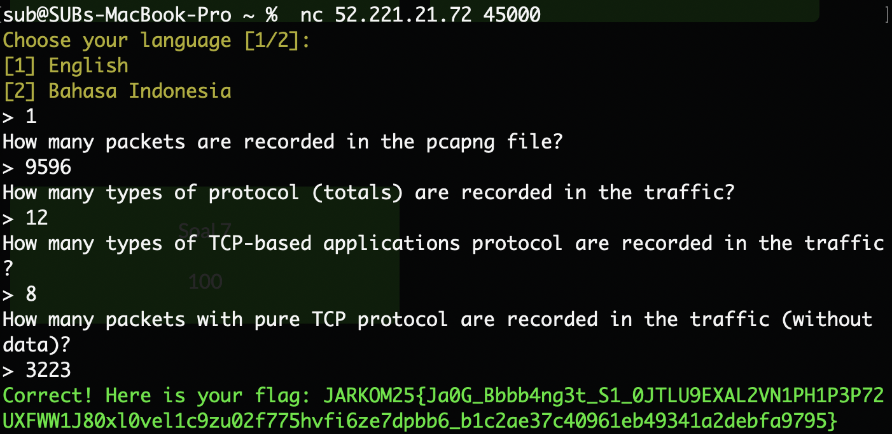

> a. Berapa banyak packet yang terekam pada file pcapng?

> _a. How many packets are recorded in the pcapng file?_

**Answer:** `9596`

- Filter expression

  `-` lihat menu Statistics -> Capture file properties

- Explanation
  <div align="justified"> 
    Pada kasus ini, kami diminta mencari jumlah packet yang ada. Sebenarnya bisa langsung di lihat di sisi bawah kanan interface wireshark. Tetapi, kejelasannya bisa di lihat di menu bagian Statistics -> Capture file properties.
  </div>

- Output result

    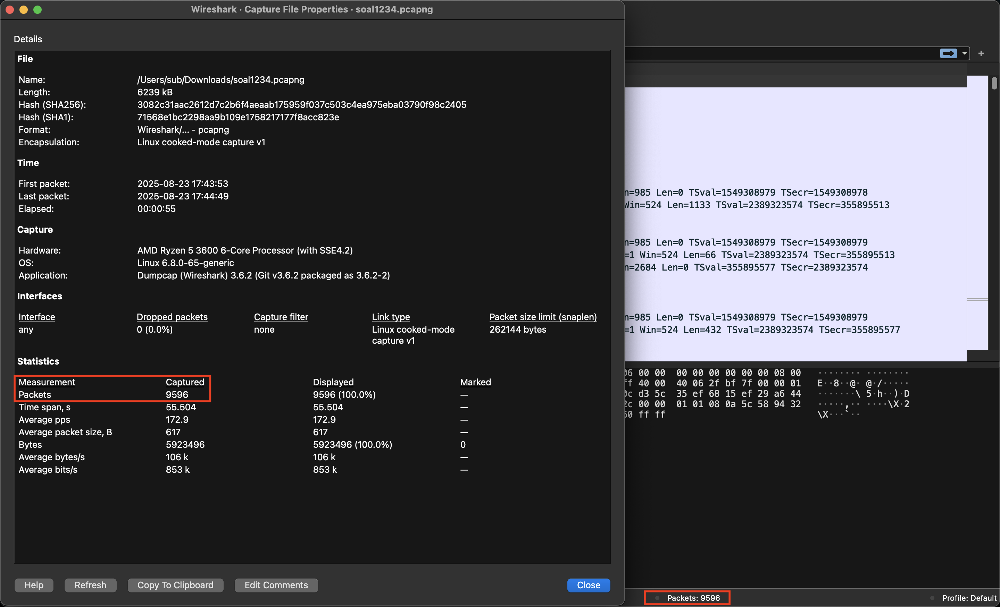

<br>
<br>

> b. Ada berapa jenis protocol (total) yang terekam pada traffic?

> _b. How many types of protocol (totals) are recorded in the traffic?_

**Answer:** `12`

- Filter expression

  `-` lihat menu Statistics -> Protocol hierarchy

- Explanation

  <div align="justified"> 
    Pada kasus ini, kami diminta mencari jumlah protocol secara total yang ada pada pcapng network capture soal1234. Cara yang bisa kita lakukan adalah dengan membuka bagian Statistics -> Protocol hierarchy dan menghitung jumlah protokol yang ada.
  </div>

- Output result

  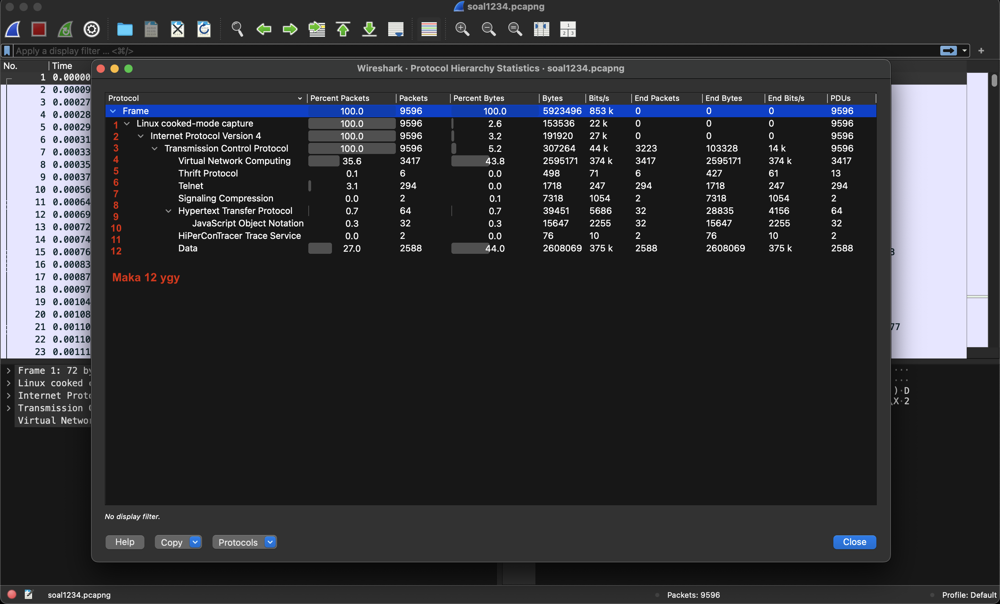

<br>
<br>

> c. Ada berapa jenis protocol berbasis TCP yang terekam pada traffic?

> _c. How many types of TCP-based applications protocol are recorded in the traffic?_

**Answer:** `8`

- Filter expression

  `-` lihat menu Statistics -> Protocol Hierarchy

- Explanation

  <div align="justified"> 
    Pada kasus ini, kami diminta mencari berapa jumlah protokol yang berbasis TCP. Maka dari itu, kita bisa lihat protokol-protokol di bawah naungan TCP pada menu Statistics -> Protocol hierarchy.
  </div>

- Output result

  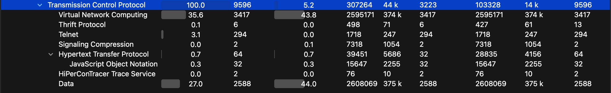

  <br>
  <br>

> d. Ada berapa banyak packet dengan protokol TCP murni yang terekam pada traffic (tanpa data)?

> _d. How many packets with pure TCP protocol are recorded in the traffic (without data)?_

**Answer:** `3223`

- Filter expression

  `-` lihat menu Statistics -> Protocol hierarchy

- Explanation

  <div align="justified"> 
    Pada kasus ini, kami diminta mencari mana saja packet yang <b>murni</b> protokol TCP, maka dari itu kita bisa lihat di Statistics -> Protocol Hierarchy dan lihat end packet pada TCP.
  </div>

- Output result

  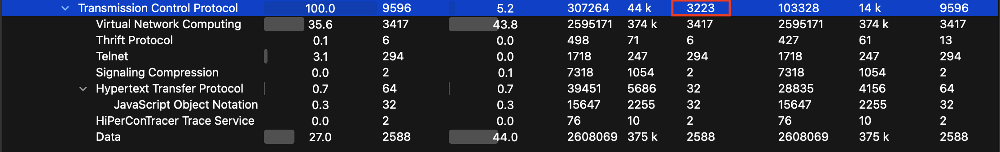

## Task 2

- Flag

  `JARKOM25{N1c3_0ne_b4nggg_UZIHJMCEYKyuMM13yzwsyodzsaqjswjxbtrwac3r4t0ps10520091784208592022_64743e9a1efb30d9854155354228c14d}`

  **Spoiler alert**
  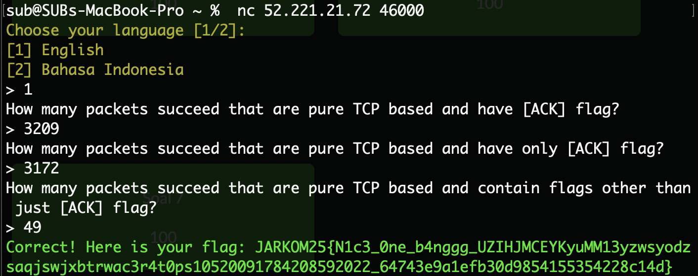

> a. Berapa banyak packet berhasil yang berbasis murni TCP dan memiliki flag [ACK]?

> _a. How many packets succeed that are pure TCP based and have [ACK] flag?_

**Answer:** `3209`

- Filter expression

  `tcp.flags.ack == 1` dan lihat end packet protokol TCP pada menu Protocol Hierarchy

- Explanation

  <div align="justified"> 
    Pada kasus ini, kami diminta mencari paket TCP murni yang memiliki flag ACK dan berhasil. Sehingga kita filter menggunakan flag ACK dan kita cari mana yang gagal dengan sort by info. Terakhir, kita lakukan pengurangan.
  </div>

- Output result

  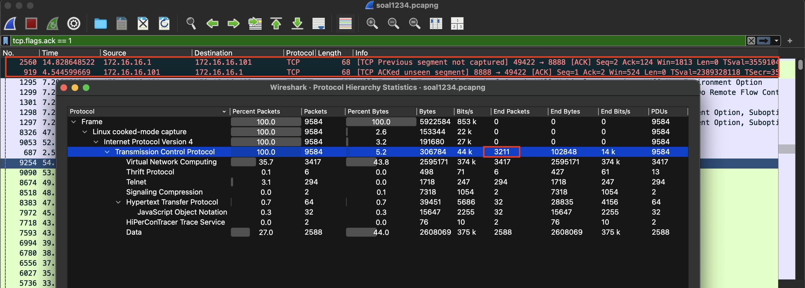
  Kita bisa lihat di sini terdapat 3211 paket TCP murni dan ada 2 yang gagal, maka kita lakukan pengurangan untuk mendapatkan 3209.

  <br>
  <br>

> b. Berapa banyak packet berhasil yang berbasis murni TCP yang hanya memiliki flag [ACK]?

> _b. How many packets succeed that are pure TCP based and have only [ACK] flag?_

**Answer:** `3172`

- Filter expression

  ```
  tcp.flags.ack == 1 && 
  tcp.flags.syn == 0 && 
  tcp.flags.reset == 0 && 
  tcp.flags.fin == 0 && 
  tcp.flags.push == 0
  ``` 
  Lihat jumlah end packet protokol TCP pada menu Protocol Hierarchy

- Explanation

  <div align="justified"> 
    Pada kasus ini kita kan hanya mencari flag ACK saja yang berhasil, maka dari itu kita kosongkan flag lain untuk mencari paket yang "hanya" flag ACK.
  </div>

- Output result

  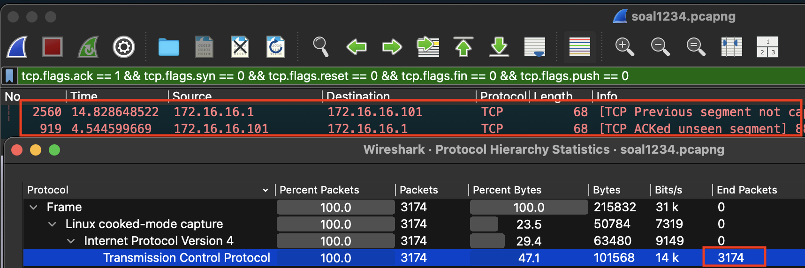
  Seperti sebelumnya, di sini ada 3174 paket dan ada 2 yang gagal, jadi kita lakukan pengurangan untuk mendapat hasil 3172

  <br>
  <br>

> c. Berapa banyak packet berhasil yang berbasis murni TCP dan memiliki flag selain hanya [ACK]?

> _c. How many packets succeed that are pure TCP based and contain flags other than just [ACK] flag?_

**Answer:** `49`

- Filter expression

  ```
  not (
  tcp.flags.ack == 1 && 
  tcp.flags.syn == 0 && 
  tcp.flags.reset == 0 && 
  tcp.flags.fin == 0 && 
  tcp.flags.push == 0
  )
  ```

- Explanation

  <div align="justified"> 
    Pada kasus ini, kami ddiminta mencari paket yang murni tcp dan memiliki flag selain hanya ACK. Maka dari itu, kita bisa gunakan negasi dari filter sebelumnya dengan NOT. Langsung ambil 49 karena TCP yang gagal berada pada sisi filter sebelumnya.

    Selain itu, juga bisa melakukan pengurangan dari jumlah paket TCP murni pada soal 1d (dikurang 2 karena 1d menampilkan keseluruhan, tidak hanya yang sukses) dan 2b yang akan menghasilkan 49.
  </div>

- Output result

  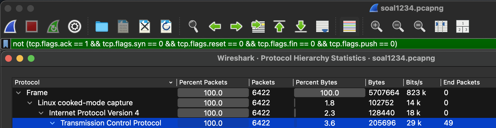

  <br>
  <br>

## Task 3

- Flag

  `JARKOM25{W0w_Y0uU_h4V33e_d0n3_444_90od_j0bB_34J8Kg0dl1k3t3p6qav5e4vvhjjgwujrjm_232cff6c4de3caec86d8907bac7a0c53}`

  **Spoiler alert**
  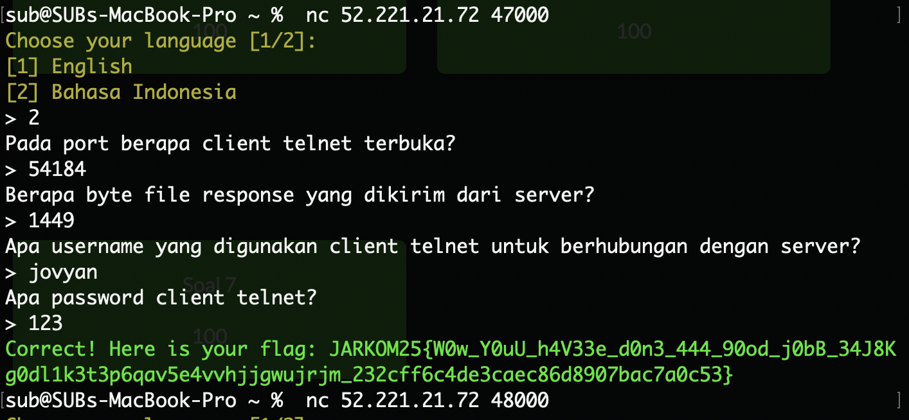

> a. Pada port berapa client telnet terbuka?

> _a. In what port is the telnet client open?_

**Answer:** `54184`

- Filter expression

  `telnet`

- Explanation

  <div align="justified"> 
    Pada kasus ini, kami diminta untuk mencari port dimana telnet client dibuka.
  </div>

- Output result

  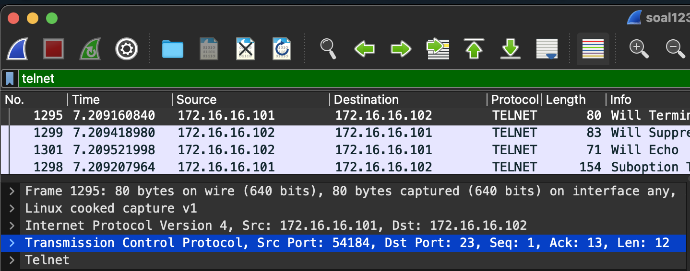
  Client adalah peminta request, maka dari itu portnya adalah src.

  <br>
  <br>

> b. Berapa byte file response yang dikirim dari server?

> _b. How many bytes of the response files are sent from the server?_

**Answer:** `1449`

- Filter expression

  `telnet && ip.src == 172.16.16.102`

- Explanation

  <div align="justified"> 
    Pada kasus ini, kita diminta mencari berapa byte yagn dikirim dari server. Dari soal sebelumnya, kita bisa tahu bahwa client memiliki ip: 172.16.16.101, maka server adalah IP yang berhubungan dengan ip tersebut. Maka dari itu, kita gunakan filter tersebut dan kita lihat di memu Statistics -> Packet hierarchy dan cek end bytes.
  </div>

- Output result

  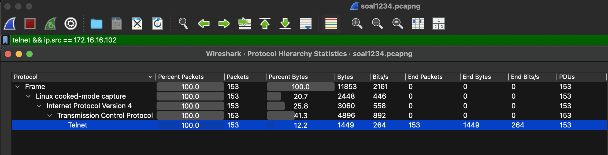

  <br>
  <br>

> c. Apa username yang digunakan client telnet untuk berhubungan dengan server?

> _c. What telnet client's username is used to connect with the server?_

**Answer:** `jovyan`

- Filter expression

  `telnet && frame contains "user"` dan follow stream

- Explanation

  <div align="justified"> 
    Pada kasus ini, kami diminta mencari username client yang digunakan untuk koneksi dengan telnet, maka dari itu kita gunakan filter sebelumnya. Packet yang mengandung nilai tersebut kita follow dan cari usernamenya.
  </div>

- Output result

  

  <br>
  <br>
 
> d. Apa password client telnet?

> _d. What is the telnet client's password?_

**Answer:** `123`

- Filter expression

  `telnet && frame contains "password"` dan follow stream

- Explanation

  <div align="justified"> 
    Pada kasus ini, kami diminta untuk mencari password dari user jovyan. Maka dari itu ya, gunakan filter yang sudah diberikan dan kita follow stream.
  </div>

- Output result

  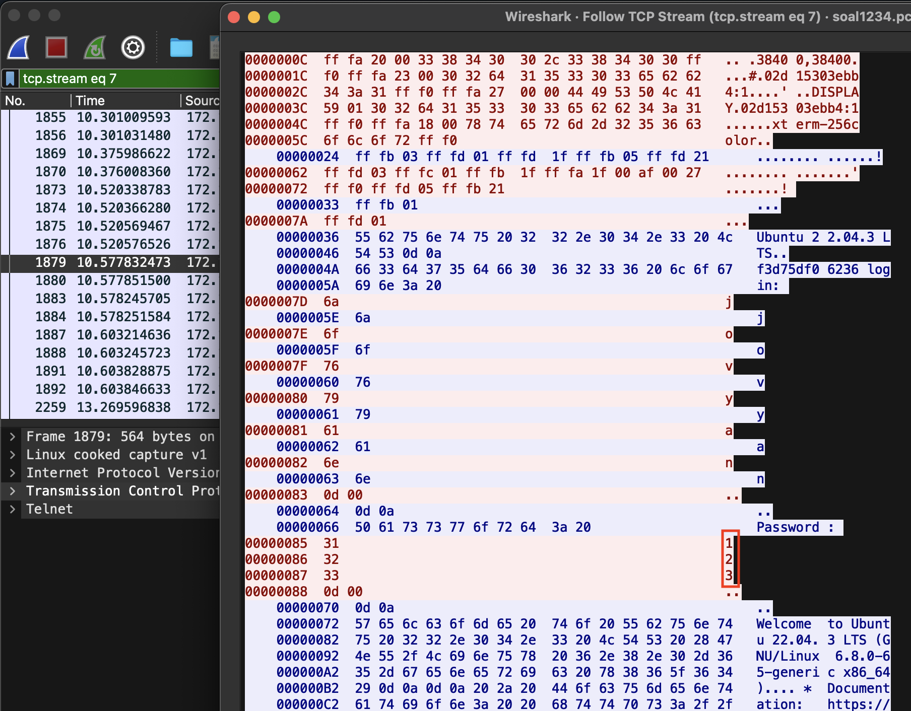

  <br>
  <br>

## Task 4

- Flag

  `JARKOM25{G04t__a4n4liz333er_LGW3RUIMN1MP0K736LTMfr0gz2ubcwr2i2eh8hyr3ys4630136722_b53280f3253c1fcd32515009c46ab1d6}`

  **Spoiler alert**
  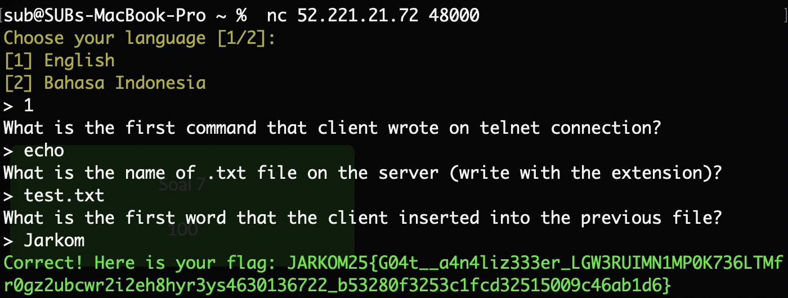

> a. Apa perintah pertama yang ditulis client pada koneksi telnet?

> _a. What is the first command that client wrote on telnet connection?_

**Answer:** `echo`

- Filter expression

  `telnet`

- Explanation

  <div align="justified"> 
    Pada kasus ini, kita tinggal lihat apa command yang pertama diminta user dan respon client.
  </div>

- Output result

  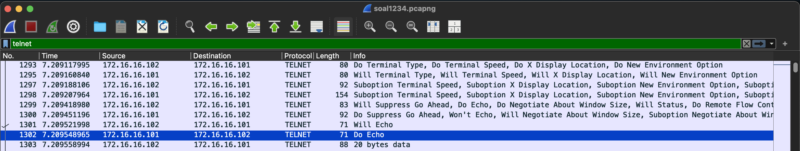

  atau juga bisa di lihat pada stream soal sebelumnya

  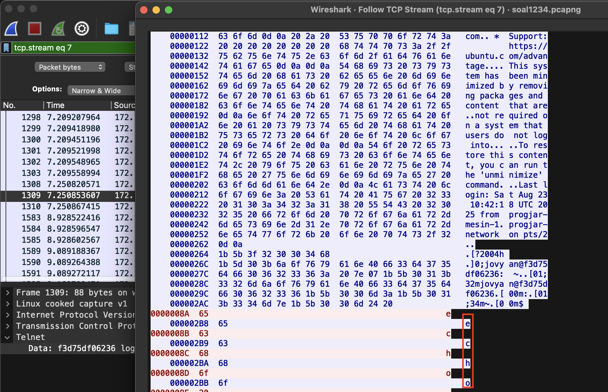

  <br>
  <br>

> b. Apa nama file .txt di server (ditulis bersama ekstensinya)?

> _b. What is the name of .txt file on the server (write with the extension)?_

**Answer:** `text.txt`

- Filter expression

  `telnet && frame contains ".txt"`

- Explanation

  <div align="justified"> 
    Pada kasus ini, kita diminta mencari file .txt yang ada di server. Gunakan filter ini untuk langsung mencari berdasarkan ekstensinya.
  </div>

- Output result

  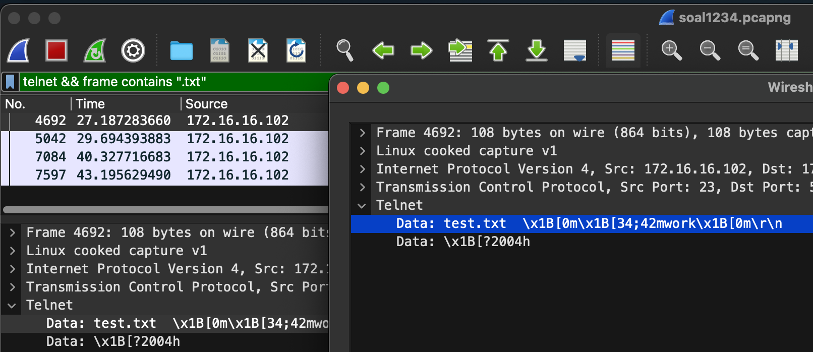

  <br>
  <br>

> c. Apa kata pertama dari frasa yang dimasukkan client ke dalam file sebelumnya?

> _c. What is the first word that the client inserted into the previous file?_

**Answer:** `Jarkom`

- Filter expression

  `telnet && frame contains ".txt"` dan follow stream

- Explanation

  <div align="justified"> 
    Pada kasus ini, kita diminta kata pertama yang dituliskan kepada file .txt tersebut. Kebetulan di situ tertulis "echo Jarkom Gampang > test.txt". Bisa kita simpulkan kata pertama adalah Jarkom.
  </div>

- Output result

  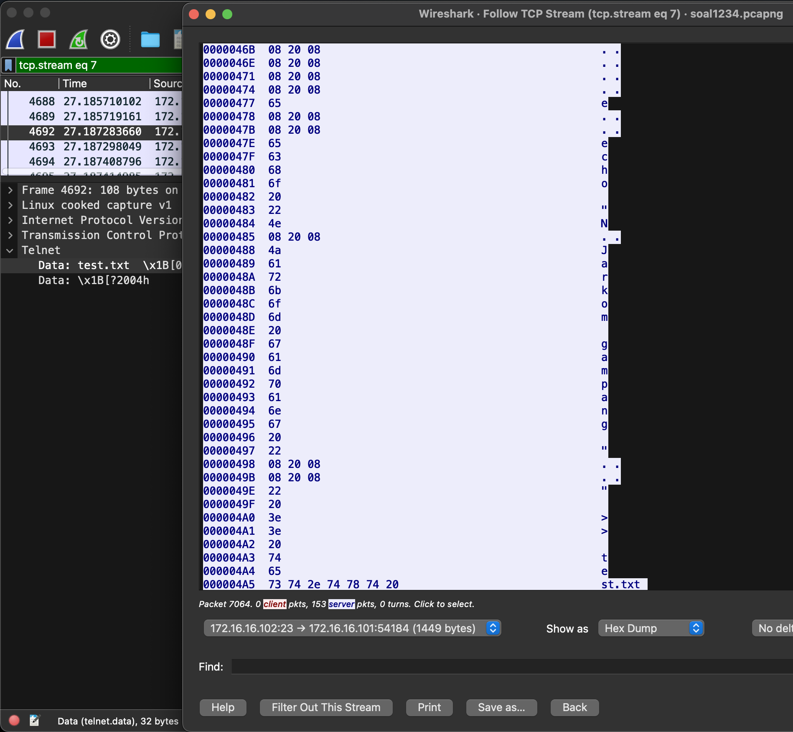

  <br>
  <br>

## Task 5

- Flag

  `JARKOM25{n4il0ng_m1lk_dr4g000n_N05AXJ87VBHRS7192OPOQUGTJR6WTWcr0crih4u28mvf0c3aceg5ahb437_68dbe4ad9a616f1e48be0295a3696502}`

  **Spoiler alert**
  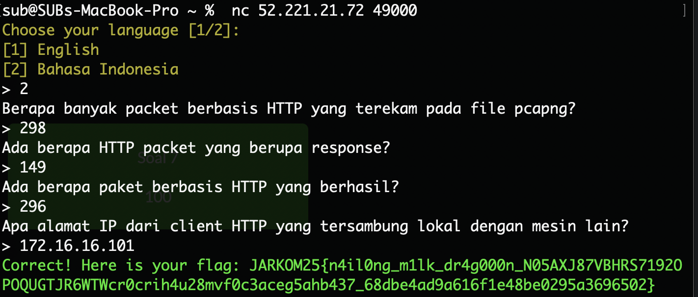

> a. Berapa banyak packet berbasis HTTP yang terekam pada file pcapng?

> _a. How many HTTP packets are recorded in the pcapng file?_

**Answer:** `298`

- Filter expression

  `http`

- Explanation

  <div align="justified"> 
    Pada kasus ini, kami diminta mencari berapa paket yang berbasis HTTP. Maka dari itu, kita pakai filter HTTP. Hasilnya dilihat di menu Statistics.
  </div>

- Output result

  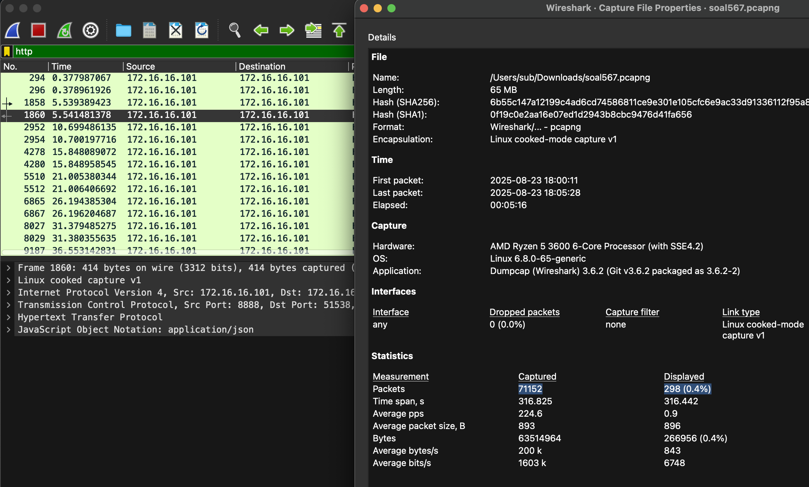

  <br>
  <br>

> b. Ada berapa HTTP packet yang berupa response?

> _b. How many response HTTP packets are recorded in the traffic?_

**Answer:** `149`

- Filter expression

  `http.response`

- Explanation

  <div align="justified"> 
    Pada kasus ini kita diminta mencari http yang berupa response, maka dari itu kita gunakan filter http.response dan melihat jumlah packet yang ditampilkan di menu Statistics.
  </div>

- Output result

  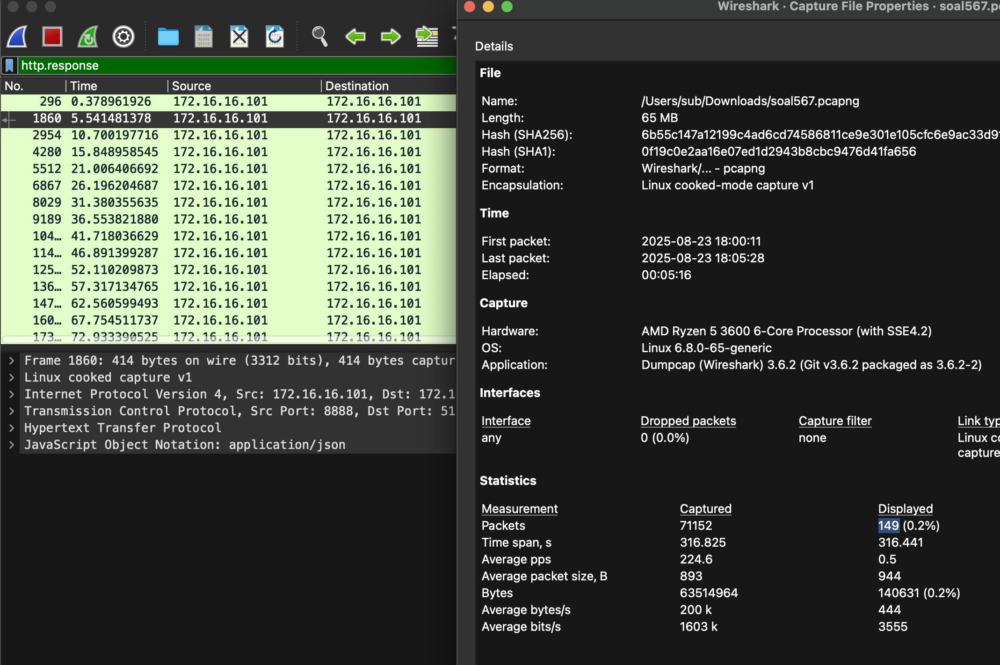

  <br>
  <br>

> c. Ada berapa paket berbasis HTTP yang berhasil?

> _c. How many HTTP packets that succeed?_

**Answer:** `296`

- Filter expression

  `http` dan sort by info

- Explanation

  <div align="justified"> 
    Pada kasus ini, kami diminta untuk mencari berapa packet http yang berhasil.
  </div>

- Output result

  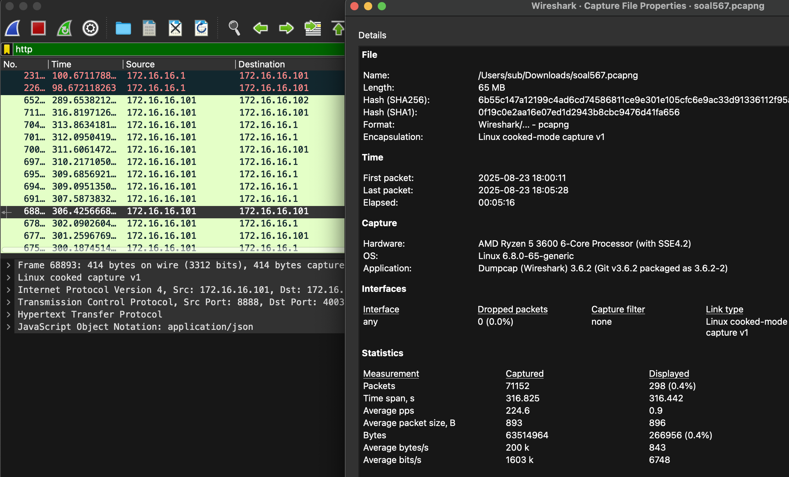

  <br>
  <br>

> d. Apa alamat IP dari client HTTP yang tersambung lokal dengan mesin lain?

> _d. What is the client HTTP IP Address in connection with other local machine?_

**Answer:** `172.16.16.101`

- Filter expression

  `http`

- Explanation

  <div align="justified"> 
    Pada kasus ini, kami diminta untuk mencari client mana yang berkomunikasi dengan local lain, maka bisa saya simpulkan bahwa IP address yang melakukan komunikasi dengan dirinya adalah pelakunya, dan dengan filter tersebut bisa kita temukan.
  </div>

- Output result

  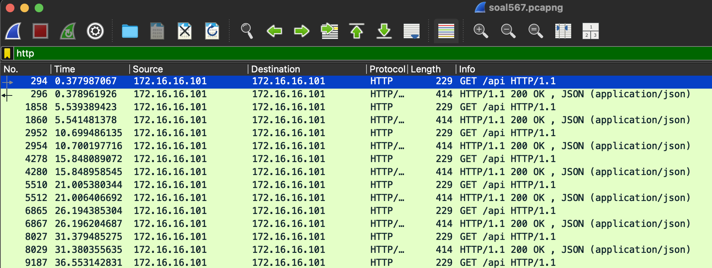

  <br>
  <br>

## Task 6

- Flag

  `JARKOM25{br0mb44rdin0u_Cr0ccc0c0c0cdi1l10l_4578777207awaesayebw7fkoxash1n0buQFZKRY0L6QSADT5_eea6939b99ee358d4e04196c1c410929}`

  **Spoiler alert**
  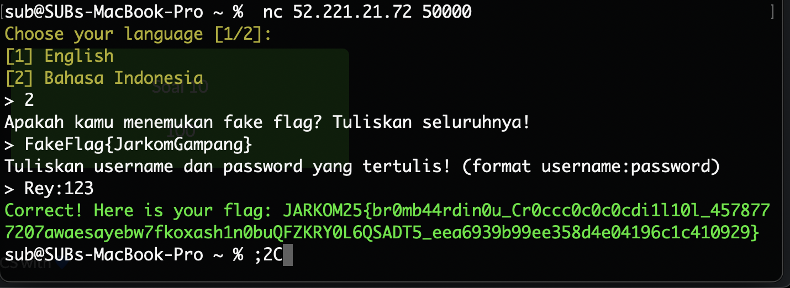

> a. Apakah kamu menemukan fake flag? Tuliskan seluruhnya!

> _a. Did you find the fake flag? Write it whole!_

**Answer:** `FakeFlag{JarkomGampang}`

- Filter expression

  `frame contains "Fake"` (atau menu find keyword "fake" dengan string pada packet bytes) dan lakukan follow stream.

- Explanation

  <div align="justified"> 
    Pada kasus ini, kami diminta mencari FakeFlag yang disembunyikan pada pcap ini. Maka dari itu kita tinggal cari kata kunci yang relevan dengan filter tersebut.
  </div>

- Output result

  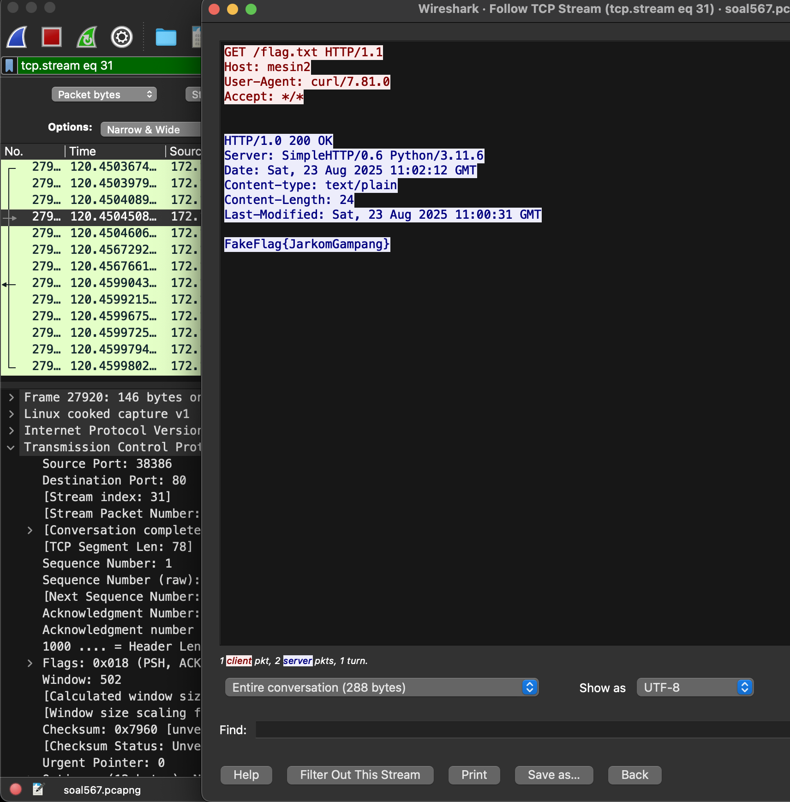

  <br>
  <br>

> b. Tuliskan username dan password yang tertulis! (format username:password)

> _b. Write the written username and password! (format username:password)_

**Answer:** `Rey:123`

- Filter expression

  `http && frame contains "pass"`

- Explanation

  <div align="justified"> 
    Pada kasus ini, kami diminta mencari username dan password yang tertulis pada pcapngg ini. Kita mengetahui bahwa user menggunakan protokol http untuk kurang lebih keseluruhan aktivitasnya, jadi bisa kita persempit cakupannya pada protokol HTTP. Umumnya juga, di soal seperti ini password nggak jauh-jauh dari kata "pass" atau "user".
  </div>

- Output result

  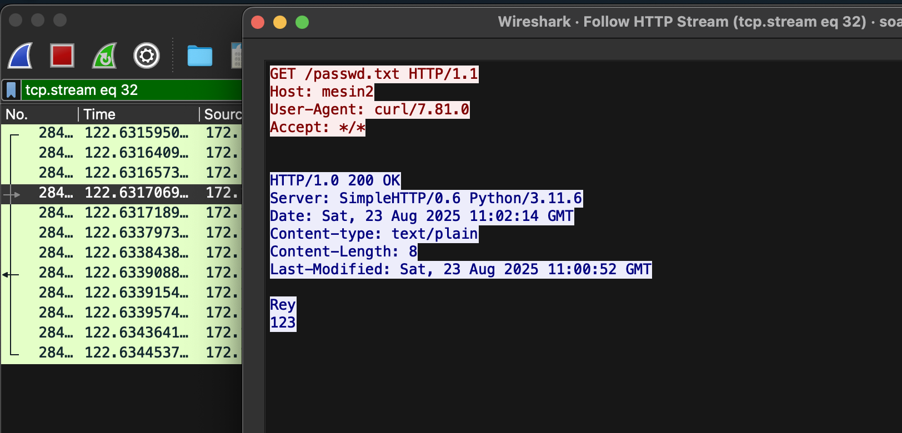

  <br>
  <br>

## Task 7

- Flag

  `JARKOM25{tr4l4lel0_tr1lil1_ejevmp0bdyk3b0s0sBN95CL5R249NO6C_d974a0683d1092484cf08d1acb5aacfc}`

  **Spoiler alert**
  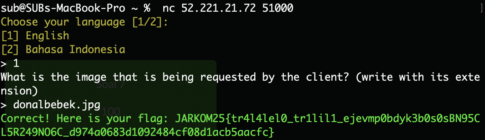

> Apa nama gambar yang direquest oleh client? (tulis dengan ekstensinya)

> _What is the image that is being requested by the client? (write with its extension)_

**Answer:** `donalbebek.jpg`

- Filter expression

  `frame contains ".jpg"`

- Explanation

  <div align="justified"> 
    Pada kasus inii, kami diminta mencari nama file gambar yang direquest oleh client. Karena ekstensi gambar tidak jauh-jauh dari jpeg, png, atau jpg, maka tentu kita bisa gunakan format-format tersebut untuk mencari hal yang berkaitan dengan gambar. Berdasarkan pengujian 4 format tersebut, hanya ditemukan gambar pada ekstensi jpg.
  </div>

- Output result

  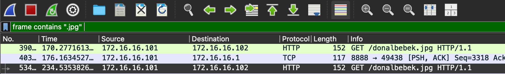

  <br>
  <br>

## Task 8

- Flag

  `JARKOM25{y0u_4r3_s0_G00d_1n_F0r3nsic_XXLAUQUPWNXMDVXF7YSSXXGQVJZ4CRx45y4n6li9zis81ku0ne1sdlsstaa5_3bab7654ec8cdab76656172472b49f3c}`

  **Spoiler alert**
  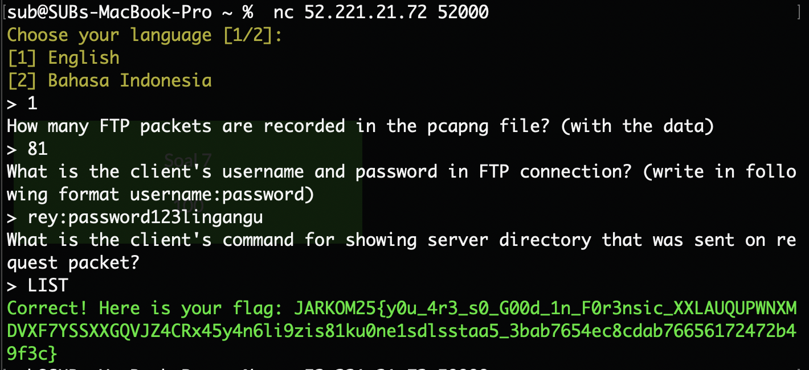

> a. Berapa banyak packet berbasis FTP yang terekam pada file pcapng? (with the data)

> _a. How many FTP packets are recorded in the pcapng file? (with the data)_

**Answer:** `81`

- Filter expression

  lihat Protocol Hierarchy

- Explanation

  <div align="justified"> 
    Pada kasus ini, kami diminta untuk mencari jumlah paket yang berbasis FTP, maka dari itu kita lihat di menu Protocol hierarchy ada berapa jummlahnya. Kita bisa jumlahkan bagian paling kanan (end packet) dengan jumlahnya 3+7+71 = 81.
  </div>

- Output result

  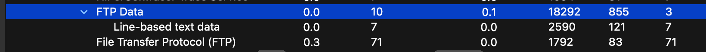

  <br>
  <br>

> b. Apa username dan password client di koneksi FTP? (tulis dalam format username:password)

> _b. What is the client's username and password in FTP connection? (write in following format username:password)_

**Answer:** `rey:password123lingangu`

- Filter expression

  `frame contains "password"` dan follow stream

- Explanation

  <div align="justified"> 
    Pada kasus ini kita diminta mencari username dan password. Untuk kasus seperti ini ya sama aja, nggak jauh-jauh dari keyword "user" atau "password" dan substring-substringgnya seperti: usr, pass, pwd, dll.
  </div>

- Output result

  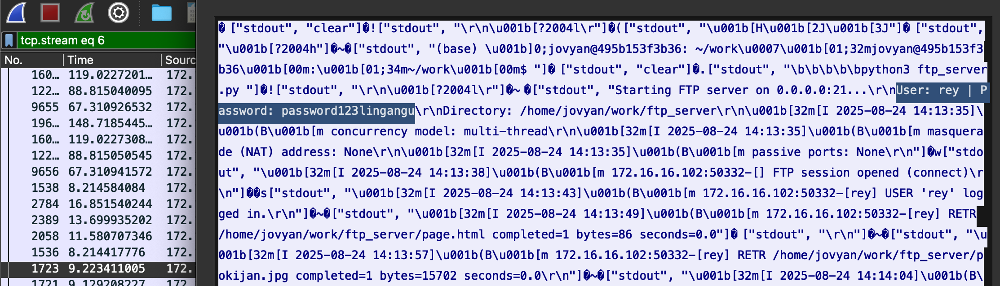

  <br>
  <br>

> c. What is the client's command for showing server directory that was sent on request packet?

> _c. Apa command client untuk melihat direktori server yang dikirimkan dalam request packet?_

**Answer:** `LIST`

- Filter expression

  follow stream yang berkaitan dengan login client

- Explanation

  <div align="justified"> 
    Pada kasus ini, kami diminta untuk mencari command yang digunakan client untuk menunjukkan directory server yang dikirimkan. Maka bisa kita lihat di stream yang berhubungan dengan interaksi client-servver.
  </div>

- Output result

  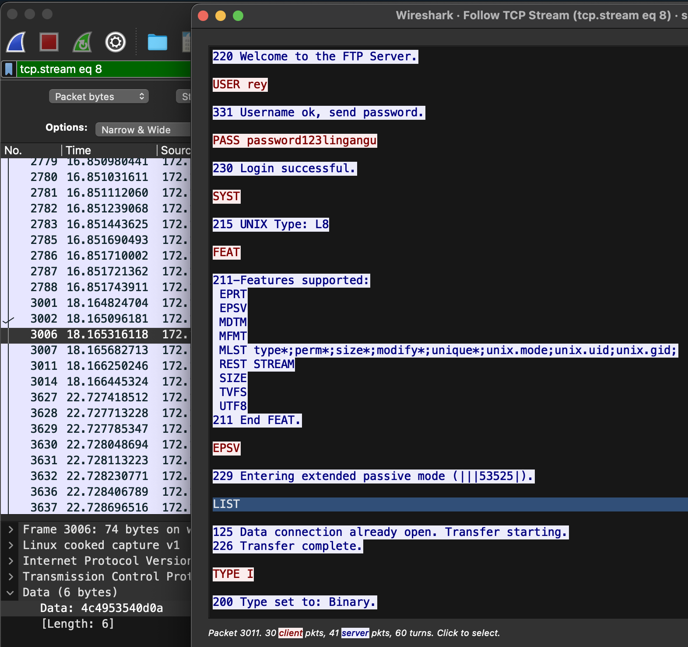

  <br>
  <br>

## Task 9

- Flag

  `JARKOM25{j4rk000000mmm_g4mpp4444n9999999_17181293118i41L4hdtimz30yi9321k0ncolP8NW1CLW2J2S49F_7369007cdf1ecb1ff16ee0f49bb7fd37}`

  **Spoiler alert**
  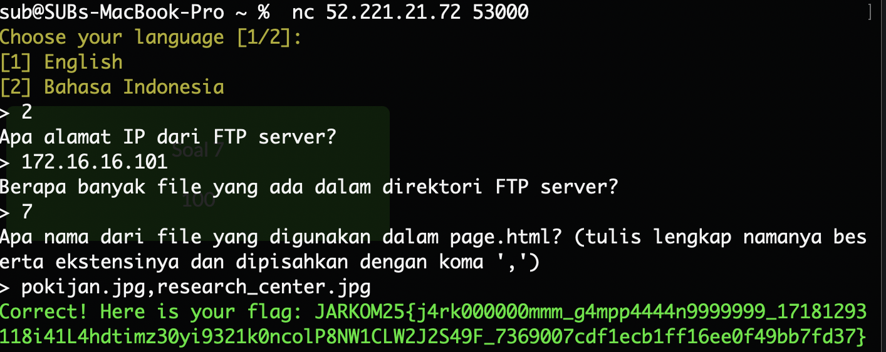

> a. Apa alamat IP dari FTP server?

> _a. What is the FTP server IP Address?_

**Answer:** `176.16.16.101`

- Filter expression

  `ftp` dan cari pesan "response"

- Explanation

  <div align="justified"> 
    Pada kasus ini, kami diminta mencari IP address dari server FTP. Kita bisa lihat mana yang menghasilkan pesan response pada informasinya (karena pesan get pasti berasal dari client).
  </div>

- Output result

  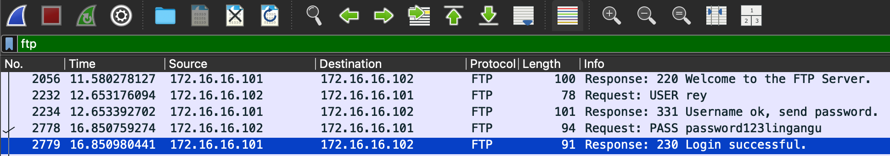

  <br>
  <br>

> b. Berapa banyak file yang ada dalam direktori FTP server?

> _b. How many files are there inside the FTP server directory?_

**Answer:** `7`

- Filter expression

  `frame contains "page.html"` dan follow stream

- Explanation

  <div align="justified"> 
    Pada kasus ini, kami diminta mencari berapa file yang ada pada server FTP. Kita bisa menemukan dengan follow stream dari salah satu file yang muncul pada pcap ini dan akan bertemu dengan urutan file lainnya. Pada kasus ini ada 8 file, tapi karena file pertama diawali ".", maka saya asumsikan itu bukan file (lebih mengarah ke checkpoint atau file buatan system).
  </div>

- Output result

  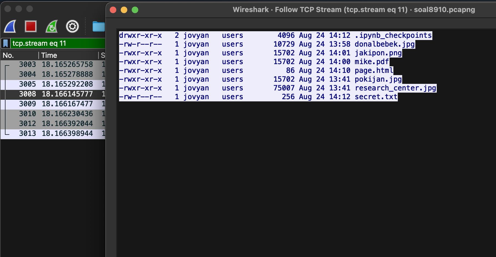

  <br>
  <br>

> c. Apa nama dari file yang digunakan dalam page.html? (tulis lengkap namanya beserta ekstensinya dan dipisahkan dengan koma ',')

> _c. What are the filenames used in the page.html? (write the filebames with their extensions and separate them with comma ',')_

**Answer:** `pokijan.jpg,research_center.jpg`

- Filter expression

  `ftp-data && frame contains "page.html"` dan follow stream

- Explanation

  <div align="justified"> 
    Pada kasus ini, kita diminta mencari namae file yang ada pada file page(dot)html, sehingga langkah yang paling cocok adalah melakukan follow pada nama file yang muncul pada nama file tersebut. Kaboom, isinya pokijan dan research_center.
  </div>

- Output result

  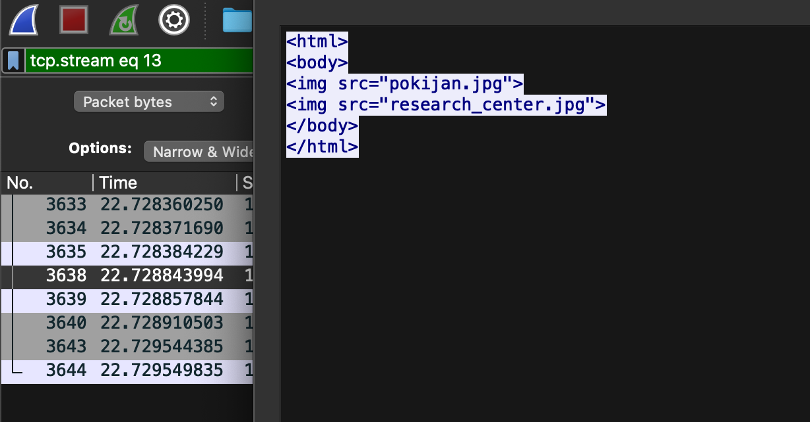

  <br>
  <br>

## Task 10

- Flag

  `JARKOM25{f1nisssshs55s5s533s_l1n333ee333E3_37996450962910qoik7s65453452151231233UPJ0QJ7H356U2X_d0af77817cfbe60ad8f0e112ec490fe6}`

  **Spoiler alert**
  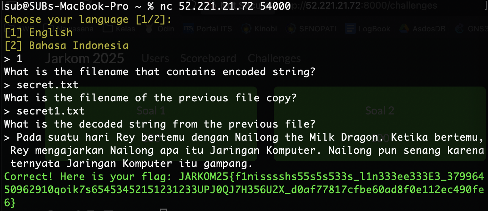

> a. Apa nama file yang mengandung string terencode?

> _a. What is the filename that contains encoded string?_

**Answer:** `secret.txt`

- Filter expression

  `ftp-data` follow stream masing-masing file

- Explanation

  <div align="justified"> 
    Pada kasus ini, kami diminta mencari file yang mengandung string encrypted. Karena data-typenya adalah string, kita bisa lupakan gambar, karena gambar berupa file binary. Sisanya adalah file "txt" dan "html", dan kita sempat lihat isi file html di soal sebelumnya berisi UTF-8. Kemudian saya curiga "secret" pada file dengan ekstensi "txt", hmmm sungguh nama yang mencurigakan bukan.
  </div>

- Output result

  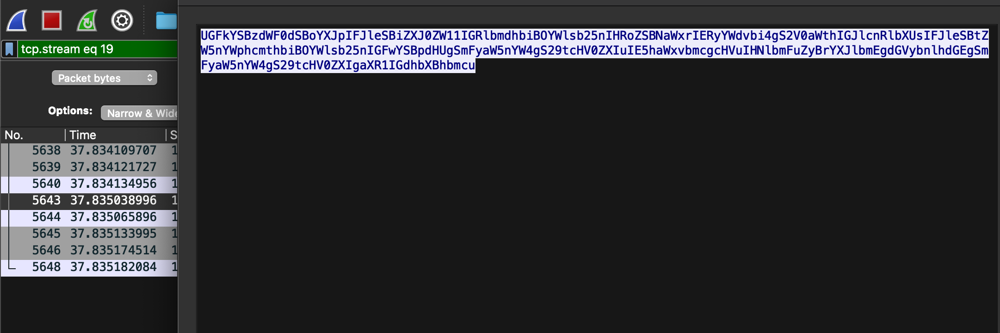

  <br>
  <br>

> b. Apa nama file hasil copy file sebelumnya?

> _b. What is the filename of the previous file copy?_

**Answer:** `secret1.txt`

- Filter expression

  `ftp-data` follow stream file yang jaraknya berdekatan dengan file secret.txt mempertimbangkan faktor-faktor yang akan kami jelaskan

- Explanation

  <div align="justified"> 
    Pada kasus ini, kami diminta untuk mencari file yang merupakan hasil copyan dari file secret.txt, maka tentu tidak jauh-jauh dari file tersebut. Juga karena adalah copy, pasti filenya berada setelah file aslinya. Jika kita lihat file di sekitarnya, ada file yang namanya "mirip" (karena copy biasanya memiliki nama yang KURANG LEBIH SAMA, seperti "secret copy.txt"), ISINYA SAMA PERSIS (namanya adalah "secret1.txt"), dan munculnya SETELAH file "secret(dot)txt", kebetulan juga file ini adalah satu-satunya.
  </div>

- Output result

  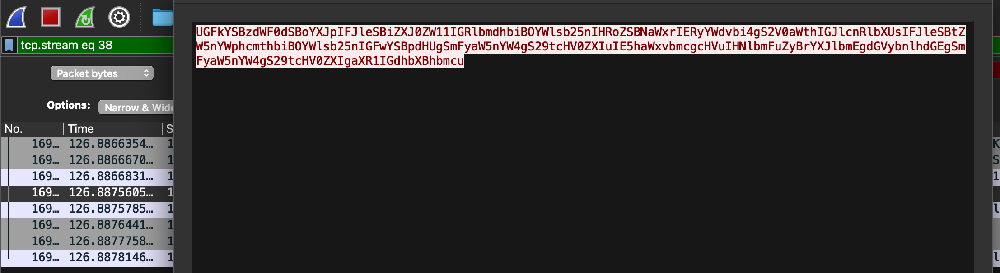

  <br>
  <br>

> c. What is the decoded string from the previous file?

> _c. Apa decoded string dari file tersebut?_

**Answer:** 
  ```
  Pada suatu hari Rey bertemu dengan Nailong the Milk Dragon. Ketika bertemu, Rey mengajarkan Nailong apa itu Jaringan Komputer. Nailong pun senang karena ternyata Jaringan Komputer itu gampang.
  ```

- Filter expression

  `ftp-data` follow stream "secret.txt" untuk diambil isinya

- Explanation

  <div align="justified"> 
    Pada kasus ini, kami diminta melakukan decode, nah kita lihat mentahannya adalah:

    > UGFkYSBzdWF0dSBoYXJpIFJleSBiZXJ0ZW11IGRlbmdhbiBOYWlsb25nIHRoZSBNaWxrIERyYWdvbi4gS2V0aWthIGJlcnRlbXUsIFJleSBtZW5nYWphcmthbiBOYWlsb25nIGFwYSBpdHUgSmFyaW5nYW4gS29tcHV0ZXIuIE5haWxvbmcgcHVuIHNlbmFuZyBrYXJlbmEgdGVybnlhdGEgSmFyaW5nYW4gS29tcHV0ZXIgaXR1IGdhbXBhbmcu

    hasil decode Base64nya adalah

    > Pada suatu hari Rey bertemu dengan Nailong the Milk Dragon. Ketika bertemu, Rey mengajarkan Nailong apa itu Jaringan Komputer. Nailong pun senang karena ternyata Jaringan Komputer itu gampang.
  </div>

- Output result

  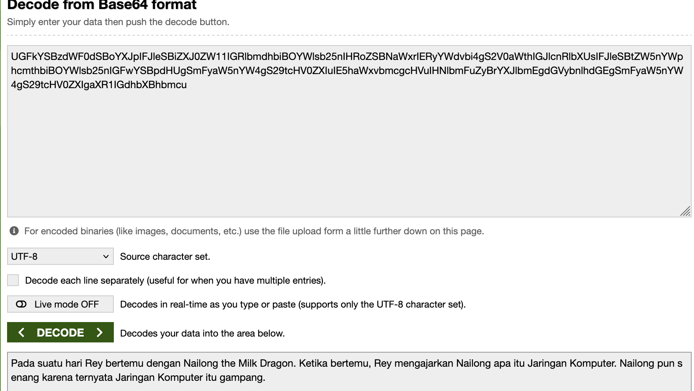

  <br>
  <br>

## Summary
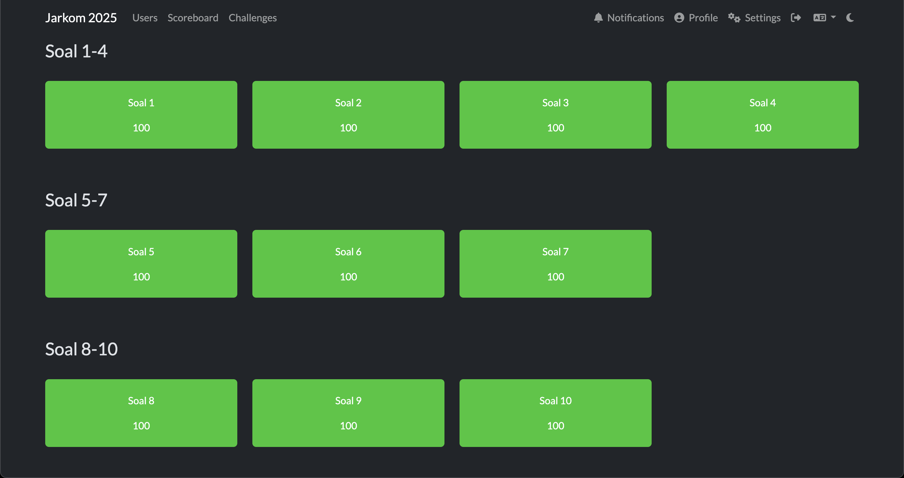
<div align="justified"> 
  Inilah hasil dari praktikumnya, kebetulan saya mendapati seluruh flag yang sudah ada dari port 45000 s.d. 540000.
</div>


## Problems
<div align="justified"> 
  There is not much problematic stuff here, it's just that with this amount of pressure, we somehow lose the ability to understand simple words and fumble.

  Tapi pada akhirnya, semua bisa terselesaikan dengan bantuan pilihan bahasa pada soal. Hal tersebut dapat diilakukan dengan membandingkan kedua bahasa. Sehingga saya bisa menentukan apa sih maksud sebenarnya dari soal-soal ambigu tersebut.
  
</div>
