[](https://classroom.github.com/a/1niUih_B)
| Name           | NRP        | Kelas     |
| ---            | ---        | ----------|
| Bintang Ilham Pabeta | 5025241152 | A |


## Put your topology config image here!

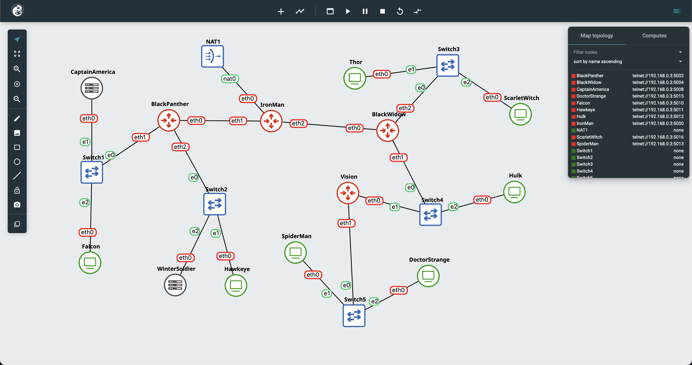

## Put your GNS3 Project file here!

[Praktikum-2-Doneeeeeee!](src/praktikum-modul-2.gns3project)

<br>

## Soal 1

> Dokumentasikan hasil pengelompokan subnet yang telah dibuat.

> _Document the results of the subnet grouping that has been created._

**Answer:**

- Screenshot

  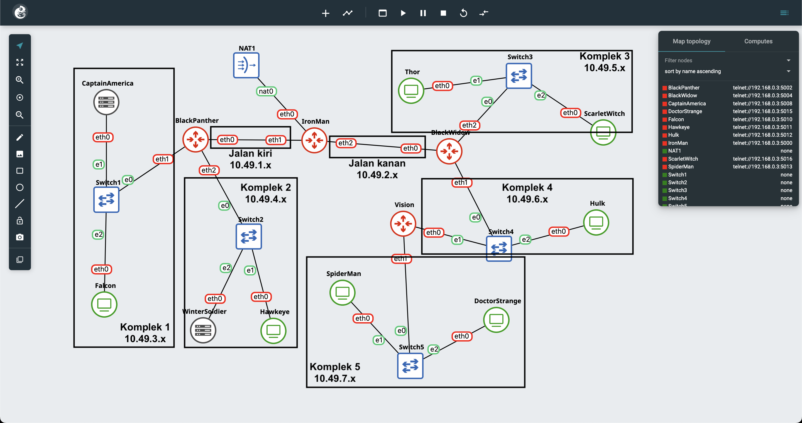

- Explanation

  Pada kasus ini, akan dilakukan pembagian zona yang dilakukan berdasarkan lokasi switch pada byte ke-3. Selain itu, byte ke-4 akan diurutkan berdasarkan jenisnya, antara lain sebagai berikut:
  
  DHCP Server

  <table>
  <th>Source</th> <th>Tujuan</th> <th>Port </th><th>Address</th>
  <tr> <td>CaptainAmerica</td><td>Switch1</td><td> eth0</td><td>10.49.3.1</td> </tr>
  <tr> <td>WinterSoldier</td><td>Switch2</td><td> eth0</td><td>10.49.4.2</td> </tr>
  </table>

  DHCP Relay

  <table>
  <th>Source</th> <th>Tujuan</th> <th>Port</th> <th>Address</th>
  <tr> <td rowspan=3>IronMan</td><td>NAT</td><td> eth0</td><td>DHCP</td> </tr>
  <tr><td>BlackPanther</td><td> eth1</td><td>10.49.1.3</td></tr>
  <tr><td>BlackWidow</td><td> eth2</td><td>10.49.2.3</td></tr>
  <tr> <td rowspan=3>BlackPanther</td><td>IronMan</td><td> eth0</td><td>10.49.1.4</td> </tr>
  <tr><td>Switch1</td><td> eth1</td><td>10.49.3.4</td></tr>
  <tr><td>Switch2</td><td> eth2</td><td>10.49.4.4</td></tr>
  <tr> <td rowspan=3>BlackWidow</td><td>IronMan</td><td> eth0</td><td>10.49.2.5</td> </tr>
  <tr><td>Switch4</td><td> eth1</td><td>10.49.6.5</td></tr>
  <tr><td>Switch3</td><td> eth2</td><td>10.49.5.5</td></tr>
  <tr> <td rowspan=2>Vision</td><td>Switch4</td><td> eth0</td><td>10.49.6.6</td> </tr>
  <tr><td>Switch5</td><td> eth1</td><td>10.49.7.6</td></tr>
  </table>

  Client

  <table>
  <th>Source</th> <th>Tujuan</th> <th>Port</th> <th>Address</th>
  <tr><td>Falcon</td><td>Switch1</td><td> eth0</td><td>DHCP</td></tr>
  <tr><td>Hawkeye</td><td>Switch2</td><td> eth0</td><td>DHCP</td></tr>
  <tr><td>Thor</td><td>Switch3</td><td> eth0</td><td>DHCP</td></tr>
  <tr><td>ScarletWitch</td><td>Switch3</td><td> eth0</td><td>DHCP</td></tr>
  <tr><td>Hulk</td><td>Switch4</td><td> eth0</td><td>DHCP</td></tr>
  <tr><td>SpiderMan</td><td>Switch5</td><td> eth0</td><td>DHCP</td></tr>
  <tr><td>DoctorStrange</td><td>Switch5</td><td> eth0</td><td>DHCP</td></tr>
  </table>


<br>

## Soal 2

> Lakukan konfigurasi routing agar setiap node dapat saling berkomunikasi. Pastikan setiap router dapat mengirimkan paket ke jaringan lain melalui tabel routing yang sesuai. Sertakan bukti bahwa Falcon bisa melakukan ping ke SpiderMan, DoctorStrange, dan ScarletWitch.

> _Configure routing so that each node can communicate with each other. Ensure each router can forward packets to other networks through the appropriate routing table. Include proof that Falcon can ping SpiderMan, DoctorStrange, and ScarletWitch._

**Answer:**

- Screenshot
  
  IP SpiderMan
  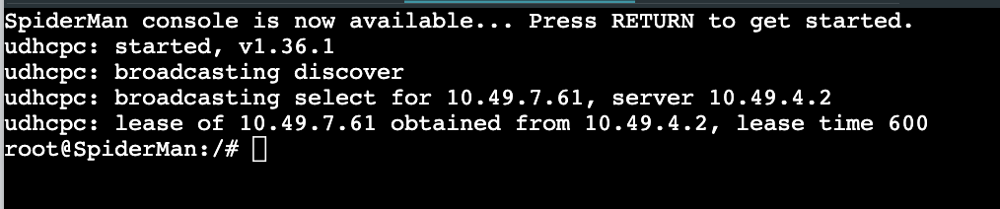

  Falcon Ping SpiderMan
  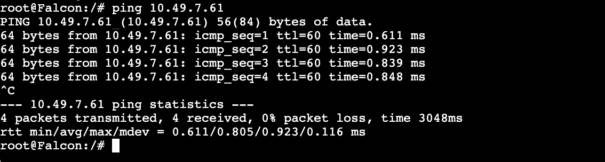

  IP DoctorStrange
  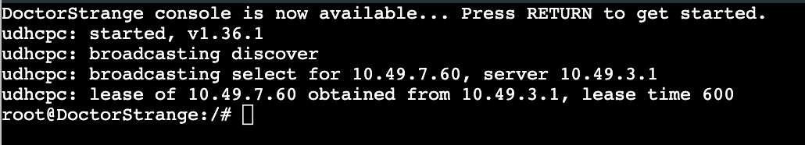

  Falcon Ping DoctorStrange
  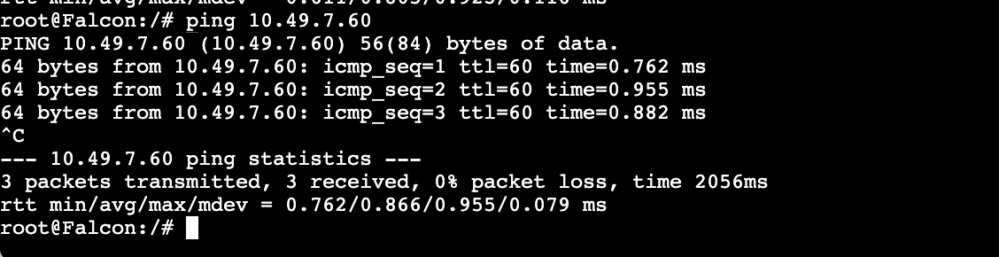

  IP ScarletWitch
  

  Falcon Ping ScarletWitch
  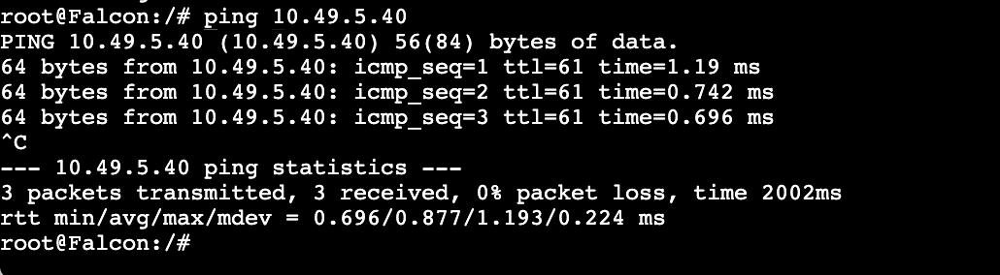


- Explanation

  Pada kasus ini, karena kompleknya terbagi menjadi 5, maka perlu dilakukan static routing antar router yang sudah ada. Maka dari itu kita akan buat konfigurasinya.

  Atur gateway pada bagian server yang menggunakan IP statis pada network configuration di menu web GNS3.

  ```bash
  CaptainAmerica eth0 10.49.3.4 # BlackPanther dari sisi switch-1
  WinterSoldier eth0 10.49.4.4 # BlackPanther dari sisi switch-2
  ```

  IronMan: /root/config.sh

  ```bash
  ip route add 10.49.3.0/24 via 10.49.1.4 # komplek 1
  ip route add 10.49.4.0/24 via 10.49.1.4 # komplek 2
  ip route add 10.49.5.0/24 via 10.49.2.5 # komplek 3
  ip route add 10.49.6.0/24 via 10.49.2.5 # komplek 4
  ip route add 10.49.7.0/24 via 10.49.2.5 # komplek 5

  ```

  BlackWidow: /root/config.sh
  
  ```bash
  ip route add 10.49.7.0/24 via 10.49.6.6  # komplek 5
  ```

  Vision: /root/config.
  
  ```bash
  ip route add default via 10.49.6.5 # seluruh koneksi diarahkan ke BlackWidow
  ```

  Kemudian untuk membuat otomasi (script tersebut jalan saat PC start)
  edit file dengan `nano ~/.bashrc` kemudian tambahkan sebuah line untuk menjalankan script tersebut saat PC dijalankan
  ```bash
  source /root/config.sh
  ```

  Kemudian untuk melakukan pemberian IP pada client secara dinamis, maka kita akan melakukan instalasi isc-dhcp-server. Masalahnya, saat ini kedua server tersebut masih belum mengenal DNS untuk tersambung ke internet. Maka kita akan gunakan `nano /etc/resolv.conf` atau
  ```bash
  echo nameserver 8.8.8.8 >> /etc/resolv.conf
  echo nameserver 1.1.1.1 >> /etc/resolv.conf
  ```

  Kemuudian kita bisa lakukan update pada apt dan lakukan instalasi dhcp server
  ```bash
  apt-get update
  apt-get install isc-dhcp-server
  service isc-dhcp-server start
  ```

  Tidak lupa setelahnya karena kita akan memberikan IPv4 pada client-client dan karena melalui port eth0. maka kita lakukan ``nano /etc/default/isc-dhcp-server`` dan ubah bagian INTERFACESv4 menjadi ``INTERFACESv4="eth0"`` atau dengan
  ```bash
  echo INTERFACESv4="eth0" >> /etc/default/isc-dhcp-server
  ```

  Mari kita berikan IP address pada anak-anaknya, di sini kita akan edit file konfigurasi isc-dhcp-server pada `/etc/dhcp/dhcpd.conf` bebas mau server manapun (toh nanti keduanya akan seperti ini tapi salah satu menjadi failover).

  ```conf
  subnet 10.49.3.0 netmask 255.255.255.0 {
      range 10.49.3.20 10.49.3.25;
      option routers 10.49.3.4;
      option broadcast-address 10.49.3.255;
      option domain-name-servers 8.8.8.8, 1.1.1.1;
      default-lease-time 120;
      max-lease-time 6000;
  }

  subnet 10.49.4.0 netmask 255.255.255.0 {
      range 10.49.4.30 10.49.4.35;
      option routers 10.49.4.4;
      option broadcast-address 10.49.4.255;
      option domain-name-servers 8.8.8.8, 1.1.1.1;
      default-lease-time 300;
      max-lease-time 7200;
  }

  subnet 10.49.5.0 netmask 255.255.255.0 {
      range 10.49.5.40 10.49.5.45;
      range 10.49.5.100 10.49.5.105;
      option routers 10.49.5.5;
      option broadcast-address 10.49.5.255;
      option domain-name-servers 8.8.8.8, 1.1.1.1;
      default-lease-time 120;
      max-lease-time 6000;
  }

  subnet 10.49.6.0 netmask 255.255.255.0 {
      range 10.49.6.50 10.49.6.55;
      option routers 10.49.6.5;
      option broadcast-address 10.49.6.255;
      option domain-name-servers 8.8.8.8, 1.1.1.1;
      default-lease-time 600;
      max-lease-time 7200;
  }

  subnet 10.49.7.0 netmask 255.255.255.0 {
      range 10.49.7.60 10.49.7.65;
      range 10.49.7.110 10.49.7.115;
      option routers 10.49.7.6;
      option broadcast-address 10.49.7.255;
      option domain-name-servers 8.8.8.8, 1.1.1.1;
      default-lease-time 600;
      max-lease-time 7200;
  }
  ```

  Kemudian tak lupa untuk install isc-dhcp-relay untuk seluruh relay yang ada di sini yaitu: IronMan, BlackPanther, BlackWidow, dan Vision dengan menggunakan:
  ```bash
  apt-get update
  apt-get install isc-dhcp-relay -y
  service isc-dhcp-relay start
  ```
  Confignya kurang lebih akan seperti ini pada `/etc/default/isc-dhcp-relay`
  ```bash
  SERVERS="10.49.3.1 10.49.4.2"   # menuju server capt dan winter
  INTERFACES="eth0 eth1 eth2"     # melayani eth mana saja
  OPTIONS=""
  ```

  Setelah semua berhasil dikonfigurasikan, maka lakukan
  ```bash
  service isc-dhcp-server restart   # start dhcp server
  service isc-dhcp-relay restart    # start dhcp relay
  ```

  Pada akhirnya, nyalakan kembali client-client yang ada agar mereka mendapatkan IP dari DHCP. Akhirnya, mereka bisa lakukan ping satu sama lain


<br>

## Soal 3

> Lakukan konfigurasi agar semua node dapat terhubung ke internet. Sertakan hasil uji coba dengan melakukan ping ke google.com dari node Falcon, CaptainAmerica, SpiderMan, dan Thor.

> _Configure all nodes to connect to the internet. Include test results by pinging google.com from the Falcon, CaptainAmerica, SpiderMan, and Thor nodes._

**Answer:**

- Screenshot

  Falcon ping google
  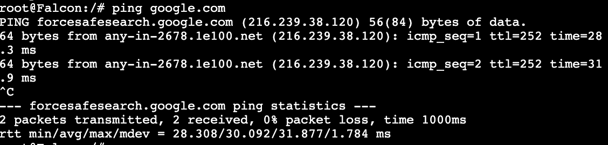

  CaptainAmerica ping google
  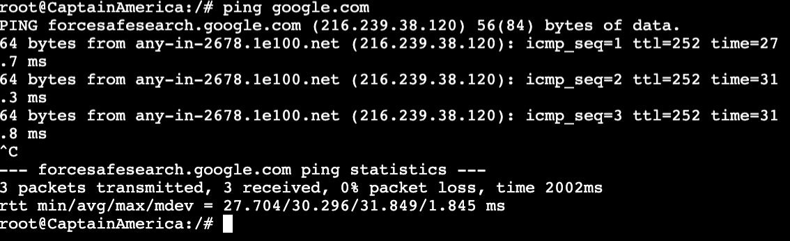

  SpiderMan ping google
  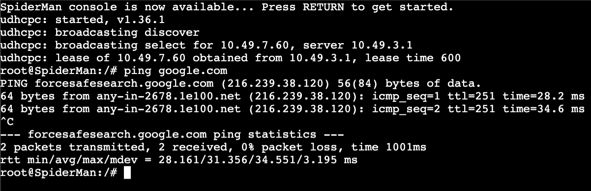

  Thor ping google
  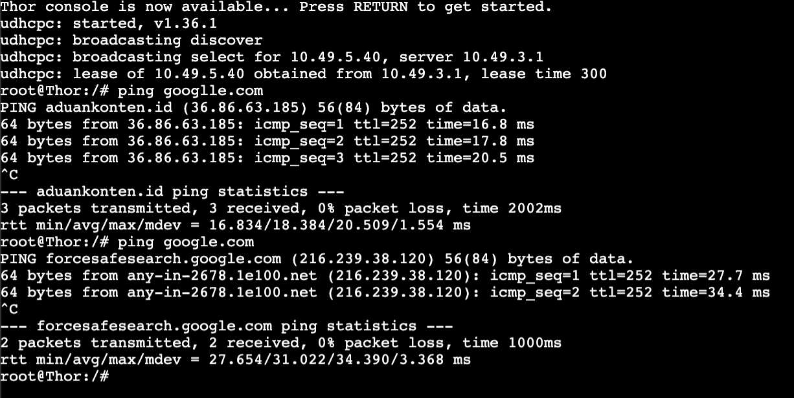


- Explanation

  Setelah melakukan konfigurasi DHCP, terutama pada bagian
  
  ```bash
  subnet [NID] netmask 255.255.255.0 {
      option domain-name-servers 8.8.8.8, 1.1.1.1;  # DNS google dan cloudflare
      # ... dan seterusnya
  }
  ```

  Kita telah berhasil mengkonfigurasikan keseluruhan node yang mendapatkan IP tersebut untuk berhubungan dengan DNS google dan cloudflare. Akhirnya, semua node bisa mendapatkan akses menuju internet.

<br>

## Soal 4

> Berikan Falcon alamat IP dalam rentang [Prefix IP].3.20 - [Prefix IP].3.25
> <br> </br>
> Berikan Hawkeye alamat IP dalam rentang [Prefix IP].4.30 - [Prefix IP].4.35
> <br> </br>
> Berikan Hulk alamat IP dalam rentang [Prefix IP].6.50 - [Prefix IP].6.55

<br>

> _Give Falcon an IP address in the range [IP Prefix].3.20 - [IP Prefix].3.25_
> <br> </br>
> _Give Hawkeye an IP address in the range [IP Prefix].4.30 - [IP Prefix].4.35_
> <br> </br>
> _Give Hulk an IP address in the range [IP Prefix].6.50 - [IP Prefix].6.55_

**Answer:**

- Screenshot

  Falcon
  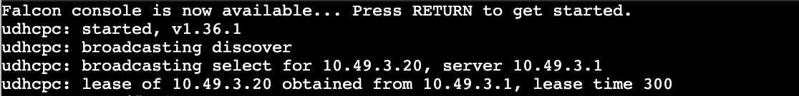
  
  Hawkeye
  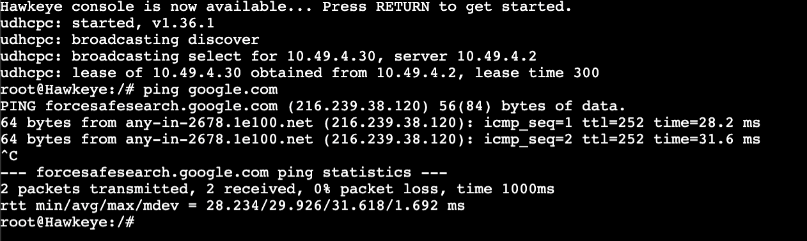

  Hulk
  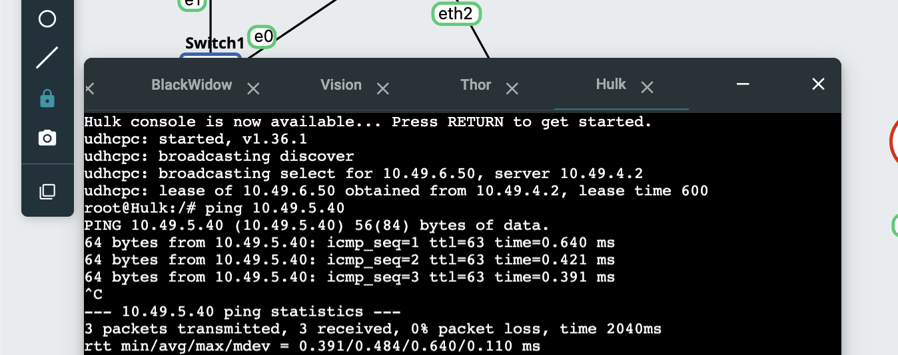

- Explanation

  Pada topologi saat ini, Falcon berada di dekat switch1 Hawkeye berada di dekat switch2, dan Hulkk di switch3. Maka pada pengelompokan awal, untuk menyesuaikan dengan soal ini, byte ke-3 dari subnet disesuaikan dengan IP yang akan kami gunakan, yang secara berurutan adalah `10.49.3.x`, `10.49.4.x`, `10.49.5.x`. Maka untuk melakukan pengalokkasian IP pada range tertentu, maka kita lakukan perubahan pada bagian range untuk subnet yang sesuai:

  1. Falcon mendapat IP [IP Prefix].3.20 - [IP Prefix].3.25
    ```bash
      subnet 10.49.3.0 netmask 255.255.255.0 {
        range 10.49.3.20 10.49.3.25;  # IP antara [prefix].3.(20 - 25)
        # ... dan seterusnya
    }
    ```

  2. Hawkeye mendapat IP [IP Prefix].4.30 - [IP Prefix].4.35
    ```bash
      subnet 10.49.4.0 netmask 255.255.255.0 {
        range 10.49.4.30 10.49.3.35;  # IP antara [prefix].4.(30 - 35)
        # ... dan seterusnya
    }
    ```

  3. Hulk mendapat IP `[IP Prefix].6.50` - `[IP Prefix].6.55`
    ```bash
      subnet 10.49.6.0 netmask 255.255.255.0 {
        range 10.49.6.50 10.49.6.55; # IP antara [prefix].3.(50 - 55)
        # ... dan seterusnya
    }
    ```

<br>

## Soal 5

> Berikan ScarletWitch dan Thor alamat IP dalam rentang [Prefix IP].5.40 - [Prefix IP].5.45 dan [Prefix IP].5.100 - [Prefix IP].5.105

> _Give ScarletWitch and Thor IP addresses in the range [IP Prefix].5.40 - [IP Prefix].5.45 and [IP Prefix].5.100 - [IP Prefix].5.105_

**Answer:**

- Screenshot

  ScarletWitch
  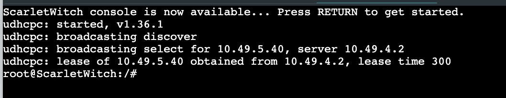

  Thor
  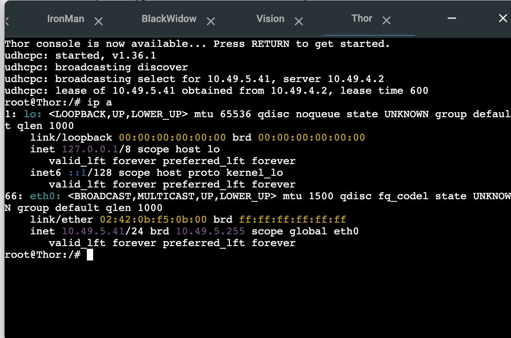


- Explanation

  Sama seperti sebelumnya. ScarletWitch dan Thor berada pada subnet `10.49.5.x`, sehingga pada subnet ini untuk mendapat 2 range tersebut dibuat seperti ini:
  ```bash
  subnet 10.49.5.0 netmask 255.255.255.0 {
      range 10.49.5.40 10.49.5.45;
      range 10.49.5.100 10.49.5.105;
      # ... dan seterusnya
  }
  ```

<br>

## Soal 6

> Berikan SpiderMan dan DoctorStrange alamat IP dalam rentang [Prefix IP].7.60 - [Prefix IP].7.65  dan [Prefix IP].7.110 - [Prefix IP].7.115

> _Give SpiderMan and DoctorStrange IP addresses in the ranges [IP Prefix].7.60 - [IP Prefix].7.65 and [IP Prefix].7.110 - [IP Prefix].7.115_

**Answer:**

- Screenshot

  SpiderMan
  

  DoctorStrange
  

- Explanation

  Sama seperti sebelumnya. SpiderMan dan DoctorStrange berada pada subnet `10.49.7.x`, sehingga pada subnet ini untuk mendapat 2 range tersebut dibuat seperti ini:
  ```bash
  subnet 10.49.5.0 netmask 255.255.255.0 {
      range 10.49.7.60 10.49.7.65;
      range 10.49.7.100 10.49.7.115;
      # ... dan seterusnya
  }
  ```

<br>

## Soal 7

> Tetapkan waktu peminjaman alamat IP pada DHCP server untuk client yang terhubung melalui Switch 2 selama 5 menit (Default), dan untuk client melalui Switch 5 selama 10 menit (Default). Tetapkan juga batas waktu peminjaman maksimal selama 2 jam.
> <br> </br>
> Tetapkan waktu peminjaman alamat IP pada DHCP server untuk client yang terhubung melalui Switch 1 dan Switch 3 selama 2 menit (Default). Tetapkan juga batas waktu peminjaman maksimal selama 100 menit.

<br>

> _Set the IP address lease period on the DHCP server for clients connected through Switch 2 to 5 minutes (default), and for clients connected through Switch 5 to 10 minutes (default). Also, set the maximum lease period to 2 hours._
> <br> </br>
> _Set the IP address lease time on the DHCP server for clients connected via Switch 1 and Switch 3 to 2 minutes (default). Also set the maximum lease time limit to 100 minutes._

**Answer:**

- Screenshot

  Switch2
  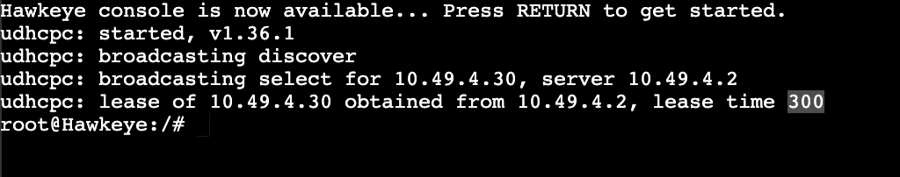

  Switch5
  


  Namun terjadi anomali pada bagian ini:
  - Switch1
    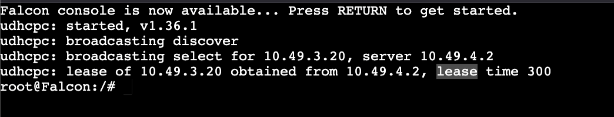

  - Switch3
    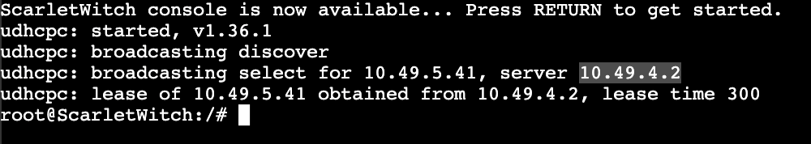

  Apa artinya? saya tidak tahu, kemungkinan yang terjadi adalah untuk subnet ini, 120 dioverwrite oleh system untuk selalu menjadi 300.

- Explanation

  Pada kasus ini Switch2, Switch5, Switch1, dan Switch3 secara berurutan adalah subnet `[prefix].4.x`, `[prefix].7.x`, `[prefix].3.x`, `[prefix].5.x` maka:
  1. Switch2 default 5 menit, Switch5 default 10 menit, dan keduanya memiliki batas waktu peminjaman maksimal selama 2 jam.
  2. Switch1 dan Switch3 default 2 menit dengan batas maksimal 100 menit

  Maka konfigurasinya adalah
  ```bash
  subnet 10.49.4.0 netmask 255.255.255.0 {
      default-lease-time 300;   # 5 menit = 300 detik
      max-lease-time 7200;      # 2 jam = 120 menit = 7200 detik
      #... dan seterusnya
  }

  subnet 10.49.7.0 netmask 255.255.255.0 {
      default-lease-time 600;   # 10 menit = 600 detik
      max-lease-time 7200;      # 2 jam = 120 menit = 7200 detik
      #... dan seterusnya
  }

  subnet 10.49.3.0 netmask 255.255.255.0 {
      default-lease-time 120;   # 2 menit = 120 detik
      max-lease-time 6000;      # 100 menit = 6000 detik
      #... dan seterusnya
  }

  subnet 10.49.5.0 netmask 255.255.255.0 {
      default-lease-time 120;   # 2 menit = 120 detik
      max-lease-time 6000;      # 100 menit = 6000 detik
      #... dan seterusnya
  }
  ```

<br>

## Soal 8

> Ubah konfigurasi DHCP Server agar Hawkeye, Thor, dan SpiderMan mendapatkan IP statis dengan [Prefix IP].x.7, namun masih menggunakan DHCP.

> _Change the DHCP Server configuration so that Hawkeye, Thor, and SpiderMan get static IPs with [Prefix IP].x.7, but still use DHCP._

**Answer:**

- Screenshot

  Hawkeye diberikan `prefix.7` via DHCP
  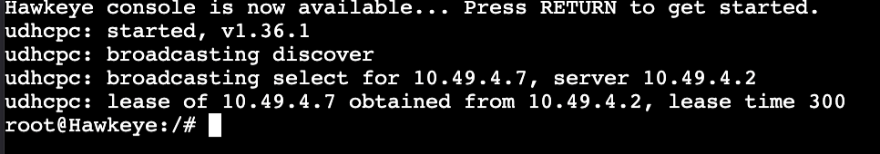

  Thor diberikan `prefix.7` via DHCP
  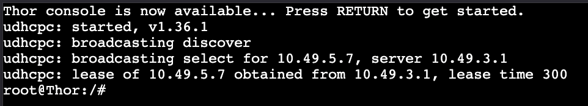

  Spiderman diberikan `prefix.7` via DHCP
  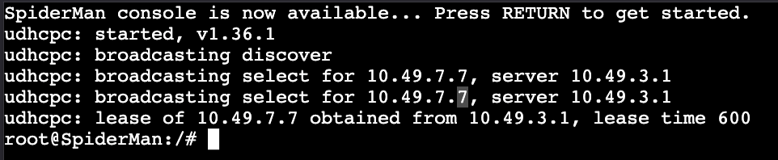


- Explanation

  Sebelumnya, saya izin mengganti soal sedikit dengan menggunakan IP lain karena `[prefix].x.7` adalah IP yang saya konfigurasikkan untuk node BlackWidow. Sehingga saya geser sedikit jadi akhiran `[prefix].x.7` untuk soal ini.

  Dengan itu, kasus ini akan kita selesaikan dengan menargetkan link hwadddress ethernet cable yang akan kita set selalu sama agar tidak berubah-ubah setiap kali project GNS3 dibuka/tutup.

  ```conf
  auto eth0
  iface eth0 inet dhcp
  hwaddress ether [address-yang-akan-digunakan]
  hostname [nama-host]
  ```

  Kemudian, pada DHCP server, kita buat khusus dengan config ini
  ```conf
  host Hawkeye {
      hardware ethernet 02:42:98:9c:14:00;
      fixed-address 10.49.4.7;
  }

  host Thor {
      hardware ethernet 02:42:0b:f5:0b:00;
      fixed-address 10.49.5.7;
  }

  host Spiderman {
      hardware ethernet 02:42:a8:f5:95:00;
      fixed-address 10.49.7.7;
  }
  ```

<br>

## Soal 9

> Buatlah konfigurasi DHCP Failover dengan WinterSoldier sebagai DHCP server backup untuk CaptainAmerica.

> _Create a DHCP Failover configuration with WinterSoldier as the backup DHCP server for CaptainAmerica._

**Answer:**

- Screenshot

  
  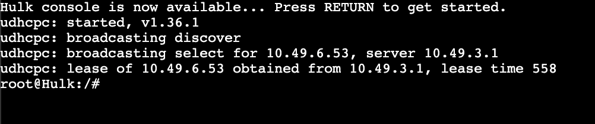
  Berdasarkan kedua gambar tersebut, karena menggunakan sistem failover, terkadang IP lease akan diberikan oleh server primary atau secondary karena saya terlanjur memberikan split index 128 (pembagian 50:50).
  >split index; This declaration defines a load balancing split between two peers. If a hash of the client'™s MAC address within a DHCP packet is less than index this server processes the DHCP packet; otherwise it drops it assuming its partner will handle it. The hash value is between 0 and 256 so a value of 256 means no load balancing while 128 means a 50-50 load balance split.

- Explanation

  Pada kasus ini, kita diminta agar CaptainAmerica menjadi server utama dan WinterSoldier sebagai backupnya dengan menggunakan konfigurasi failover. Sehingga, kita perlu ubah konfigurasinya pada `/etc/dhcp/dhcpd.conf`

  1. Konfigurasi CaptainAmerica
    ```conf
    failover peer "dhcp-failover" {
        primary;                     # CaptainAmerica sebagai server utama
        address 10.49.3.1;           # Alamat IP CaptainAmerica
        port 647;                    # Port yang digunakan untuk komunikasi failover
        peer address 10.49.4.2;      # Alamat IP WinterSoldier sebagai server cadangan
        peer port 647;               # Port untuk server cadangan
        max-response-delay 60;       # Waktu maksimum menunggu respon (detik)
        max-unacked-updates 10;      # Batas update yang belum terakui
        mclt 3600;                   # Waktu Maximum Client Lead Time (detik)
        split 128;
    }
    ```
  
  2. Konfigurasi WinterSoldier
    ```conf
    failover peer "dhcp-failover" {
        secondary;                    # WinterSoldier sebagai server cadangan
        address 10.49.4.2;            # Alamat IP WinterSoldier
        port 647;                     # Port yang digunakan untuk komunikasi failover
        peer address 10.49.3.1;       # Alamat IP CaptainAmerica sebagai server utama
        peer port 647;                # Port untuk server utama
    }
    ```

  3. Keduanya diikuti
    ```conf
    subnet 10.49.3.0 netmask 255.255.255.0 {
        option routers 10.49.3.4;
        option broadcast-address 10.49.3.255;
        option domain-name-servers 8.8.8.8, 1.1.1.1;
        default-lease-time 120;
        max-lease-time 6000;

        pool {
            failover peer "dhcp-failover";
            range 10.49.3.20 10.49.3.25;
        }
    }

    subnet 10.49.4.0 netmask 255.255.255.0 {
        option routers 10.49.4.4;
        option broadcast-address 10.49.4.255;
        option domain-name-servers 8.8.8.8, 1.1.1.1;
        default-lease-time 300;
        max-lease-time 7200;

        pool {
            failover peer "dhcp-failover";
            range 10.49.4.30 10.49.4.35;
        }
    }

    subnet 10.49.5.0 netmask 255.255.255.0 {
        option routers 10.49.5.5;
        option broadcast-address 10.49.5.255;
        option domain-name-servers 8.8.8.8, 1.1.1.1;
        default-lease-time 120;
        max-lease-time 6000;

        pool {
            failover peer "dhcp-failover";
            range 10.49.5.40 10.49.5.45;
            range 10.49.5.100 10.49.5.105;
        }
    }

    subnet 10.49.6.0 netmask 255.255.255.0 {
        option routers 10.49.6.5;
        option broadcast-address 10.49.6.255;
        option domain-name-servers 8.8.8.8, 1.1.1.1;
        default-lease-time 600;
        max-lease-time 7200;

        pool {
            failover peer "dhcp-failover";
            range 10.49.6.50 10.49.6.55;
        }
    }

    subnet 10.49.7.0 netmask 255.255.255.0 {
        option routers 10.49.7.6;
        option broadcast-address 10.49.7.255;
        option domain-name-servers 8.8.8.8, 1.1.1.1;
        default-lease-time 600;
        max-lease-time 7200;

        pool {
            failover peer "dhcp-failover";
            range 10.49.7.60 10.49.7.65;
            range 10.49.7.110 10.49.7.115;
        }
    }
    ```

  4. Lakukan restart pada keduanya
    ```bash
    service isc-dhcp-server restart
    ```
  
  Kemudian untuk menguji kinerja failover, kita bisa matikan server CaptainAmerica dan melihat dari mana lease diberikan saat kita menyalakan PC client.

<br>

## Soal 10

> Buatlah konfigurasi agar CaptainAmerica dan WinterSoldier berjalan dengan mode Load Balancing.

> _Create a configuration so that CaptainAmerica and WinterSoldier run in Load Balancing mode._

**Answer:**

- Screenshot

  `Put your screenshot in here`
  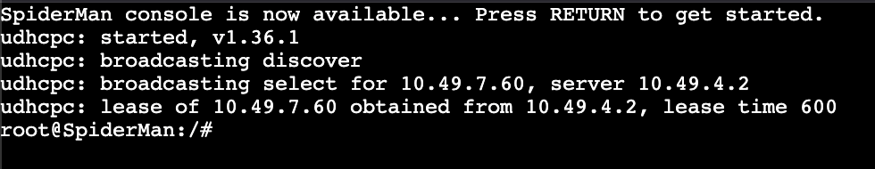
  Setelah dilakukan setup, maka salah satu hasilnya akan mengambiil dari salah satu server, nanti akan melakukan pergantian berdasarkan nilai dari:
  >load-balance-max-seconds x;	Serve other server's client requests if DHCP header "SECS" value is greater than x.

- Explanation

  Untuk mengganti menjadi mode loadbalancing, maka kita otak-atik lagi ygy di bagian `/etc/dhcp/dhcpd.conf` dengan isinya:

  1. Konfigurasi CaptainAmerica

    ```conf
    failover peer "dhcp-lb" {
        primary;
        address 10.49.3.1;
        port 647;
        peer address 10.49.4.2;
        peer port 647;
        max-response-delay 60;
        max-unacked-updates 10;
        mclt 3600;
        split 128;
        load balance max seconds 3;
    }
    ```

  2. Konfigurasi WinterSoldier
    ```conf
    failover peer "dhcp-lb" {
        secondary;
        address 10.49.4.2;
        port 647;
        peer address 10.49.3.1;
        peer port 647;
        max-response-delay 60;
        max-unacked-updates 10;
        load balance max seconds 3;
    }
    ```

  3. Keduanya diikuti

    ```conf
    subnet 10.49.3.0 netmask 255.255.255.0 {
        option routers 10.49.3.4;
        option broadcast-address 10.49.3.255;
        option domain-name-servers 8.8.8.8, 1.1.1.1;
        default-lease-time 120;
        max-lease-time 6000;

        pool {
            failover peer "dhcp-lb";
            range 10.49.3.20 10.49.3.25;
        }
    }

    subnet 10.49.4.0 netmask 255.255.255.0 {
        option routers 10.49.4.4;
        option broadcast-address 10.49.4.255;
        option domain-name-servers 8.8.8.8, 1.1.1.1;
        default-lease-time 300;
        max-lease-time 7200;

        pool {
            failover peer "dhcp-lb";
            range 10.49.4.30 10.49.4.35;
        }
    }

    subnet 10.49.5.0 netmask 255.255.255.0 {
        option routers 10.49.5.5;
        option broadcast-address 10.49.5.255;
        option domain-name-servers 8.8.8.8, 1.1.1.1;
        default-lease-time 120;
        max-lease-time 6000;

        pool {
            failover peer "dhcp-lb";
            range 10.49.5.40 10.49.5.45;
            range 10.49.5.100 10.49.5.105;
        }
    }

    subnet 10.49.6.0 netmask 255.255.255.0 {
        option routers 10.49.6.5;
        option broadcast-address 10.49.6.255;
        option domain-name-servers 8.8.8.8, 1.1.1.1;
        default-lease-time 600;
        max-lease-time 7200;

        pool {
            failover peer "dhcp-lb";
            range 10.49.6.50 10.49.6.55;
        }
    }

    subnet 10.49.7.0 netmask 255.255.255.0 {
        option routers 10.49.7.6;
        option broadcast-address 10.49.7.255;
        option domain-name-servers 8.8.8.8, 1.1.1.1;
        default-lease-time 600;
        max-lease-time 7200;

        pool {
            failover peer "dhcp-lb";
            range 10.49.7.60 10.49.7.65;
            range 10.49.7.110 10.49.7.115;
        }
    }

    host Hawkeye {
        hardware ethernet 02:42:98:9c:14:00;
        fixed-address 10.49.4.7;
    }

    host Thor {
        hardware ethernet 02:42:0b:f5:0b:00;
        fixed-address 10.49.5.7;
    }

    host Spiderman {
        hardware ethernet 02:42:a8:f5:95:00;
        fixed-address 10.49.7.7;
    }
    ```
  
  3. Restart kedua node
    ```bash
    service isc-dhcp-server restart
    ```
  
  Untuk mengujinya, kita bisa periksa alamat IP yang diberikan ke client. Client harus mendapatkan IP dari CaptainAmerica atau WinterSoldier secara bergantian.

<br>
  
## Problems

GNS kadang ngambek, ngehang semua, ngulang dari awal. Meskipun saya sudah mengerjakan secara ideal (catat & buat script sambil mengerjakan) tetap akan memakan waktu lama.

## Revisions (if any)

Mungkin nanti saya troubleshoot bagian nomor 7 untuk switch-switch yang bermasalah