[](https://classroom.github.com/a/e_s827HM)
| Name           | NRP        | Kelas     |
| :---:          | :---:      | :-------: |
| Bintang Ilham Pabeta | 5025241152 | A |


## Put your topology config image here!

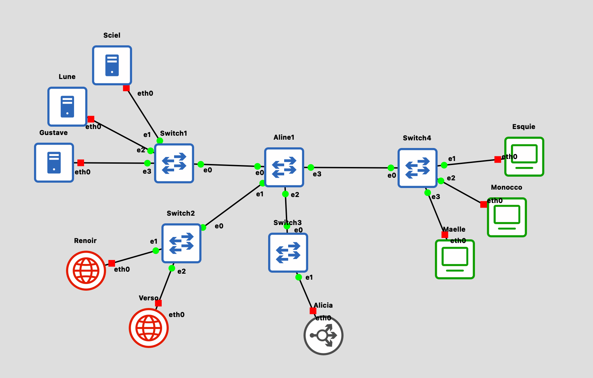

## Put your GNS3 Project file here!

##### [GNS3 Project File](src/praktikum-modul-3.gns3project)
##### [Config masing-masing node](config/)

<br>

## Soal 1

> Setup Topo

> _Document the results of the subnet grouping that has been created._

**Answer:**

- Screenshot

  

- Explanation

  Berdasarkan panduan soal karena semua IP dikonfigurasikan secara statis dengan pengelompokan subnet merujuk ke [panduan soal praktikum jarkom modul-3](https://docs.google.com/document/d/1WjMjAOECPLE9Hbooz5Ye60y1J33D3ATjaVehF8kb-ks/edit?tab=t.0)
  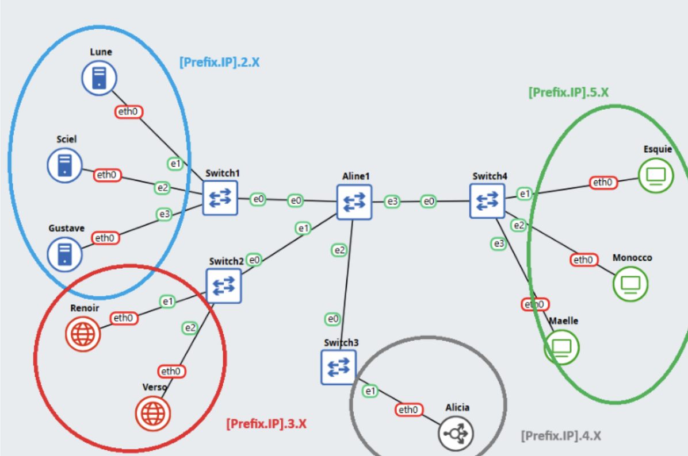

  Dengan pengelompokan IPnya sebagai berikut

  <table>
    <tr> <th>Komplek</th> <th>Node</th> <th>Byte-4</th> </tr>
    <tr> <td rowspan="3">10.49.2.x (Web-Server)</td> <td> <a href="src/Lune/">Lune</a> </td> <td>1</td> </tr>
    <tr> <td><a href="src/Sciel/">Sciel</a></td> <td>2</td> </tr>
    <tr> <td><a href="src/Gustave/">Gustave</a></td> <td>3</td> </tr>
    <tr> <td rowspan="2">10.49.3.x (DNS-Server)</td> <td><a href="src/Renoir/">Renoir</a></td> <td>1</td> </tr>
    <tr> <td><a href="src/Verso/">Verso</a></td> <td>2</td> </tr>
    <tr> <td>10.49.4.x (Loadbalancer)</td> <td><a href="src/Alicia/">Alicia</a></td> <td>1</td> </tr>
    <tr> <td rowspan="3">10.49.5.x (Client)</td> <td>Maelle</td> <td>1</td> </tr>
    <tr> <td>Monocco</td> <td>2</td> </tr>
    <tr> <td>Esquie</td> <td>3</td> </tr>
  </table>

  > Note:
  > Jangan lupa netmask 255.255.0.0 karena menggunakan switch
  > (IP antar node hanya sama di 16 bit pertama, byte ke-3 dan 4 beda).

<br>

## Soal 2

> Buatlah konfigurasi untuk domain 
> **lune33.com** → ke IP node Lune , 
> **sciel33.com** → ke IP node Sciel ,
> **gustave33.com** → ke IP node Gustave 
> pada DNS Master Renoir. Kemudian konfigurasikan node Verso sebagai DNS Slave yang bekerja untuk DNS Master Renoir.

> _Dns Configuration , on  the DNS Master (Renoir)_
> _lune33.com → IP of node Lune ,_
> _sciel33.com → IP of node Sciel ,_
> _gustave33.com → IP of node Gustave_
> _Configure Verso as the DNS Slave that works with DNS Master Renoir._

**Answer:**

- Screenshot

  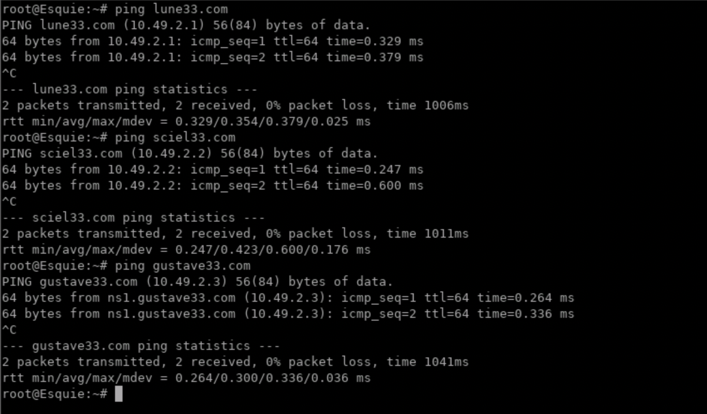

- Explanation

  Kita akan mengatur DNS server untuk mengarahkan nama-nama domain tersebut ke IP address dari node yang sudah ditentukan, maka kita bisa membuat konfigurasi pada DNS Master (Renoir) menggunakan `named.conf` yang isinya:

  ```conf
  options {
    directory "/myscripts/dns";
    listen-on { any; };
    allow-query { any; };
    allow-transfer { 10.49.3.2; }; # transfer ke slave (Verso)
  };

  zone "lune33.com" {
    type master;
    file "db.lune33";
  };

  zone "sciel33.com" {
    type master;
    file "db.sciel33";
  };

  zone "gustave33.com" {
    type master;
    file "db.gustave33";
  };
  ```

  Sedangkan untuk DNS Slave (Verso) `named.conf` berisikan:
  ```conf
  options {
      directory "/myscripts/dns";
      listen-on { any; };
      allow-query { any; };
  };

  zone "lune33.com" {
      type slave;
      file "db.lune33";
      masters { 10.49.3.1; };  # IP master (Renoir)
  };

  zone "sciel33.com" {
      type slave;
      file "db.sciel33";
      masters { 10.49.3.1; };
  };

  zone "gustave33.com" {
      type slave;
      file "db.gustave33";
      masters { 10.49.3.1; };
  };
  ```

  Pada Renoir jangan lupa dengan masing-masing file yang akan merujuk kepada IP address web server masing-masing di file `db.[namaserver]`
  > Note that di Verso nggak perlu buat karena udah ada file transfer dari Master

  1. `db.lune33`
    ```bash
    $TTL 86400
    @   IN  SOA ns1.lune33.com. admin.lune33.com. (
            1		    ; serial 
            3600        ; refresh
            1800        ; retry
            604800      ; expire
            86400       ; minimum
    )

    @   IN NS ns1.lune33.com.
    ns1 IN A 10.49.3.1

    @   IN A 10.49.2.1
    www IN CNAME lune33.com.
    ```
    Artinya pada zona `lune33.com` akan dikerjakan oleh NS `ns1.lune33.com` oleh DNS Master dan ketika ada traffic masuk ke zona tersebut, akan diarahkan ke IP Node Lune `10.49.2.1`, selebihnya untuk sciel dan gustave di bawah sama saja

  2. `db.sciel33`
    ```bash
    $TTL 86400
    @   IN  SOA ns1.sciel33.com. admin.sciel33.com. (
            1		    ; serial 
            3600        ; refresh
            1800        ; retry
            604800      ; expire
            86400       ; minimum
    )

    @   IN  NS ns1.sciel33.com.
    ns1 IN  A   10.49.3.1

    @   IN A 10.49.2.2
    www IN CNAME sciel33.com.
    ```

  3. `db.gustave33`
    ```bash
    $TTL 86400
    @   IN  SOA ns1.gustave33.com. admin.gustave33.com. (
            1		    ; serial 
            3600        ; refresh
            1800        ; retry
            604800      ; expire
            86400       ; minimum
    )

    @   IN NS ns1.gustave33.com.
    ns1 IN A  10.49.3.1

    @   IN A 10.49.2.3
    www IN CNAME gustave33.com
    ```


<br>

## Soal 3

> Tambahkan subdomain alias berupa exp.lune33.com yang mengarah ke alamat lune33.com dan exp.sciel33.com yang mengarah ke alamat sciel33.com (HINT: CNAME). Selain itu, tambahkan konfigurasi untuk melakukan reverse DNS lookup untuk domain gustave33.com

> _Subdomain Configuration,_ 
> _Add alias subdomains (HINT: CNAME)._
> _exp.lune33.com → alias to lune33.com_
> _exp.sciel33.com → alias to sciel33.com_
> _Also, configure reverse DNS lookup for the domain gustave33.com._

**Answer:**

- Screenshot

  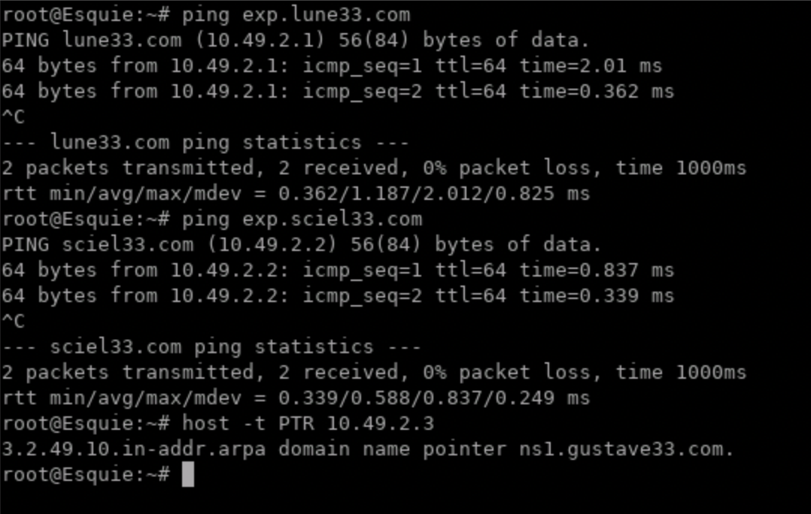

- Explanation

  Pada kasus pertama, memberi awalan exp untuk web lune dan sciel, kita hanya perlu menambahkan alias baru pada file `db.[namaserver]` yaitu
  ```bash
  exp IN  CNAME [alamat].
  ```

  Maka domain `exp.[alamat]` akan menjadi alias ke [alamat] tersebut, sehingga kurang lebih seperti ini

  ```bash
  exp IN  CNAME lune33.com.   ; untuk file db.lune33
  exp IN  CNAME sciel33.com.  ; untuk file db.sciel33
  ```

  Pada kasus kedua, reverse DNS lookup untuk domain `gustave33.com` bisa kita lakukan dengan cara menambahkan zona baru pada file `named.conf` DNS-server yang berupa ip address terbalik dari subnet Web-server.

  1. Renoir (DNS-master)
    ```conf
    zone "2.49.10.in-addr.arpa" {
        type master;
        file "db.2.49.10.in-addr.arpa";
    };
    ```

  2. Verso (DNS-slave)
    ```conf
    zone "2.49.10.in-addr.arpa" {
        type slave;
        file "db.2.49.10.in-addr.arpa";
        masters { 10.49.3.1; };
    };
    ```

  Baru akhirnya kita buat zona untuk reverse DNS yakni `db.2.49.10.in-addr.arpa` dengan PTR record 3 untuk mengarahkan request `10.49.2.3` ke nameserver `gustave33.com`
  ```asm
  $TTL 86400
  @   IN  SOA ns1.2.49.10.in-addr.arpa. admin.2.49.10.in-addr.arpa. (
          1          ; serial 
          3600       ; refresh
          1800       ; retry
          604800     ; expire
          86400      ; minimum
  )

  @   IN  NS ns1.gustave33.com. ; 
  3   IN  PTR gustave33.com.    ; 
  ```

  Cek reverse proxy menggunakan
  ```bash
  host -t PTR 10.49.2.3   # IP gustave
  ```

<br>

## Soal 4

> Buatlah subdomain berupa expedition.gustave33.com dan delegasikan subdomain tersebut dari Renoir ke Verso dengan alamat IP tujuan adalah node Gustave. Kemudian, matikan Renoir dan coba lakukan ping ke semua domain dan subdomain yang telah dikonfigurasikan pada nomor 2, 3, dan 4.

> _Create a subdomain expedition.gustave33.com and delegate it from Renoir to Verso, with the target IP being node Gustave.Then, turn off Renoir and try pinging all domains and subdomains configured in tasks 2, 3, and 4 to verify delegation works correctly._

**Answer:**

- Screenshot

  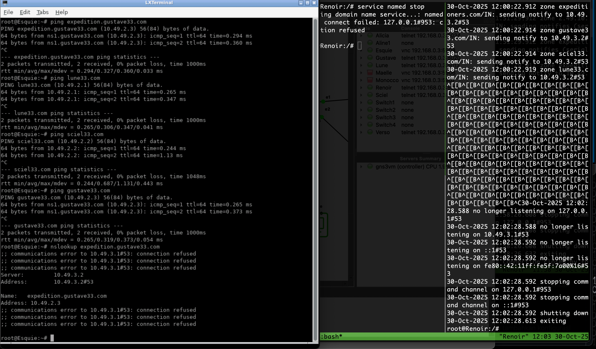

  Verso tetap bisa serve name server kepada client setelah DNS Renoir dimatikan (karena ada file transfer dari Renoir)

- Explanation

  Untuk membuat subdomain baru, kita hanya perlu untuk sedikit mengubah file zona pada DNS-server. Tetapi, kita akan mendelegasikannya dari Renoir ke Verso, sehingga langkah-langkahnya adalah sebagai berikut:
  
  1. Tambahkan 2 line pada `db.gustave33` di Renoir

    ```bash
    expedition IN NS ns1.expedition.gustave33.com.
    ns1.expedition IN A 10.49.3.2
    ```

  2. Pada Verso, kita tambahkan zona baru pada file `named.conf` sebagai master, karena zona ini didelegasikan oleh master Renoir untuk dikerjakan oleh Verso

    ```conf
    zone "expedition.gustave33.com" {
        type master;
        file "db.expedition.gustave33";
    };
    ```

  3. Membuat file zona `db.expedition.gustave33` yang berisi:
  
    ```asm
    $TTL 86400
    @   IN  SOA ns1.expedition.gustave33.com. admin.expedition.gustave33.com. (
            1          ; serial
            3600       ; refresh
            1800       ; retry
            604800     ; expire
            86400      ; minimum
    )

    @   IN  NS  ns1.expedition.gustave33.com.
    ns1 IN  A   10.49.3.2

    @   IN  A   10.49.2.3
    www IN  CNAME expedition.gustave33.com.
    ```

  Pada intinya, zona ini dimulai dari `db.gustave33` yang melayani subdomain `expedition` kepada nameserver `ns1.expedition.gustave33.com`. Nameserver tersebut dikerjakan oleh Verso dengan tujuan untuk mengarahkan permintaan expedition dari Renoir ke IP Verso `10.49.3.2`, kemudian diarahkan kepada web-server yang sebenarnya pada IP Gustave `10.49.2.3`.

<br>

## Soal 5

> Konfigurasi node Lune, Sciel, dan Gustave agar berfungsi sebagai web server Nginx yang akan menyajikan halaman profil, dimana halaman profil akan berbeda untuk setiap node. Dari folder berikut, gunakan profile_lune.html untuk menyajikan halaman profil di node Lune, profile_sciel.html untuk menyajikan halaman profil di node Sciel, dan profile_gustave.html untuk menyajikan halaman profil di node Gustave. Konfigurasikan Nginx di setiap node untuk menyimpan custom access log ke file /tmp/access.log dan error log ke file /tmp/error.log. 

> _Configure Lune, Sciel, and Gustave as Nginx web servers serving profile pages, where each node has a unique profile page:_
> _- Use profile_lune.html for Lune_
> _- Use profile_sciel.html for Sciel_
> _- Use profile_gustave.html for Gustave_
> _In each web server, Configure Nginx to store custom logs:_
> _- Access log: /tmp/access.log_
> _- Error log: /tmp/error.log_

**Answer:**

- Screenshot

  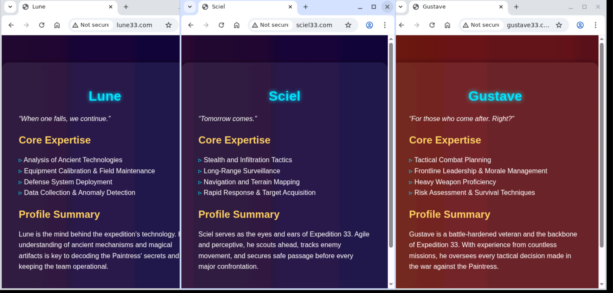
  Profil ketiga anggota Expedition 33 yang ditampilkan pada web masing-masing

- Explanation

  Kita akan melakukan setup web-server dengan menggunakan nginx, kita hanya perlu memasukkan web yang sudah ada placeholdernya dan membuat `nginx.conf` yang isinya:
  
  ```conf
  user www-data;
  worker_processes auto;
  worker_cpu_affinity auto;
  pid /tmp/nginx.pid;
  error_log /tmp/error.log;

  events { worker_connections 768; }

  http {
    server {
      listen 80;
      server_name [namaserver];
      
      access_log /tmp/access.log;
      root /myscripts/myweb;
      index profile_[node].html;
      
      location / {
        try_files $uri $uri/ =404;
      }
    }
  }
  ```

  Sesuaikan bagian `[namaserver]` dan `[node]` sesuai dengan bagian yang kita ubah.

<br>

## Soal 6

> Setelah website berhasil dideploy pada masing-masing node web server dan halaman dapat menampilkan profil yang sesuai,  buatlah custom access log ke file /tmp/access.log di masing-masing node web server menggunakan format log tertentu seperti di bawah:
> - Tanggal dan waktu akses dalam format standar log.
> - Nama node yang sedang diakses.
> - Alamat IP klien yang mengakses website.
> - Metode HTTP dan URI yang diakses oleh klien.
> - Status respons HTTP yang diberikan oleh server.
> - Jumlah byte yang dikirimkan dalam respons.
> - Waktu yang dihabiskan oleh server untuk menangani permintaan.
> - Contoh format log yang sesuai:
>   [01/Oct/2024:11:30:45 +0000] Jarkom Node Lune Access from 192.168.1.15 using method "GET /resep/bayam HTTP/1.1" returned status 200 with 2567 bytes sent in 0.038 seconds

> _After successfully deploying each website and verifying the correct profile page is displayed, create a custom access log in /tmp/access.log on each web server using the following format:_
> _- Date and time of access (standard log format)_
> _- Name of the node being accessed_
> _- IP address of the client accessing the website_
> _- HTTP method and URI accessed by the client_
> _- HTTP response status code_
> _- Number of bytes sent in the response_
> _- Time taken by the server to process the request_
> _- Example Log Format:_
> _[01/Oct/2024:11:30:45 +0000] Jarkom Node Lune Access from 192.168.1.15 using method "GET /resep/bayam HTTP/1.1" returned status 200 with 2567 bytes sent in 0.038 seconds_

**Answer:**

- Screenshot

  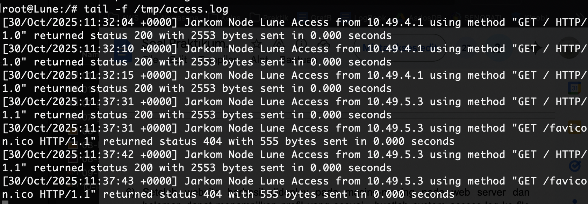

- Explanation

  Karena kita ingin custom log dengan urutan di atas, kita akan menggunakan variabel yang relevan dan merujuk pada [dokumentasi nginx](https://nginx.org/en/docs/http/ngx_http_log_module.html#access_log) 
  
  Kita akan pecah satu-satu permintaan soal berdasarkan hasil yang diiharapkan

  > [01/Oct/2024:11:30:45 +0000] Jarkom Node Lune Access from 192.168.1.15 using method "GET /resep/bayam HTTP/1.1" returned status 200 with 2567 bytes sent in 0.038 seconds

  - Tanggal dan waktu akses dalam format standar log - `'$time_local'`
  - Nama node yang sedang diakses - `'$hostname'` atau langsung tulis nama hostnya pada config nginx masing-masing (karena $hostname akan menghasilkan output kecil semua, ex: lune, renoir, gustave)
  - Alamat IP klien yang mengakses website. - `'$remote_addr'`
  - Metode HTTP dan URI yang diakses oleh klien. - `'$request'`
  - Status respons HTTP yang diberikan oleh server. - `'$status'`
  - Jumlah byte yang dikirimkan dalam respons. - `'$body_bytes_sent'`
  - Waktu yang dihabiskan oleh server untuk menangani permintaan. - `'$request_time'`
  
  Sehingga perubahan config untuk mengimplementasikan format log tersebut adalah dengan cara menambahkan 2 bagian ini:

  ```conf
  http {
    log_format  no6 '[$time_local] Jarkom Node $hostname Access from $remote_addr using method "$request" returned status $status with $body_bytes_sent bytes sent in $request_time seconds';
    # ... dan seterusnya

    server {
      access_log /tmp/access.log no6;
      # ... dan seterusnya
    }
  }
  ```

<br>

## Soal 7

> Gustave merupakan web server yang tidak disarankan untuk dilihat oleh publik. Maka dari itu, ubahlah konfigurasi nginx sehingga halaman profil Gustave menjadi hanya bisa di akses melalui port 8080 dan 8888.

> _The Gustave web server should not be publicly accessible.
Modify the Nginx configuration so that Gustave’s profile page can only be accessed through ports 8080 and 8888._

**Answer:**

- Screenshot

  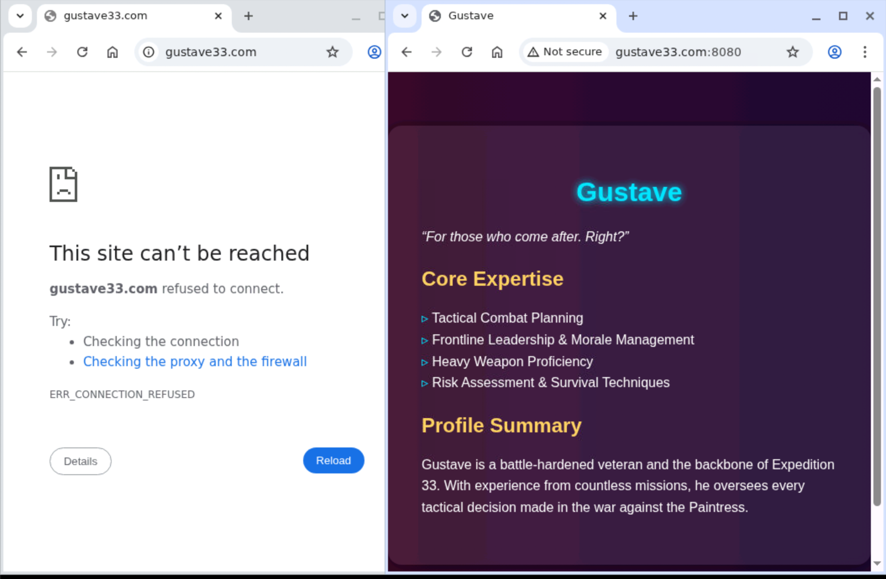
  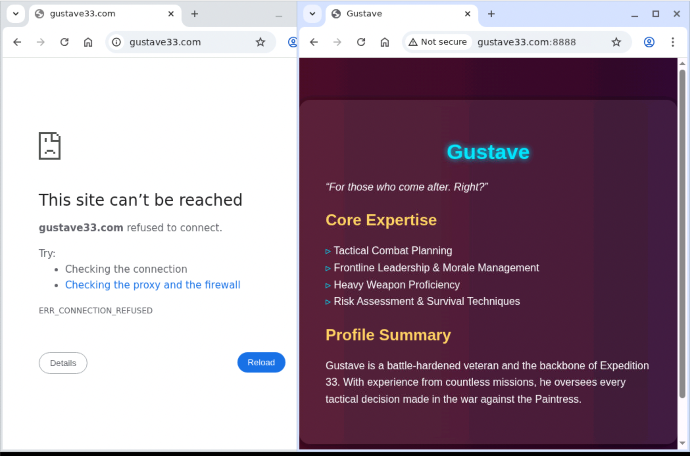
  
  Gustave hanya bisa menerima koneksi untuk 8080 dan 8888, ditolak pada panggilan `gustave33.com` karena port default menuju http (dan itu bukan bagian port yang digunakan)

- Explanation

  Kita hanya perlu mengganti bagian listen agar hanya menerima request dari port 8080, hal ini dapat dilakukan dengan membuat 2 bagian server pada nginx yang masing-masing hanya menerima koneksi dari port 8080 dan 8888.

  ```conf
  http {
    # ...

    server {
      listen 8080;
      listen 8888;
      
      root /myscripts/myweb;
      index profile_gustave.html;
      # ... dan seterusnya
    }
  }
  ```

<br>

## Soal 8

> Untuk mempermudah program ekspedisi, maka node Lune, Sciel, Gustave sepakat untuk membuat halaman informasi dengan konten yang sama. Maka dari itu, buatlah lagi 1 server block di dalam konfigurasi nginx yang akan menyajikan file HTML ini. Namun, mereka ingin menyajikan halaman informasi tersebut di port yang berbeda-beda, yaitu Lune menggunakan port 8000, Sciel menggunakan port 8100, dan Gustave menggunakan port 8200.

> _To simplify coordination for the expedition program, Lune, Sciel, and Gustave agree to create a shared information page with the same content. Add one more server block in each node’s Nginx configuration that serves this HTML file 
Each node should serve the information page on a different port:_
> _- Lune → port 8000_
> _- Sciel → port 8100_
> _- Gustave → port 8200_

**Answer:**

- Screenshot

  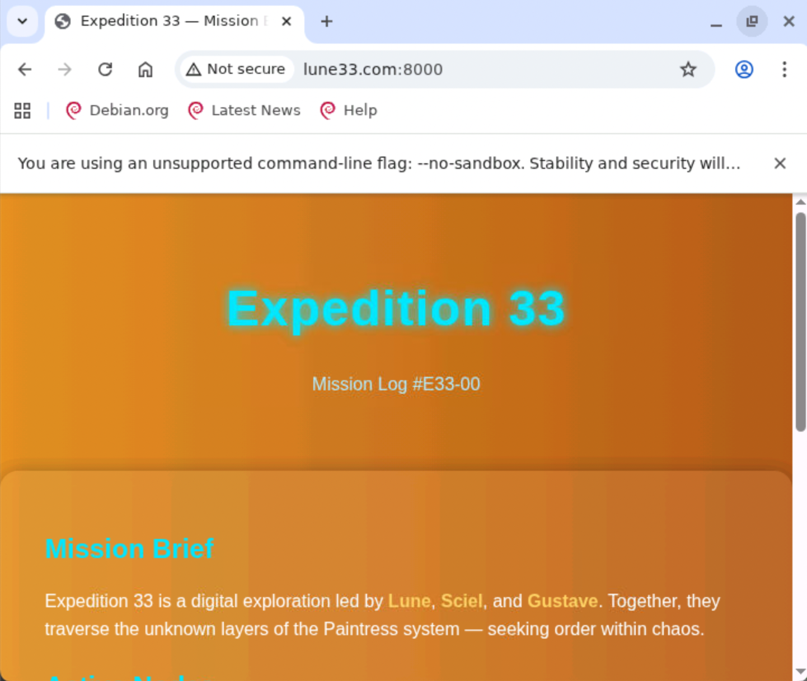
  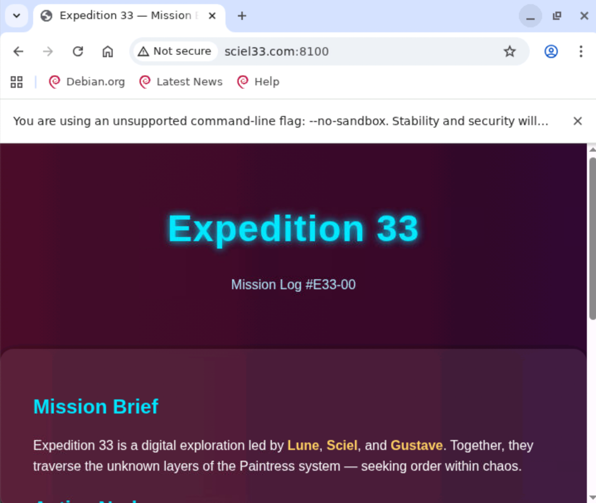
  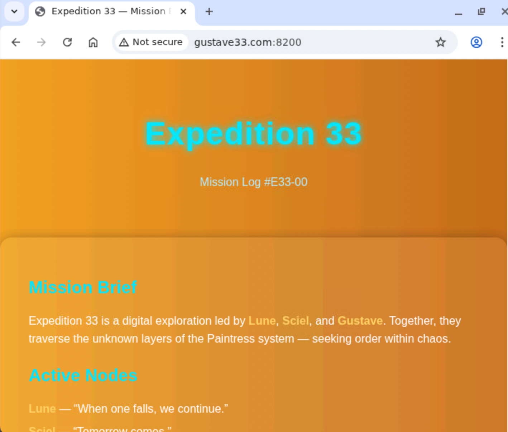

- Explanation

  Pada kasus ini, kami diminta untuk mengatur port yang digunakan untuk halaman info pada masing-masing web server, kita hanya perlu menambahkan sebuah server lagi dengan listen pada port yang sesuai. Kurang lebih hanya tinggal mengubah template ini:

  ```conf
  server {
      listen [port yang diminta];
      server_name [mamaserver];

      access_log /tmp/access.log no6;
      root /myscripts/myweb;
      index info.html;
      
      location / {
        try_files $uri $uri/ =404;
      }
  }
  ```

  Hanya perlu menyesuaikan dengan soal, yakni 
  > _- Lune → port 8000_
  > _- Sciel → port 8100_
  > _- Gustave → port 8200_

<br>

## Soal 9

> Untuk mempermudah akses ke profil tiap anggota ekspedisi, buatlah 1 domain lagi yaitu "expeditioners.com" yang akan mengarah ke Alicia. Lalu, untuk mencegah overload dari salah satu web server, konfigurasikan reverse proxy Alicia agar bisa forward request ke server yang sesuai berdasarkan URL profile yang diminta oleh klien dengan ketentuan sebagai berikut:
> -  Request untuk “expeditioners.com/profil_lune” harus dialihkan ke halaman profil web server Lune.
> -  Request untuk “expeditioners.com/profil_sciel” harus dialihkan ke halaman profil web server Sciel.
> -  Request untuk “expeditioners.com/profil_gustave” harus dialihkan ke halaman profil web server Gustave.
> Jika terdapat request ke URL selain profil yang ditentukan, reverse proxy akan mengalihkan ke halaman informasi pada web server Lune.

> _To make it easier to access each member’s profile, create a new domain “expeditioners.com” that points to Alicia. "
Configure Alicia’s reverse proxy (Nginx) to forward requests to the correct web server based on the requested URL, with the following rules:_
> _- Request URL expeditioners.com/profil_lune, Forward To Lune’s profile page_
> _- Request URL expeditioners.com/profil_sciel, Forward To Sciel’s profile page_
> _- Request URL expeditioners.com/profil_gustave, Forward To Gustave’s profile page_
> _- Any other URL, Forward To Lune’s information page_

**Answer:**

- Screenshot

  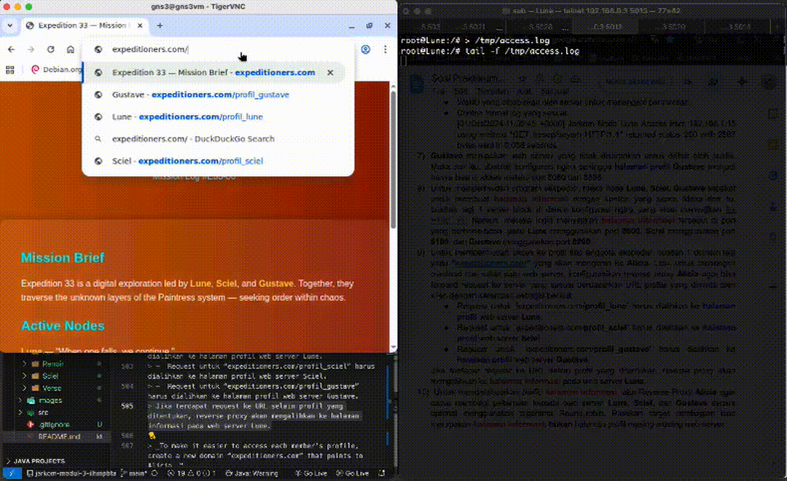

- Explanation

  Kita akan membuat zona `expeditioners.com` yang akan mengarah ke Alicia, dan Alicia akan menjadi reverse proxy yang akan melakukan passing kepada nameserver dengan port yang relevan untuk url-url tertentu, maka kurang lebih langkah-langkahnya seperti ini

  1. Bagian DNS
    Terdapat 2 bagiian yang berperan penting dalam mengerjakan DNS pada topologi ini, yakni DNS Master dan DNS Slave

    1. DNS-master Renoir
    Kita menambahkan zona baru sebagai master, yakni expeditioners.com pada `named.conf` seperti ini:
    ```conf
    zone "expeditioners.com" {
        type master;
        file "db.expeditioners";
    };
    ```

    Kemudian kita buat file `db.expeditioners` yang mengarahkan ke IP Alicia
    ```bash
    $TTL 86400
    @   IN  SOA www.expeditioners.com. admin.expeditioners.com. (
            1		    ; serial 
            3600        ; refresh
            1800        ; retry
            604800      ; expire
            86400       ; minimum
    )

    @   IN NS ns1.expeditioners.com.
    ns1 IN A 10.49.3.1

    @   IN A 10.49.4.1
    www IN CNAME expeditioners.com.
    ```


    2. DNS-slave Verso
      Karena semuanya sudah diatur pada DNS-master Renoir, maka kita tinggal menambahkan zona pada `named.conf` sebagai slave
      
      ```conf
      zone "expeditioners.com" {
            type slave;
            file "db.expeditioners";
            masters { 10.49.3.1; };
      };
      ```
  
  2. Bagian Web Alicia

    Alicia akan menjadi bagian yang mengatur kinerja `expeditioners.com`, maka kita atur pembagian urlnya dengan menggunakan proxy_pass

    ```conf
    user www-data;
    worker_processes auto;
    worker_cpu_affinity auto;
    pid /tmp/nginx.pid;
    error_log /tmp/error.log;

    events { worker_connections 768; }

    http {
        log_format  no6 '[$time_local] Jarkom Node $hostname Access from $remote_addr using method "$request" returned status $status with $body_bytes_sent bytes sent in $request_time seconds';
        
        server {
            listen 80;
            server_name expeditioners.com;
            access_log /tmp/access.log no6;

            location = / {
                proxy_pass http://10.49.2.1:8000/;
                proxy_set_header Host $host;
                proxy_set_header X-Real-IP $remote_addr;
            }

            location = /profil_lune {
                proxy_pass http://10.49.2.1:80/;
                proxy_set_header Host $host;
                proxy_set_header X-Real-IP $remote_addr;
            }

            location = /profil_sciel {
                proxy_pass http://10.49.2.2:80/;
                proxy_set_header Host $host;
                proxy_set_header X-Real-IP $remote_addr;
            }

            location = /profil_gustave {
                proxy_pass http://10.49.2.3:8080/;
                proxy_set_header Host $host;
                proxy_set_header X-Real-IP $remote_addr;
            }

            location / {
                rewrite ^ / last;
            }
        }
    }
    ```

    Setiap input akan diarahkan ke tempat yang bersesuaian

    1. `expeditioners.com` ke IP address Lune port 8000 (`info.html`)
    2. `expeditioners.com/profil_lune` ke IP address Lune port 80 (`profile_lune.html`)
    3. `expeditioners.com/profil_sciel`ke IP address Sciel port 80 (`profile_sciel.html`)
    4. `expeditioners.com/profil_gustave` ke IP address Gustave port 8080 (`profile_gustave.html`)
    5. Untuk kasus anomali seperti `expeditioners.com/profil_ijazah` maka akan masuk ke `location /` kemudiian direwrite menjadi path `/`.Sehingga mengarah kembali pada `location = /` yakni Profil di Node Lune.

<br>

## Soal 10

> Untuk mendistribusikan traffic halaman informasi, atur Reverse Proxy Alicia agar dapat membagi pekerjaan kepada web server Lune, Sciel, dan Gustave secara optimal menggunakan algoritma Round-robin. Pastikan target pembagian load merupakan halaman informasi, bukan halaman profil masing-masing web server.

> _To distribute traffic for the information page, configure the reverse proxy (Alicia) to use Round-robin load balancing between the three web servers: Lune, Sciel, and Gustave.
Ensure that only the information page is included in the load-balancing configuration - not the profile pages._

**Answer:**

- Screenshot

  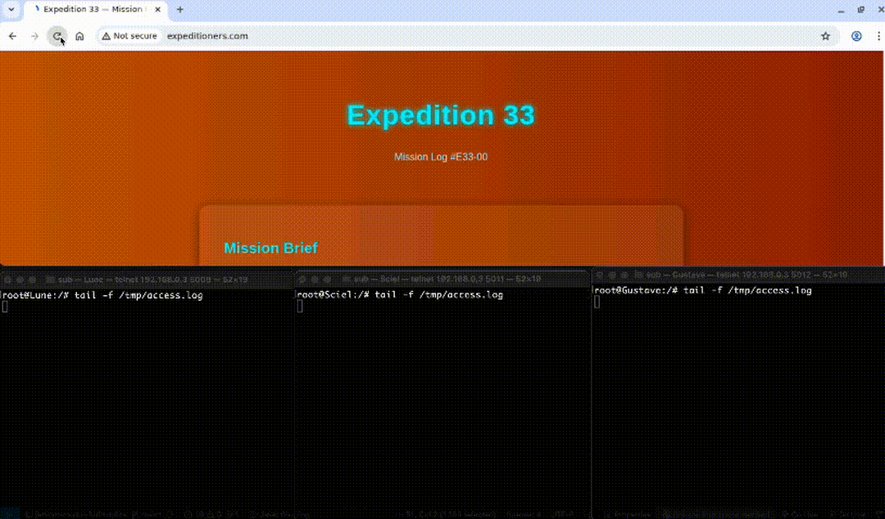

- Explanation

  Untuk melakukan loadbalancing secara round-robin, kita hanyya perlu memanfaatkan fitur dari nginx yakni dengan cara menambahkan line ini pada `nginx.conf` di Load-balancer Alicia

  ```conf
  http {
    # bagian yang akan dilakukan round-robin
    upstream roundrobinx {
        server 10.49.2.1:8000;
        server 10.49.2.2:8100;
        server 10.49.2.3:8200;
    }

    server {
      # ganti proxy_pass dari node Lune ke roundrobinx yang sudah dibuat
      location = / {
          proxy_pass http://roundrobinx/;
          proxy_set_header Host $host;
          proxy_set_header X-Real-IP $remote_addr;
      }

      # ...
    }
  }
  ```

  Maka client yang masuk ke server `expeditioners.com` akan secara berurutan mengunjungi
  1. `10.49.2.1:8000` - `info.html` Lune
  2. `10.49.2.2:8100` - `info.html` Sciel
  3. `10.49.2.3:8200` - `info.html` Gustave

<br>
  
## Problems
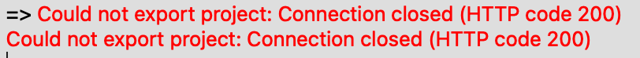

## Revisions (if any)
