[](https://classroom.github.com/a/oYnIPZ_t)
| Name           | NRP        | Kelas     |
| ---            | ---        | ----------|
| Bintang Ilham Pabeta | 5025241152 | A |


## Put your topology config image here!

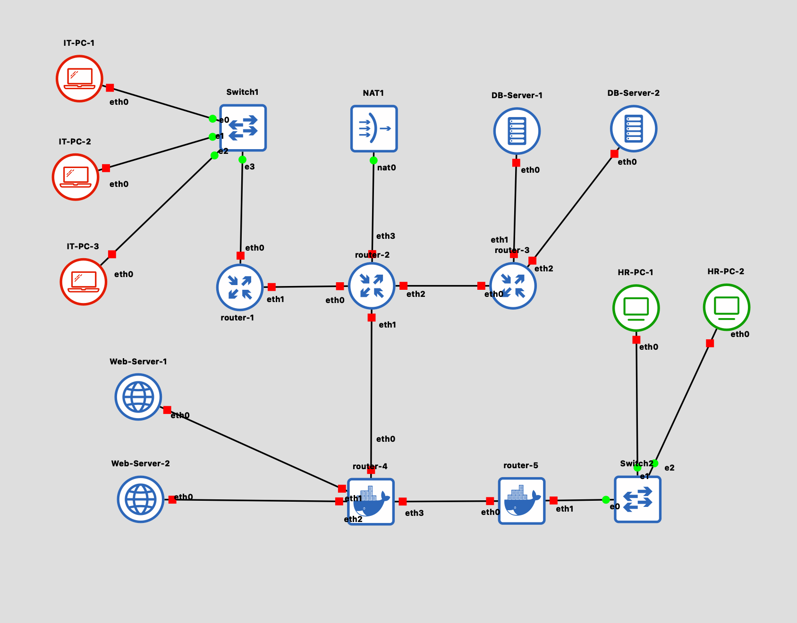

## Put your GNS3 Project file here!

[Praktikum-Modul-4.gns3project](src/jarkom-modul-4.gns3project)

<br>

## Soal 1

> Lakukan subnetting pada topologi diatas menggunakan metode VLSM: [Referensi](https://github.com/arsitektur-jaringan-komputer/Modul-Jarkom/tree/master/Modul-4/Subnetting#2-vlsm-variable-length-subnet-masking)  
*Cantumkan juga tabel dan diagram pembagian subnet pada laporan praktikum*.


> _Subnet the topology above using the VLSM method: [Reference](https://github.com/arsitektur-jaringan-komputer/Modul-Jarkom/tree/master/Modul-4/Subnetting#2-vlsm-variable-length-subnet-masking)_  
_Also include the subnet table and diagram in the lab report._

**Answer:**

- Screenshot

  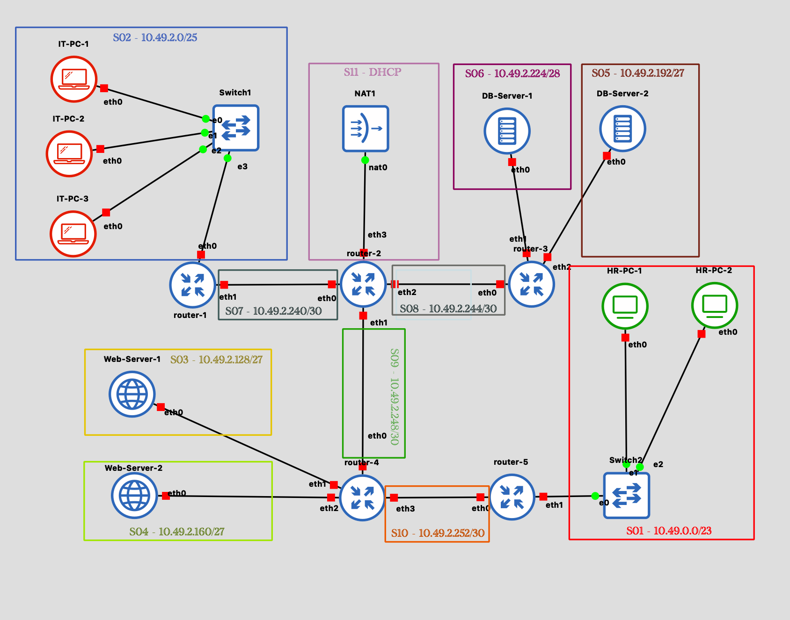

- Explanation

  Pada kasus ini, berasarkan jalur-jalur yang ada, kita memiliki 11 (10 + NAT) subnet dengan jumlah Host yang berbeda-beda, antara lain:

  <table>
    <thead>
      <tr><th>Subnet</th><th>Host</th><th>Jumlah</th><th>Total</th><th>Netmask</th><th>Jumlah IP (2<sup>32-SM</sup>-2)</th></tr>
    </thead>
    <tbody>
      <tr><td rowspan="4">Switch 1</td><td>IT-PC-1</td><td>50</td><td rowspan="4">116</td><td rowspan="4">/25</td><td rowspan="4">126</td></tr>
      <tr><td>IT-PC-2</td><td>25</td></tr>
      <tr><td>IT-PC-3</td><td>40</td></tr>
      <tr><td>Router 1 (eth0)</td><td>1</td></tr>
      <tr><td rowspan="2">R1 - R2</td><td>Router 1 (eth1)</td><td>1</td><td rowspan="2">2</td><td rowspan="2">/30</td><td rowspan="2">2</td></tr>
      <tr><td>Router 2 (eth0)</td><td>1</td></tr>
      <tr><td rowspan="2">R2 - R3</td><td>Router 2 (eth2)</td><td>1</td><td rowspan="2">2</td><td rowspan="2">/30</td><td rowspan="2">2</td></tr>
      <tr><td>Router 3 (eth0)</td><td>1</td></tr>
      <tr><td rowspan="2">R3 - DBS1</td><td>Router 3 (eth1)</td><td>1</td><td rowspan="2">13</td><td rowspan="2">/28</td><td rowspan="2">14</td></tr>
      <tr><td>DB-Server-1</td><td>12</td></tr>
      <tr><td rowspan="2">R3 - DBS2</td><td>Router 3 (eth2)</td><td>1</td><td rowspan="2">19</td><td rowspan="2">/27</td><td rowspan="2">30</td></tr>
      <tr><td>DB-Server-2</td><td>18</td></tr>
      <tr><td rowspan="2">R2 - R4</td><td>Router 2 (eth1)</td><td>1</td><td rowspan="2">2</td><td rowspan="2">/30</td><td rowspan="2">2</td></tr>
      <tr><td>Router 4 (eth0)</td><td>1</td></tr>
      <tr><td rowspan="2">R4 - WS1</td><td>Router 4 (eth1)</td><td>1</td><td rowspan="2">26</td><td rowspan="2">/27</td><td rowspan="2">30</td></tr>
      <tr><td>Web Server 1</td><td>25</td></tr>
      <tr><td rowspan="2">R4 - WS2</td><td>Router 4 (eth2) </td><td>1</td><td rowspan="2">21</td><td rowspan="2">/27</td><td rowspan="2">30</td></tr>
      <tr><td>Web Server 2</td><td>20</td></tr>
      <tr><td rowspan="2">R4 - R5</td><td>Router 4 (eth3)</td><td>1</td><td rowspan="2">2</td><td rowspan="2">/30</td><td rowspan="2">2</td></tr>
      <tr><td>Router 5 (eth0)</td><td>1</td></tr>
      <tr><td rowspan="3">Switch 2</td><td>Router 5 (eth1)</td><td>1</td><td rowspan="3">451</td><td rowspan="3">/23</td><td rowspan="3">510</td></tr>
      <tr><td>HR-PC-1</td><td>250</td></tr>
      <tr><td>HR-PC-2</td><td>200</td></tr>
      <tr><td rowspan="2">R2 - NAT</td><td>Router 2 (eth3)</td><td>1</td><td rowspan="2">2</td><td rowspan="2">/30</td><td rowspan="2">2</td></tr>
      <tr><td>NAT</td><td>1</td></tr>
    </tbody>
  </table>

  Pada dasarnya, jumlah host yang bisa digunakan adalah 2^32-netmask^ - 2 (2 dari Network ID dan Broadcast), sehingga kita gunakan formula tersebut untuk menentukan VLSM (Variable Length Subnet Mask) pada masing-masing subnet. Kemudian kita akan menentukan masing-masing network ID dari setiap subnet yang kita buat. Subnet yang kita miliki dari urutan terbesar ke terkecil adalah:

  ```txt
  23 - 25 - 27 - 27 - 27 - 28 - 30 - 30 - 30 - 30 - N/A
  ```

  > Subnet diurutkan dari terbesar ke terkecil untuk meminimalkan fragmentasi address space, sesuai prinsip VLSM.

  > Terkait N/A adalah subnet yang tidak termasuk hitungan VLSM, pada kasus ini adalah pada hubungan antara Router 2 - NAT yang akan diselesaikan dengan DHCP dari NAT.

  Sehingga kita buat sebuah urutan subnetting yang dimulai dari `10.49.0.0/16` dan akan kita berikan sebuah penamaan Subnet1-Subnet11 (S01-S11).

  <table>
    <thead>
      <tr> <th>Serial</th> <th>Nama Subnet</th> <th>Network ID / Netmask</th> <th>Broadcast</th> <th>Usable Range</th> </tr>
    </thead>
    <tbody>
      <tr><td>S01</td><td>Switch 2</td><td>10.49.0.0 /23</td><td>10.49.1.255</td><td>10.49.0.1 - 10.49.1.254</td></tr>
      <tr><td>S02</td><td>Switch 1</td><td>10.49.2.0 /25</td><td>10.49.2.127</td><td>10.49.2.1 - 10.49.2.126</td></tr>
      <tr><td>S03</td><td>R4 - WS1</td><td>10.49.2.128 /27</td><td>10.49.2.159</td><td>10.49.2.129 - 10.49.2.158</td></tr>
      <tr><td>S04</td><td>R4 - WS2</td><td>10.49.2.160 /27</td><td>10.49.2.191</td><td>10.49.2.161 - 10.49.2.190</td></tr>
      <tr><td>S05</td><td>R3 - DBS2</td><td>10.49.2.192 /27</td><td>10.49.2.223</td><td>10.49.2.193 - 10.49.2.222</td></tr>
      <tr><td>S06</td><td>R3 - DBS1</td><td>10.49.2.224 /28</td><td>10.49.2.239</td><td>10.49.2.225 - 10.49.2.238</td></tr>
      <tr><td>S07</td><td>R1 - R2</td><td>10.49.2.240 /30</td><td>10.49.2.243</td><td>10.49.2.241 - 10.49.2.242</td></tr>
      <tr><td>S08</td><td>R2 - R3</td><td>10.49.2.244 /30</td><td>10.49.2.247</td><td>10.49.2.245 - 10.49.2.246</td></tr>
      <tr><td>S09</td><td>R2 - R4</td><td>10.49.2.248 /30</td><td>10.49.2.251</td><td>10.49.2.249 - 10.49.2.250</td></tr>
      <tr><td>S10</td><td>R4 - R5</td><td>10.49.2.252 /30</td><td>10.49.2.255</td><td>10.49.2.253 - 10.49.2.254</td></tr>
      <tr><td>S11</td><td>R2 - NAT</td><td>N/A</td><td>N/A</td><td>N/A</td></tr>
    </tbody>
  </table>

  Sehingga hasil akhir IP berdasarkan jumlah host di masing-masing subnetnya adalah:

  <table>
    <thead>
      <tr> <th>Serial</th> <th>Nama Host</th> <th>Jumlah Host</th> <th>Interface</th> <th>IP Range Host</th> </tr>
    </thead>
    <tbody>
      <tr><td rowspan="3">S01</td><td>Router 5</td><td>1</td><td>eth1</td><td>10.49.0.1</td></tr>
      <tr><td>HR-PC-1</td><td>250</td><td>eth0</td><td>10.49.0.2 - 10.49.0.251</td></tr>
      <tr><td>HR-PC-2</td><td>200</td><td>eth0</td><td>10.49.0.252 - 10.49.1.195</td></tr>
      <tr><td rowspan="4">S02</td><td>Router 1</td><td>1</td><td>eth0</td><td>10.49.2.1</td></tr>
      <tr><td>IT-PC-1</td><td>50</td><td>eth0</td><td>10.49.2.2 - 10.49.2.51</td></tr>
      <tr><td>IT-PC-2</td><td>25</td><td>eth0</td><td>10.49.2.52 - 10.49.2.76</td></tr>
      <tr><td>IT-PC-3</td><td>40</td><td>eth0</td><td>10.49.2.77 - 10.49.2.116</td></tr>
      <tr><td rowspan="2">S03</td><td>Router 4</td><td>1</td><td>eth1</td><td>10.49.2.129</td></tr>
      <tr><td>Web Server 1</td><td>25</td><td>eth0</td><td>10.49.2.130 - 10.49.2.154</td></tr>
      <tr><td rowspan="2">S04</td><td>Router 4</td><td>1</td><td>eth2</td><td>10.49.2.161</td></tr>
      <tr><td>Web Server 2</td><td>20</td><td>eth0</td><td>10.49.2.162 - 10.49.2.181</td></tr>
      <tr><td rowspan="2">S05</td><td>Router 3</td><td>1</td><td>eth2</td><td>10.49.2.193</td></tr>
      <tr><td>DB-Server-2</td><td>18</td><td>eth0</td><td>10.49.2.194 - 10.49.2.211</td></tr>
      <tr><td rowspan="2">S06</td><td>Router 3</td><td>1</td><td>eth1</td><td>10.49.2.225</td></tr>
      <tr><td>DB-Server-1</td><td>12</td><td>eth0</td><td>10.49.2.226 - 10.49.2.237</td></tr>
      <tr><td rowspan="2">S07</td><td>Router 1</td><td>1</td><td>eth1</td><td>10.49.2.241</td></tr>
      <tr><td>Router 2</td><td>1</td><td>eth0</td><td>10.49.2.242</td></tr>
      <tr><td rowspan="2">S08</td><td>Router 2</td><td>1</td><td>eth2</td><td>10.49.2.245</td></tr>
      <tr><td>Router 3</td><td>1</td><td>eth0</td><td>10.49.2.246</td></tr>
      <tr><td rowspan="2">S09</td><td>Router 2</td><td>1</td><td>eth1</td><td>10.49.2.249</td></tr>
      <tr><td>Router 4</td><td>1</td><td>eth0</td><td>10.49.2.250</td></tr>
      <tr><td rowspan="2">S10</td><td>Router 4</td><td>1</td><td>eth3</td><td>10.49.2.253</td></tr>
      <tr><td>Router 5</td><td>1</td><td>eth0</td><td>10.49.2.254</td></tr>
      <tr><td rowspan="2">S11</td><td>Router 2</td><td>1</td><td>eth3</td><td>N/A</td></tr>
      <tr><td>NAT</td><td>1</td><td>nat0</td><td>N/A</td></tr>
    </tbody>
  </table>

  > Catatan
  > Hanya IP paling awal yang digunakan dalam sebuah node untuk tiap-tiap range IP (karena hanya representasi)
  > (misal, 10.49.0.2 - 10.49.0.251, maka IP dari Host adalah 10.49.0.2)
<br>

## Soal 2

> Buatlah agar router-2 dapat melakukan koneksi ke internet. [Dapat menggunakan static routing].

> _Make sure router-2 can connect to the internet. [Can use static routing]._

**Answer:**

- Screenshot

  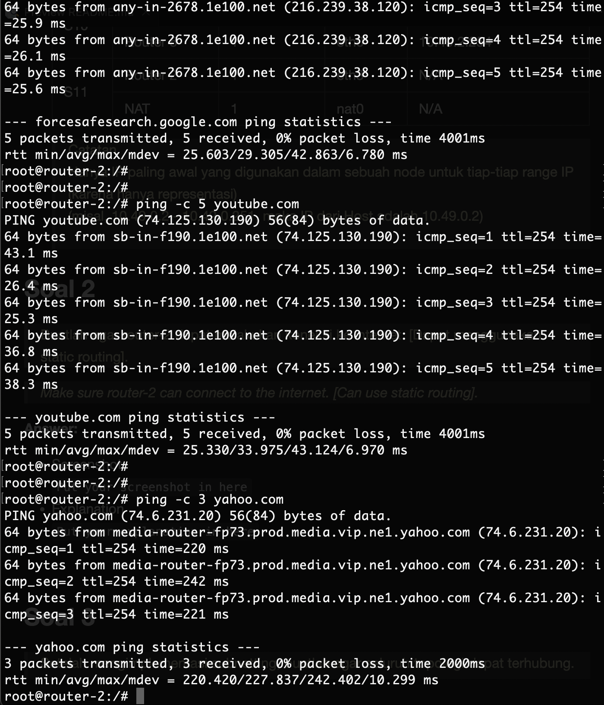

- Explanation

  Untuk pemberian akses internet pada router yang terhubung dengan NAT, cara mengerjakannya bisa dilakukan seperti pada saat materi static routing. Bisa dilakukan dengan menggunakan DHCP pada koneksi terhadap NAT (eth3 - nat0).

<br>

## Soal 3

> Setelah mengimplementasi subnetting, buatlah agar seluruh topologi dapat terhubung. Lakukan Dynamic Routing pada topologi tersebut.
*Pastikan seluruh node yang ada dapat mengakses internet*.

> _After implementing subnetting, ensure the entire topology is connected. Perform dynamic routing on the topology._  
_Ensure all existing nodes can access the internet._

**Answer:**

- Screenshot

  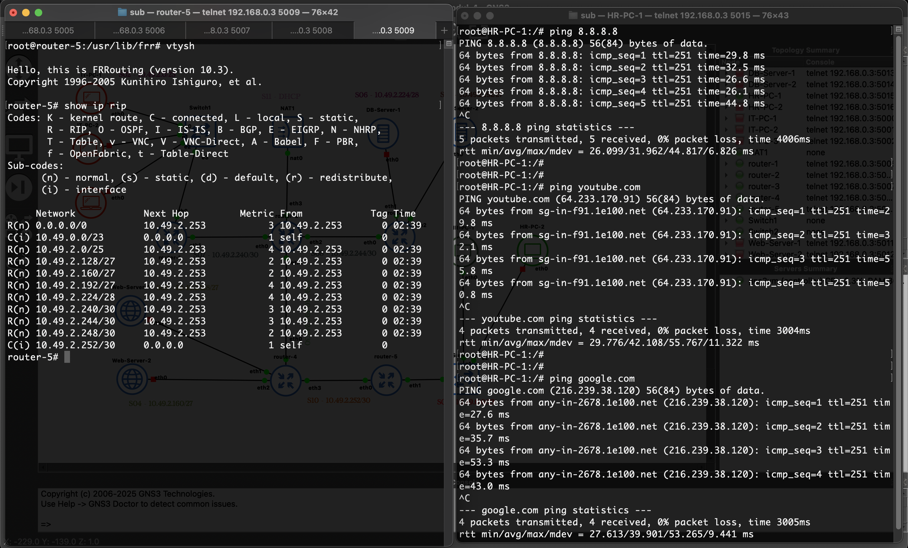

- Explanation

  Berdasarkan pembagian subnet sebelumnya, maka kita akan memberikan FRR RIP yang sesuai dengan network-network sebelahnya, maka dari itu kita akan lakukan:

  ```bash
  cd /usr/lib/frr
  ./zebra -d
  ./ripd -d
  ./mgmtd -d
  vtysh
  conf t
  router rip
  ```

  Kemudian kita berikan routing berupa NID/Netmask sesuai dengan subnet yang berhubungan/bersebelahan langsung dengan masing-masing router

  ```bash
  # config pada router-1
  network 10.49.2.240/30
  network 10.49.2.0/25

  # config pada router-2
  network 10.49.2.240/30
  network 10.49.2.244/30
  network 10.49.2.248/30

  # config pada router-3
  network 10.49.2.192/27
  network 10.49.2.224/28
  network 10.49.2.244/30

  # config pada router-4
  network 10.49.2.128/27
  network 10.49.2.160/27
  network 10.49.2.248/30
  network 10.49.2.252/30

  # config pada router-5
  network 10.49.0.0/23
  network 10.49.2.252/30
  ```

  Kemudian untuk router-2 sebagai jalan keluar, maka akan dijadikan jalan keluar default (karena terhubung dengan NAT)

  ```bash
  ip route add default via 192.168.122.1 dev eth3
  ```

  Setelah dibuat sebuah route default, maka masukkan ke dalam FRR via RIP (`vtysh` -> `conf t` -> `router-rip`)
  
  ```bash
  default-information originate
  ```

  Hal ini adalah sebuah pesan RIP seolah seperti

  > Router 2:
  > "Jika kalian tidak tau mau ke mana, kirim paket ke sini aja!"

  Router lain tidak perlu diberi default route manual karena RIP akan menerima prefix 0.0.0.0/0 dari Router-2 setelah default-information originate diterapkan.

<br>

## Soal 4

> Lakukan setup web server dengan file html di attachment berikut: [ Attachment ](https://drive.google.com/file/d/199qwfTNJCkxDV7mdO-MsaDdApkmKsnAG/view?usp=sharing)  menggunakan nginx pada “Web-Server-1” dan “Web-Server-2”.  
*Config dibebaskan kepada praktikkan dengan catatan menggunakan port 80*.

> _Set up a web server with the HTML file in the following attachment: [ Attachment ](https://drive.google.com/file/d/199qwfTNJCkxDV7mdO-MsaDdApkmKsnAG/view?usp=sharing) using nginx on “Web-Server-1” and “Web-Server-2”._
_Configuration is free to practice, but note that it uses port 80._

**Answer:**

- Screenshot

  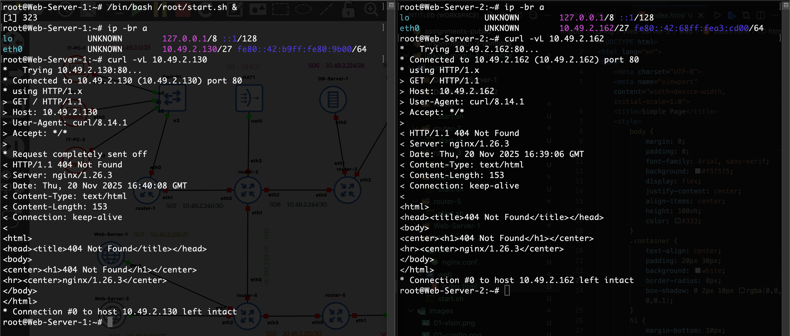

- Explanation

  Kita akan menggunakan config standar dalam pembuatan sebuah web server (kurang lebih sama dengan modul-3). Konfigurasi ini akan menerima koneksi hanya dari port 80.

  ```
  user www-data;
  worker_processes auto;
  worker_cpu_affinity auto;
  pid /tmp/nginx.pid;
  error_log /tmp/error.log;

  events { worker_connections 768; }

  http {
      log_format  mod3 '[$time_local] Jarkom Node $hostname Access from $remote_addr using method "$request" returned status $status with $body_bytes_sent bytes sent in $request_time seconds';
      
      server {
          listen 80;
          server_name ws1.com;

          access_log /tmp/access.log mod3;
          root /root/web;
          index index.html;

          location / {
          try_files $uri $uri/ =404;
          }
      }
  }
  ```

<br>

## Soal 5

> Kalian diminta untuk melakukan drop semua paket TCP yang masuk  ke subnet HR dengan port 1337 dan 4444. Lakukan testing dengan netcat.

> _You are asked to drop all incoming TCP packets to the HR subnet with ports 1337 and 4444. Test with netcat._

**Answer:**

- Screenshot

  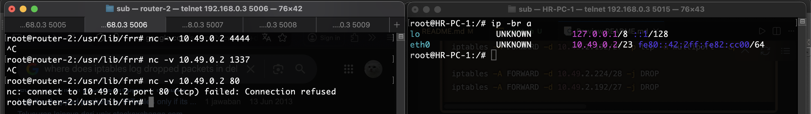

  Pada port yang dilarang, maka permintaan tidak diteruskan ke HR-PC-1 dan tidak ada kabar kembali.

  

  Contoh lain yang lebih mencolok ^^

- Explanation

  Pada kasus ini, kita akan menolah semua packet yang masuk menggunakan port 1337 dan 4444 untuk menuju subnet HR (S01 - 10.49.0.0/23). Untuk itu, kita akan berikan sebuah firewall yang akan melakukan drop paket dengan port tersebut menuju subnet yang bersangkutan pada router yang paling dekat dengan subent tersebut:

  **Router-5**

  ```bash
  iptables -A FORWARD -d 10.49.0.0/23 -p tcp -m multiport --dports 1337,4444 -j DROP
  ```

  Kemudian, kita bisa menguji hasilnya dengan menggunakan netcat ke IP salah satu host pada subnet tersebut (misalnya HR-PC-1)

  ```bash
  nc 10.49.0.2 1337
  nc 10.49.0.2 4444
  ```

  Maka hasilnya akan gagal, seperti pada jawaban screenshot pada soal ini. Netcat pada port lain (misal 80) tetap berhasil sampaii ke host.

<br>

## Soal 6

> Lakukan pembatasan sehingga koneksi SSH pada semua Web Server hanya dapat dilakukan oleh user yang berada pada node IT-PC-1, IT-PC-2, dan IT-PC-3. 

> _Implement restrictions so that SSH connections to all Web Servers can only be made by users on nodes IT-PC-1, IT-PC-2, and IT-PC-3._

**Answer:**

- Screenshot

  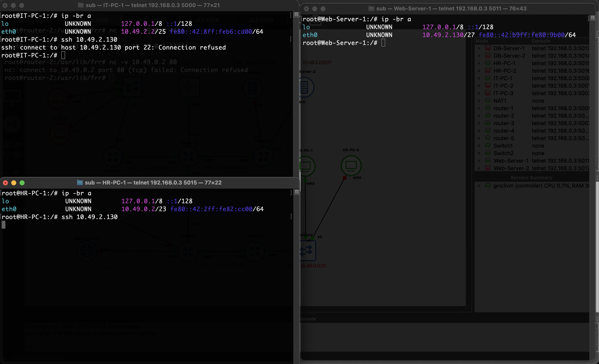

  Bisa dilihat, pada IT-PC ssh ditolak (karena SSH belum disetting), tetapi pada HR-PC permintaan tidak dikembalikan (maka dapat disimpulkan berhasil drop di router)

- Explanation

  Pada kasus ini, kita akan membatasi koneksi pada port SSH (TCP 22) hanya masuk dari subnet IT-PC (S02 - 10.49.2.0) dan akan menolak koneksi SSH dari subnet lain, maka kita bisa lakukan firewall pada router terdekat terhadap web-server:

  **Router-4**

  ```bash
  iptables -A FORWARD -s 10.49.2.0/25 -d 10.49.2.128/27 -p tcp --dport 22 -j ACCEPT
  iptables -A FORWARD -s 10.49.2.0/25 -d 10.49.2.160/27 -p tcp --dport 22 -j ACCEPT

  # selain itu, tolak ssh dari subnet lain
  iptables -A FORWARD -d 10.49.2.128/27 -p tcp --dport 22 -j DROP
  iptables -A FORWARD -d 10.49.2.160/27 -p tcp --dport 22 -j DROP
  ```

  Maka, setiap ada koneksi masuk ke arah subnet kedua web-server:
  1. Jika port 22 (ssh) masuk ke web-server dan berasal dari subnet 10.49.2.0 maka izinkan
  2. Else, port 22 (ssh) masuk ke subnet web-server akan di drop.

  Sehingga pada kasus ini, hanya port ssh dari subnet IT-PC yang akan sampai ke subnet web-server.

<br>

## Soal 7

> Semua subnet hanya dapat mengakses semua DB-Server pada port 80 dan 443 (DB-Server-1 dan DB-Server-2) pada hari Senin-Sabtu, pukul 07:00- 22:00.

> _All subnets can only access all DB-Servers on ports 80 and 443 (DB-Server-1 and DB-Server-2) on Monday-Saturday, 07:00-22:00._

**Answer:**

- Screenshot

  | 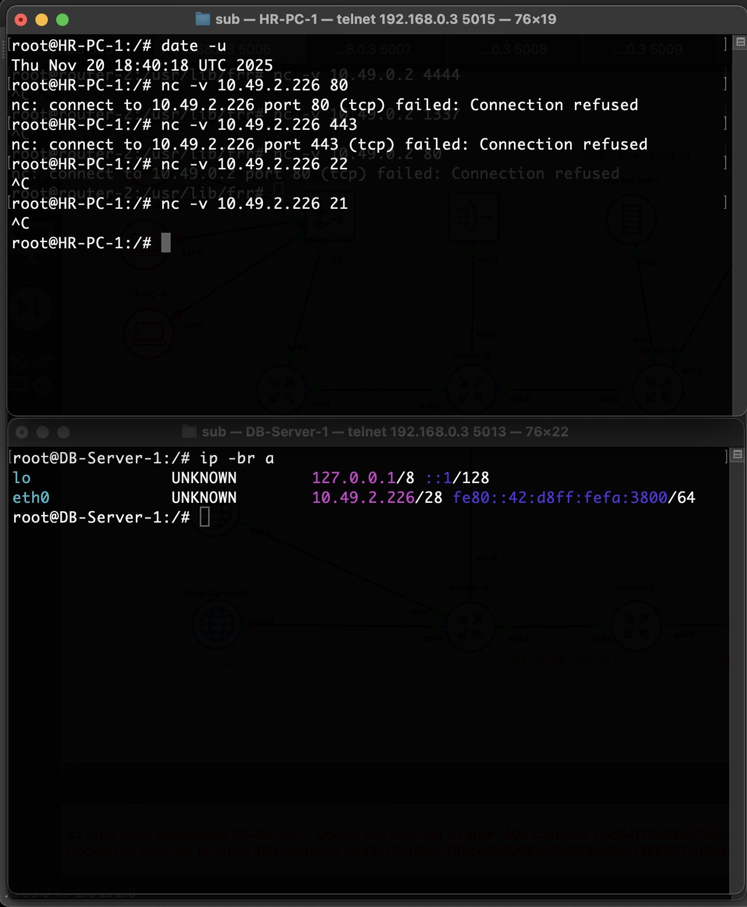 | 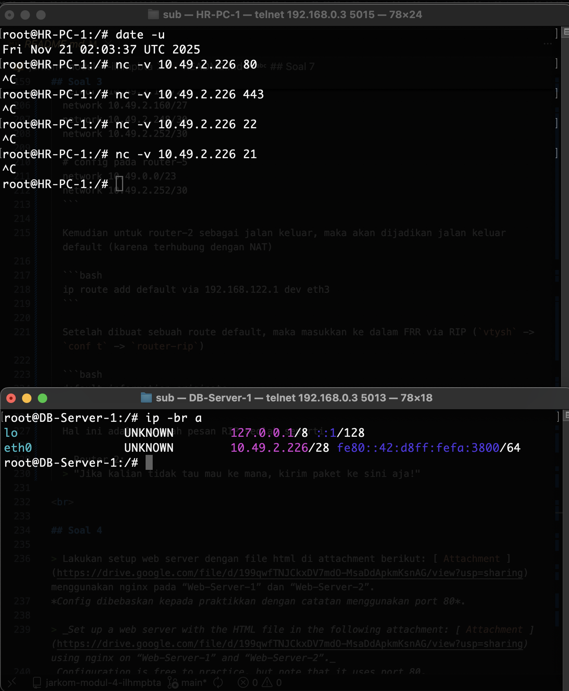 |
  |---|---|
  | Koneksi NC akan sampai ke DB-Server pada jam 18.40:18 di hari kamis (masih termasuk rentang waktu) | Koneksi tidak akan sampai ke DB-Server pada jam 02:03:37 di hari Jum'at (diluar rentang waktu 07:00 - 22:00) | 

  Contoh lebih mendetail pada jam kerja yang berhasil:
  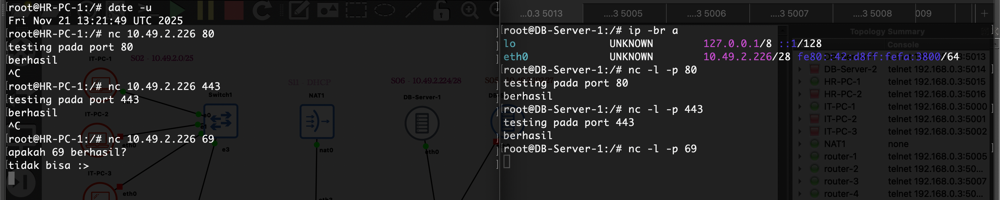

- Explanation

  Kita akan lakukan firewall pada paket yang masuk subnet DB-Server (S05 dan S06) hanya diterima pada hari Senin-Sabtu, pada jam tertentu, maka kita bisa lakukan firewall pada router terdekat terhadap db-server:

  **Router-3**

  ```bash
  iptables -A FORWARD -d 10.49.2.224/28 -p tcp -m multiport --dports 80,443 -m time --timestart 07:00 --timestop 22:00 --weekdays Mon,Tue,Wed,Thu,Fri,Sat -j ACCEPT
  iptables -A FORWARD -d 10.49.2.192/27 -p tcp -m multiport --dports 80,443 -m time --timestart 07:00 --timestop 22:00 --weekdays Mon,Tue,Wed,Thu,Fri,Sat -j ACCEPT

  iptables -A FORWARD -d 10.49.2.224/28 -j DROP
  iptables -A FORWARD -d 10.49.2.192/27 -j DROP
  ```

  Dalam pengujiannya, kita hanya perlu lihat `date -u` karena sepertinya iptables bekerja dalam waktu UTC (WIB-7).

<br>

## Soal 8

> Kemudian, buat agar “Web-Server-1” dan “Web-Server-2” hanya memperbolehkan traffic bertipe HTTP.

> _Then, make sure that “Web-Server-1” and “Web-Server-2” only allow HTTP type traffic._

**Answer:**

- Screenshot

  

  Bisa dilihat bahwa hanya koneksi port 80 yang sampai pada host.

  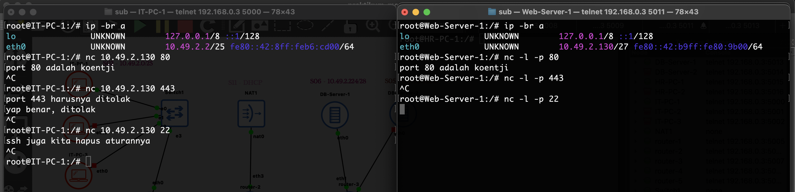

  Gambaran lebih jelas terkait koneksi hanya menerima port 80.

- Explanation

  Kita akan buat aturan hanya port 80 yang bisa sampai pada web-server

  **Router-4**

  ```bash
  # bersihkan aturan ssh tadi
  iptables -F FORWARD

  iptables -A FORWARD -d 10.49.2.128/27 -p tcp --dport 80 -j ACCEPT
  iptables -A FORWARD -d 10.49.2.160/27 -p tcp --dport 80 -j ACCEPT

  iptables -A FORWARD -d 10.49.2.128/27 -j DROP
  iptables -A FORWARD -d 10.49.2.160/27 -j DROP
  ```

  Maka, setiap ada koneksi masuk ke arah subnet kedua web-server:
  1. Jika port adalah 80, maka diizinkan (2 rule untuk: subnet web-server-1 dan web-server-2 yang beda subnet)
  2. Else, paket masuk ke subnet tersebut akan di drop.

  Sehingga pada kasus ini, hanya port 80 yang akan bisa tersampaikan ke host pada subnet tersebut.

<br>

## Soal 9

> Pilih salah satu Subnet dan lakukan blokir terhadap semua request protokol ICMP (ping) dari luar subnet terhadap subnet tersebut.

> _Select one of the Subnets and block all ICMP protocol requests (ping) from outside the subnet to that subnet._

**Answer:**

- Screenshot

  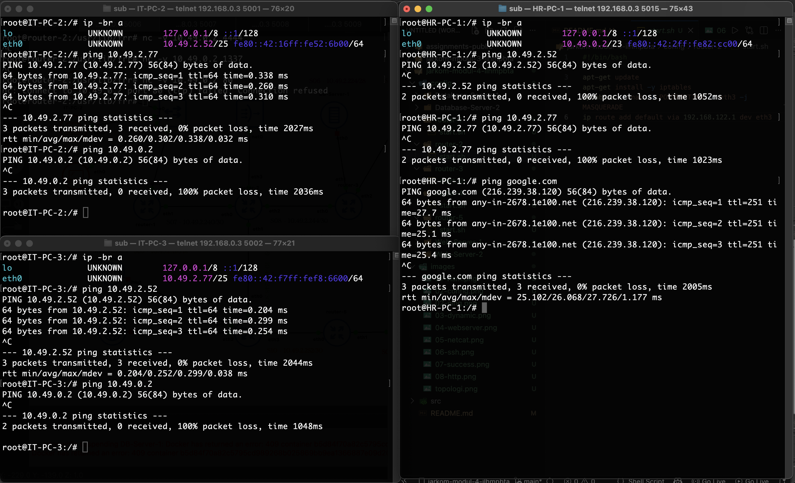

  Bisa dilihat, ping dalam 1 subnet bisa dilakukan, tetapi dari luar tidak bisa (dan bukan masalah routing, terbukti dari ping google)

  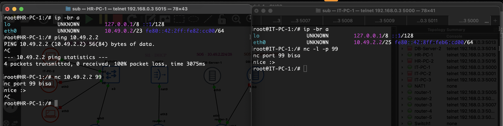
  
  Ini adalah contoh extra, ping tidak bisa dari luar, tetapi bisa netcat dengan menggunakan port lain.

- Explanation

  Misal kita ingin blokir ICMP pada subnet S02 (IT-PC), maka kita tinggal berikan aturan firewall pada router terdekat:

  **Router-1**

  ```bash
  iptables -A FORWARD -d 10.49.2.0/25 -p icmp ! -s 10.49.2.0/25 -j DROP
  ```

  Artinya:
  1. jika ada protokol ping ke IP pada subnet 10.49.2.0/25 berasal dari luar subnet 10.49.2.0/25, maka drop

  Selebihnya akan langsung terima protokol ICMP (pada kasus ini hanya tersisa dari subnet 10.49.2.0/25 itu sendiri)

<br>

## Soal 10

> Konfigurasikan fitur logging untuk melakukan log terhadap seluruh paket yang di-DROP pada lalu lintas setiap node.

> _Configure the logging feature to log all dropped packets on each node's traffic._

**Answer:**

- Screenshot

  Router-1
  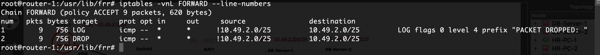

  Router-2
  > Karena router-2 hanyalah perantara antar router, maka tidak perlu diberikan logging (tidak ada aturan yang terkait dengan router-2)

  Router-3
  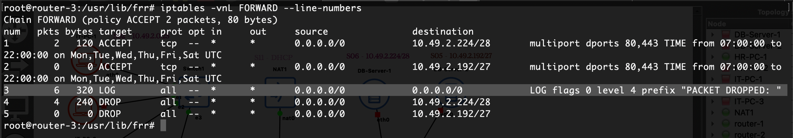

  Router-4
  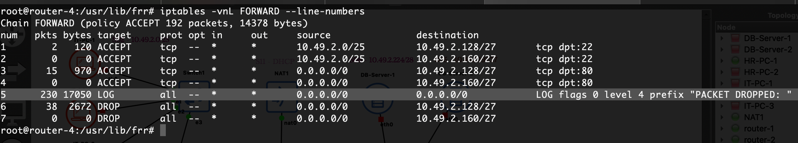

  Router-5
  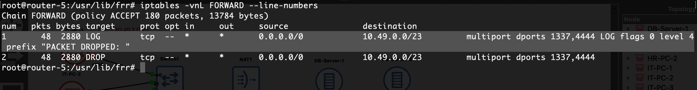

- Explanation

  Kita akan selipkan satu logging pada firewall sebelum dilakukan drop-drop paket yang tidak memenuhi kriteria ACCCEPT dengan gambaran urutan seperti ini
  ```bash
  # rules accept
  iptables -A FORWARD -j ACCEPT

  # setelah bagian yang lolos firewall, maka adalah kumpulan paket yang akan di drop, maka kita lakukan logging
  iptables -A FORWARD -j LOG --log-prefix "PACKET DROPPED: "

  # rules drop
  iptables -A FORWARD -j DROP

  # Jika hanya ada aturan drop, kita berikan
  # aturan yang sama persis dengan drop 
  # tetapi dibuat ke arah logging
  iptables -A FORWARD -d 10.49.0.0/23 -p tcp -m multiport --dports 1337,4444 -j LOG --log-prefix "PACKET DROPPED: "
  ```

  Kemudian kita bisa melihat hasil dropnya di masing-masing router yang bersangkutan
  
  > Jujur saya kurang tau lognya di mana, jadi ditunjukkan hit iptables pada klausa log

  Seluruh konfigurasi yang bisa diautomasikan akan masuk ke dalam shellscript yang bersangkutan, bisa dilihat
  - [Router-1](config/router-1/start.sh) untuk iptables
  - [Router-2](config/router-2/start.sh) untuk iptables
  - [Router-3](config/router-3/start.sh) untuk iptables
  - [Router-4](config/router-4/start.sh) untuk iptables awal, [iptables untuk nomor 8](config/router-4/sec.sh)
  - [Router-5](config/router-5/start.sh) untuk iptables
  - [Web-Server-1](config/Web-Server-1/start.sh) untuk nginx
  - [Web-Server-2](config/Web-Server-2/start.sh) untuk nginx

<br>
  
## Problems

## Revisions (if any)
