[](https://classroom.github.com/a/aRvIU2lf)
| Name           | NRP        | Kelas     |
| ---            | ---        | ----------|
| Bintang Ilham Pabeta | 5025241152 | A |


## Put your topology config image here!

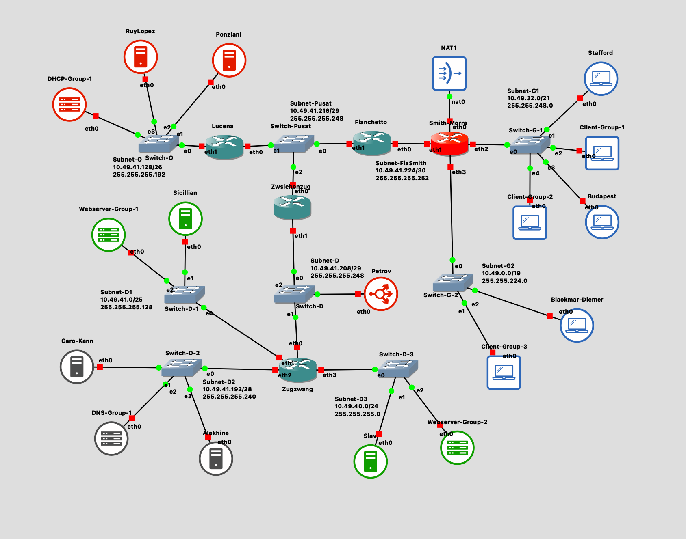

## Put your GNS3 Project file here!

[Jarkom Modul Final](src/jarkom-modul-final.gns3project)

<br>

## Soal 1

> Menggunakan metode VLSM, buatlah pembagian subnet untuk masing-masing gedung dengan cara yang seefisien mungkin!

> _Using the VLSM method, create subnets for each building as efficiently as possible!_

**Answer:**

- Screenshot

  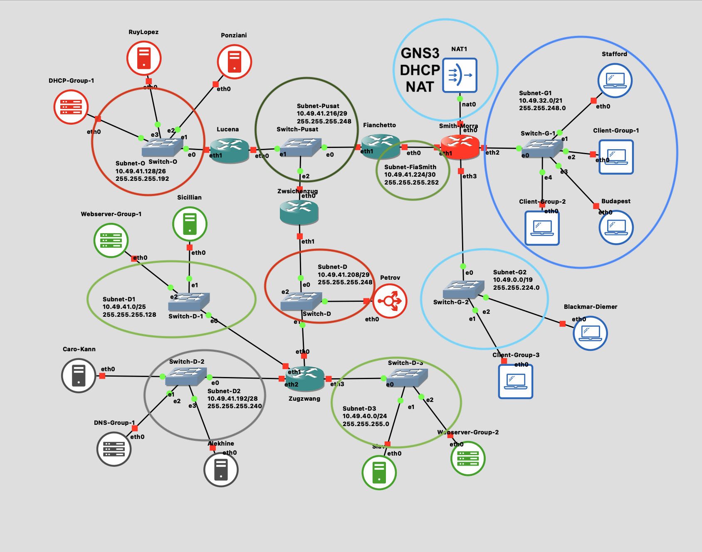

- Explanation

  Pada kasus ini, kita diminta untuk melakukan subnetting dan sesuai pada screenshot yang telah diberikan, terdapat 9 subnet yang jabarannya adalah sebagai berikut:

  <table>
      <thead>
          <tr>
              <th>Subnet</th>
              <th>Host Name</th>
              <th>Host Count</th>
              <th>Total Host</th>
              <th>Network / Mask</th>
              <th>Available IP</th>
              <th>IP Range</th>
          </tr>
      </thead>
      <tbody>
          <tr>
              <td rowspan="3">G-2</td>
              <td>Smith-Morra (eth3)</td>
              <td>1</td>
              <td rowspan="3">5002</td>
              <td rowspan="3">10.49.0.0 /19 (255.255.224.0)</td>
              <td rowspan="3">8190</td>
              <td rowspan="3">10.49.0.1 - 10.49.31.254</td>
          </tr>
          <tr>
              <td>Client-Group-3</td>
              <td>5000</td>
          </tr>
          <tr>
              <td>Blackmar-Diemer</td>
              <td>1</td>
          </tr>
          <tr>
              <td rowspan="5">G-1</td>
              <td>Smith-Morra (eth2)</td>
              <td>1</td>
              <td rowspan="5">1253</td>
              <td rowspan="5">10.49.32.0 /21 (255.255.248.0)</td>
              <td rowspan="5">2046</td>
              <td rowspan="5">10.49.32.1 - 10.49.39.254</td>
          </tr>
          <tr><td>Stafford</td><td>1</td></tr>
          <tr><td>Budapest</td><td>1</td></tr>
          <tr><td>Client-Group-1</td><td>250</td></tr>
          <tr><td>Client-Group-2</td><td>1000</td></tr>
          <tr>
              <td rowspan="3">D-3</td>
              <td>Zugzwang (eth3)</td>
              <td>1</td>
              <td rowspan="3">202</td>
              <td rowspan="3">10.49.40.0 /24 (255.255.255.0)</td>
              <td rowspan="3">254</td>
              <td rowspan="3">10.49.40.1 - 10.49.40.254</td>
          </tr>
          <tr><td>Slav</td><td>1</td></tr>
          <tr><td>Webserver-Group-2</td><td>200</td></tr>
          <tr>
              <td rowspan="3">D-1</td>
              <td>Zugzwang (eth1)</td>
              <td>1</td>
              <td rowspan="3">102</td>
              <td rowspan="3">10.49.41.0 /25 (255.255.255.128)</td>
              <td rowspan="3">126</td>
              <td rowspan="3">10.49.41.1 - 10.49.41.126</td>
          </tr>
          <tr><td>Sicillian</td><td>1</td></tr>
          <tr><td>Webserver-Group-1</td><td>100</td></tr>
          <tr>
              <td rowspan="4">O</td>
              <td>Lucena (eth1)</td>
              <td>1</td>
              <td rowspan="4">53</td>
              <td rowspan="4">10.49.41.128 /26 (255.255.255.192)</td>
              <td rowspan="4">62</td>
              <td rowspan="4">10.49.41.129 - 10.49.41.190</td>
          </tr>
          <tr><td>RuyLopez</td><td>1</td></tr>
          <tr><td>Ponziani</td><td>1</td></tr>
          <tr><td>DHCP-Group-1</td><td>50</td></tr>
          <tr>
              <td rowspan="4">D-2</td>
              <td>Zugzwang (eth2)</td>
              <td>1</td>
              <td rowspan="4">13</td>
              <td rowspan="4">10.49.41.192 /28 (255.255.255.240)</td>
              <td rowspan="4">14</td>
              <td rowspan="4">10.49.41.193 - 10.49.41.206</td>
          </tr>
          <tr><td>Carro-Kan</td><td>1</td></tr>
          <tr><td>Alekhine</td><td>1</td></tr>
          <tr><td>DNS-Group-1</td><td>10</td></tr>
          <tr>
              <td rowspan="3">D</td>
              <td>Zwsichenzug (eth1)</td>
              <td>1</td>
              <td rowspan="3">3</td>
              <td rowspan="3">10.49.41.208 /29 (255.255.255.248)</td>
              <td rowspan="3">6</td>
              <td rowspan="3">10.49.41.209 - 10.49.41.214</td>
          </tr>
          <tr><td>Zugzwang (eth0)</td><td>1</td></tr>
          <tr><td>Petrov</td><td>1</td></tr>
          <tr>
              <td rowspan="3">Pusat</td>
              <td>Fianchetto (eth1)</td>
              <td>1</td>
              <td rowspan="3">3</td>
              <td rowspan="3">10.49.41.216 /29 (255.255.255.248)</td>
              <td rowspan="3">6</td>
              <td rowspan="3">10.49.41.217 - 10.49.41.222</td>
          </tr>
          <tr><td>Lucena (eth0)</td><td>1</td></tr>
          <tr><td>Zwsichenzug (eth0)</td><td>1</td></tr>
          <tr>
              <td rowspan="2">Fia-Smith</td>
              <td>Smith-Morra (eth1)</td>
              <td>1</td>
              <td rowspan="2">2</td>
              <td rowspan="2">10.49.41.224 /30 (255.255.255.252)</td>
              <td rowspan="2">2</td>
              <td rowspan="2">10.49.41.225 - 10.49.41.226</td>
          </tr>
          <tr><td>Fianchetto (eth0)</td><td>1</td></tr>
      </tbody>
  </table>

  > Terdapat 1 subent yang tidak masuk perhitungan VLSM, NAT. 

  Mengapa bisa mendapati subnet berikut? hal ini dikerjakan dengan mengurutkan subnet dari jumlah terbesar hingga terkecil. Berikut adalah jabaran urutannya:

  ```
  G2/19 - G1/21 - D3/24 - D1/25 - O/26 - D2/28 - D/29 - Pusat/29 - FiaSmi/30
  ```

  > Subnetting dilakukan mulai dari subnet terbesar untuk meminimalisir fragmentasi yang terjadi di dalam subnet. Maka dari itu, kita menghitung secara kumulatif dan tidak dengan memecah.

  Sehingga kita melakukan perhitungan IP menggunakan pohon "keberlanjutan" sebagai berikut:

  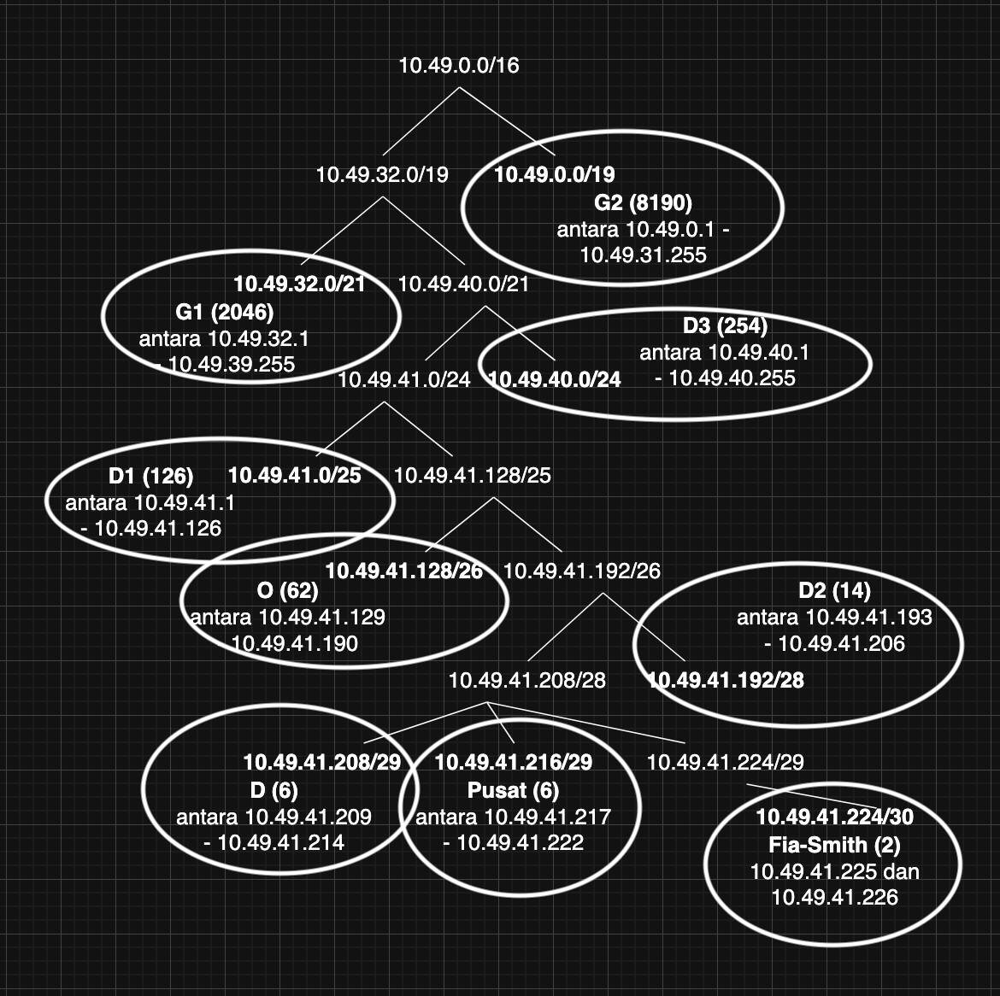


<br>

## Soal 2

> Konfigurasi semua router agar bisa terhubung ke semua jaringan. Gunakan static routing dan uji dengan melakukan ping dari **Budapest** ke **Alekhine** dan dari **Ponziani** ke **Sicilian**!

> _Configure all routers to connect to all networks. Use static routing and perform testing by pinging from **Budapest** to **Alekhine** and from **Ponziani** to **Sicilian**!_

**Answer:**

- Screenshot
  
  > Ponziani - Sicilian
  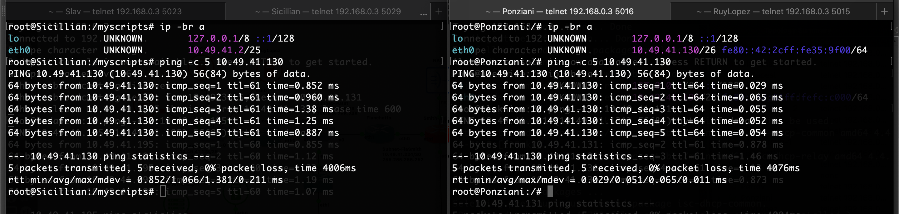

  > Budapest - Alekhine
  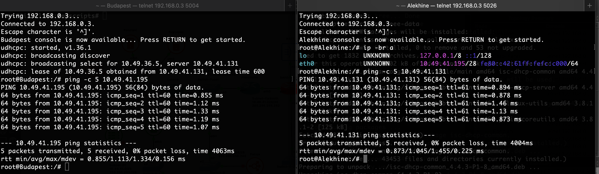

- Explanation

  Untuk itu, kita akan tetapkan dulu IP static pada setiap router:

  <table>
      <thead>
          <tr>
              <th>Host</th>
              <th>Interface</th>
              <th>Subnet</th>
              <th>IP Address</th>
          </tr>
      </thead>
      <tbody>
          <tr>
              <td rowspan="4">Smith-Morra</td>
              <td>eth0</td>
              <td>NAT</td>
              <td>DHCP (GNS3)</td>
          </tr>
          <tr><td>eth1</td><td>Fia-Smith</td><td>10.49.41.225</td></tr>
          <tr><td>eth2</td><td>G-1</td><td>10.49.32.1</td></tr>
          <tr><td>eth3</td><td>G-2</td><td>10.49.0.1</td></tr>
          <tr>
              <td rowspan="2">Fianchetto</td>
              <td>eth0</td>
              <td>Fia-Smith</td>
              <td>10.49.41.226</td>
          </tr>
          <tr><td>eth1</td><td>Pusat</td><td>10.49.41.217</td></tr>
          <tr>
              <td rowspan="2">Zwischenzug</td>
              <td>eth0</td>
              <td>Pusat</td>
              <td>10.49.41.218</td>
          </tr>
          <tr><td>eth1</td><td>D</td><td>10.49.41.209</td></tr>
          <tr>
              <td rowspan="2">Lucena</td>
              <td>eth0</td>
              <td>Pusat</td>
              <td>10.49.41.219</td>
          </tr>
          <tr><td>eth1</td><td>O</td><td>10.49.41.129</td></tr>
          <tr>
              <td rowspan="4">Zugzwang</td>
              <td>eth0</td>
              <td>D</td>
              <td>10.49.41.210</td>
          </tr>
          <tr><td>eth1</td><td>D-1</td><td>10.49.41.1</td></tr>
          <tr><td>eth2</td><td>D-2</td><td>10.49.41.193</td></tr>
          <tr><td>eth3</td><td>D-3</td><td>10.49.40.1</td></tr>
      </tbody>
  </table>

  Sehingga pemberian IP yang perlu static/reserved DHCP pada setiap subnet adalah:

  <table>
      <thead>
          <tr>
              <th>Subnet</th>
              <th>Network / Netmask</th>
              <th>Host</th>
              <th>Description</th>
              <th>IP Address</th>
          </tr>
      </thead>
      <tbody>
          <tr>
              <td rowspan="3">O</td>
              <td rowspan="3">10.49.41.128 /26</td>
              <td>Lucena (eth1)</td>
              <td>Router</td>
              <td>10.49.41.129</td>
          </tr>
          <tr><td>Ponziani</td><td>DHCP Server</td><td>10.49.41.130</td></tr>
          <tr><td>RuyLopez</td><td>DHCP Slave</td><td>10.49.41.131</td></tr>
          <tr>
              <td rowspan="3">D</td>
              <td rowspan="3">10.49.41.208 /29</td>
              <td>Zwischenzug (eth1)</td>
              <td>Router</td>
              <td>10.49.41.209</td>
          </tr>
          <tr><td>Zugzwang (eth0)</td><td>Router</td><td>10.49.41.210</td></tr>
          <tr><td>Petrov</td><td>Reverse Proxy</td><td>10.49.41.211</td></tr>
          <tr>
              <td rowspan="2">D-1</td>
              <td rowspan="2">10.49.41.0 /25</td>
              <td>Zugzwang (eth1)</td>
              <td>Router</td>
              <td>10.49.41.1</td>
          </tr>
          <tr><td>Sicillian</td><td>Webserver (Reserved DHCP)</td><td>10.49.41.2</td></tr>
          <tr>
              <td rowspan="3">D-2</td>
              <td rowspan="3">10.49.41.192 /28</td>
              <td>Zugzwang (eth2)</td>
              <td>Router</td>
              <td>10.49.41.193</td>
          </tr>
          <tr><td>Caro-Kann</td><td>DNS Master</td><td>10.49.41.194</td></tr>
          <tr><td>Alekhine</td><td>DNS Slave</td><td>10.49.41.195</td></tr>
          <tr>
              <td rowspan="2">D-3</td>
              <td rowspan="2">10.49.40.0 /24</td>
              <td>Zugzwang (eth3)</td>
              <td>Router</td>
              <td>10.49.40.1</td>
          </tr>
          <tr><td>Slav</td><td>Webserver (Reserved DHCP)</td><td>10.49.40.2</td></tr>
          <tr>
              <td>G-1</td>
              <td>10.49.32.0 /21</td>
              <td>Smith-Morra (eth2)</td>
              <td>Router</td>
              <td>10.49.32.1</td>
          </tr>
          <tr>
              <td>G-2</td>
              <td>10.49.0.0 /19</td>
              <td>Smith-Morra (eth3)</td>
              <td>Router</td>
              <td>10.49.0.1</td>
          </tr>
          <tr>
              <td rowspan="3">Pusat</td>
              <td rowspan="3">10.49.41.216 /29</td>
              <td>Fianchetto (eth1)</td>
              <td>Router</td>
              <td>10.49.41.217</td>
          </tr>
          <tr><td>Zwischenzug (eth0)</td><td>Router</td><td>10.49.41.218</td></tr>
          <tr><td>Lucena (eth0)</td><td>Router</td><td>10.49.41.219</td></tr>
          <tr>
              <td rowspan="2">Fia-Smith</td>
              <td rowspan="2">10.49.41.224 /30</td>
              <td>Smith-Morra (eth1)</td>
              <td>Router</td>
              <td>10.49.41.225</td>
          </tr>
          <tr><td>Fianchetto (eth0)</td><td>Router</td><td>10.49.41.226</td></tr>
      </tbody>
  </table>

  > Beberapa node seperti webserver, DNS server, dan reverse proxy menggunakan DHCP reservation karena perangkat-perangkat tersebut membutuhkan IP yang konsisten. Jika IP berubah (misalnya akibat lease renewal DHCP), maka DNS tidak lagi mencocokkan nama domain dengan alamat yang benar. Untuk mencegah terjadinya “IP shifting”, alamat server dibuat permanen melalui DHCP reservation sehingga tetap terkelola oleh DHCP namun tidak berubah-ubah.

  Kemudian kita akan melakukan static routing, di mana kita harus listing semua subnet yang tidak bersebelahan langsung pada setiap router, maka dari itu inilah routingnya:

  > Berikut adalah refreshment untuk setiap subnet (untuk mempermudah eliminasi routing yang tidak dibutuhkan)

  ```bash
  ip route add 10.49.0.0/19 via       # G2
  ip route add 10.49.32.0/21 via      # G1
  ip route add 10.49.40.0/24 via      # D3
  ip route add 10.49.41.0/25 via      # D1
  ip route add 10.49.41.128/26 via    # O
  ip route add 10.49.41.192/28 via    # D2
  ip route add 10.49.41.208/29 via    # D
  ip route add 10.49.41.216/29 via    # Pusat
  ip route add 10.49.41.224/30 via    # Fia-Smith
  ip route add default via            # NAT
  ```

  1. Smith-Morra
  Smith-Morra terhubung secara langsung dengan subnet NAT, Fia-Smith, G1, dan G2 sehingga setup routing:

      ```bash
      ip route add 10.49.40.0/24 via 10.49.41.226
      ip route add 10.49.41.0/25 via 10.49.41.226
      ip route add 10.49.41.128/26 via 10.49.41.226
      ip route add 10.49.41.192/28 via 10.49.41.226
      ip route add 10.49.41.208/29 via 10.49.41.226
      ip route add 10.49.41.216/29 via 10.49.41.226
      ```

      > DHCP dari NAT GNS3 akan membuat rute default otomatis untuk Smith-Morra agar bisa terhubung ke internet.


  2. Fianchetto
  Fianchetto terhubung secara langsung dengan subnet Fia-Smith dan Pusat sehingga setup routing:

      ```bash
      ip route add 10.49.0.0/19 via 10.49.41.225
      ip route add 10.49.32.0/21 via 10.49.41.225
      ip route add 10.49.40.0/24 via 10.49.41.218
      ip route add 10.49.41.0/25 via 10.49.41.218
      ip route add 10.49.41.128/26 via 10.49.41.219
      ip route add 10.49.41.192/28 via 10.49.41.218
      ip route add 10.49.41.208/29 via 10.49.41.218
      ip route add default via 10.49.41.225
      ```

  3. Zwischenzug
  Zwischenzug terhubung secara langsung dengan subnet Pusat dan D sehingga setup routing:

      ```bash
      ip route add 10.49.0.0/19 via 10.49.41.217
      ip route add 10.49.32.0/21 via 10.49.41.217
      ip route add 10.49.40.0/24 via 10.49.41.210
      ip route add 10.49.41.0/25 via 10.49.41.210
      ip route add 10.49.41.128/26 via 10.49.41.219
      ip route add 10.49.41.192/28 via 10.49.41.210
      ip route add 10.49.41.224/30 via 10.49.41.217
      ip route add default via 10.49.41.217
      ```

  4. Lucena
  Lucena terhubung secara langsung pada Subnet O dan Pusat sehingga setup routing:

      ```bash
      ip route add 10.49.0.0/19 via 10.49.41.217
      ip route add 10.49.32.0/21 via 10.49.41.217
      ip route add 10.49.40.0/24 via 10.49.41.218
      ip route add 10.49.41.0/25 via 10.49.41.218
      ip route add 10.49.41.192/28 via 10.49.41.218
      ip route add 10.49.41.208/29 via 10.49.41.218
      ip route add 10.49.41.224/30 via 10.49.41.217
      ip route add default via 10.49.41.217
      ```

  5. Zugzwang
  Zugzwang terhubung secara langsung dengan subnet D, D1, D2, dan D3 sehingga setup routing:

      ```bash
      ip route add 10.49.0.0/19 via 10.49.41.209
      ip route add 10.49.32.0/21 via 10.49.41.209
      ip route add 10.49.41.128/26 via 10.49.41.209
      ip route add 10.49.41.216/29 via 10.49.41.209
      ip route add 10.49.41.224/30 via 10.49.41.209
      ip route add default via 10.49.41.209
      ```

<br>

## Soal 3

> Berikan seluruh client (**Blackmar-Diemer, Budapest,** dan **Stafford**) IP secara dinamis dari DHCP. Range IP dibebaskan, namun tunjukkan bahwa mereka mendapatkan IP secara dinamis!

> _Assign all clients (**Blackmar-Diemer, Budapest,** and **Stafford**) dynamic IP addresses via DHCP. You may use any IP range you would like, but prove that they receive IP addresses dynamically!_

**Answer:**

- Screenshot

  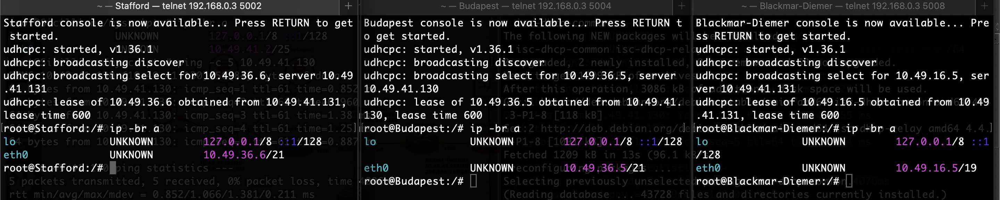

- Explanation

  Setelah melakukan routing dengan benar, maka semua node akan bisa terhubung ke internet, maka kita akan gunakan ilmu modul 2, isc-dhcp-server dan isc-dhcp-relay. Pada kasus ini kita perlu untuk melakukan instalasi isc-dhcp-server pada Ponziani sebagai DHCP master:

  ```bash
  apt-get-update
  apt-get install isc-dhcp-server
  ```

  Berdasarkan subnetting yang telah dilakukan sebelumnya, kita akan berikan config ini untuk RuyLopez sebagai DHCP master pada `/etc/dhcp/dhcpd.conf`

  ```conf
  failover peer "anti-bongcloud" {
      primary;                    # Ponziani server utama
      address 10.49.41.130;       # Alamat IP Ponz
      port 647;                   # Port komunikasi failover
      peer address 10.49.41.131;  # Alamat IP Ruy
      peer port 647;              # Port komunikasi Ruy
      max-response-delay 60;       
      max-unacked-updates 10;      
      mclt 3600;                   
      split 128;
  }
  ```

  Karena di sini Ponziani bertindak sebagai DHCP Slave, maka kita buat diia sebagai failover secondary dari RuyLopez:
  
  ```conf
  failover peer "anti-bongcloud" {
      secondary;                  # RuyLopez server secondary
      address 10.49.41.131;       # Alamat IP Ruy
      port 647;                   # Port komunikasi failover
      peer address 10.49.41.130;  # Alamat IP Ponz
      peer port 647;              # Port komunikasi Ponz
  }
  ```

  Keduanya diikuti dengan pool-subnet yakni:

  ```conf
  subnet <network_id> netmask <netmask> {
      option routers <ip_router>;
      option broadcast-address <ip-broadcast-netID>;
      option domain-name-servers <CarroKan> <Alekhine> <Google>;
      default-lease-time 120;
      max-lease-time 3600;

      pool {
        failover peer "anti-bongcloud"
        range <start-range> <end-range>
      }
  }
  ```

  > Pada kasus ini, mungkin IP DNS Server google ``(8.8.8.8)`` tidak diperlukan karena tidak adanya keperluan untuk dan atau membuktikan konektivitas DHCP client dengan internet. Tetapi bisa digunakan sebagai bukti tambahan saja.

  Tidak lupa untuk semua router (Fianchetto, Lucena, Smith-Morra, Zugzwang, Zwischenzug) kita lakukan instalasi isc-dhcp-relay untuk menyalurkan broadcast:

  ```bash
  apt-get-update
  apt-get install isc-dhcp-relay
  ```


<br>

## Soal 4

> Berikan web server **Slav** dan **Sicilian** IP address yang tetap/fixed dari DHCP. 

> _Assign **Slav** and **Sicilian** web servers fixed IP addresses via DHCP._

**Answer:**

- Screenshot

  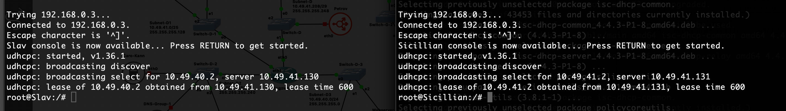

- Explanation

  Kita perlu melakukan reserver IP dari DHCP server, maka kita tetapkan hwaddress dari kedua Webserver tersebut pada network configuration setelah ``iface eth0 inet dhcp``:

  ```bash
  hwaddress ether 02:42:a6:21:e1:00   # Slav
  hwaddress ether 02:42:8c:44:92:00   # Sicillian
  ```

  Kemudian, berdasarkan [list ip (soal 2)](#soal-2) yang sudah kita berikan, maka kita tambahkan setup pada ``/etc/dhcp/dhcpd.conf``:
  
  ```bash
  host Slav {
      hardware ethernet 02:42:a6:21:e1:00;
      fixed-address 10.49.40.2
  }

  host Sicillian {
      hardware ethernet 02:42:8c:44:92:00;
      fixed-address 10.49.41.2;
  }
  ```

<br>

## Soal 5

> Buatlah konfigurasi untuk domain:  
**parkov.com** → IP Node **Slav**  
**paskarov.com** → IP Node **Sicilian** 
Pada **DNS Master Caro-Kann.** Tambahkan juga subdomain www untuk kedua domain tersebut.

> _Configure the domains:  
**parkov.com** → **Slav** Node IP  
**paskarov.com** → **Sicilian** Node IP  
On the **Caro-Kann DNS Master,** then add the www subdomain for both domains._

**Answer:**

- Screenshot

  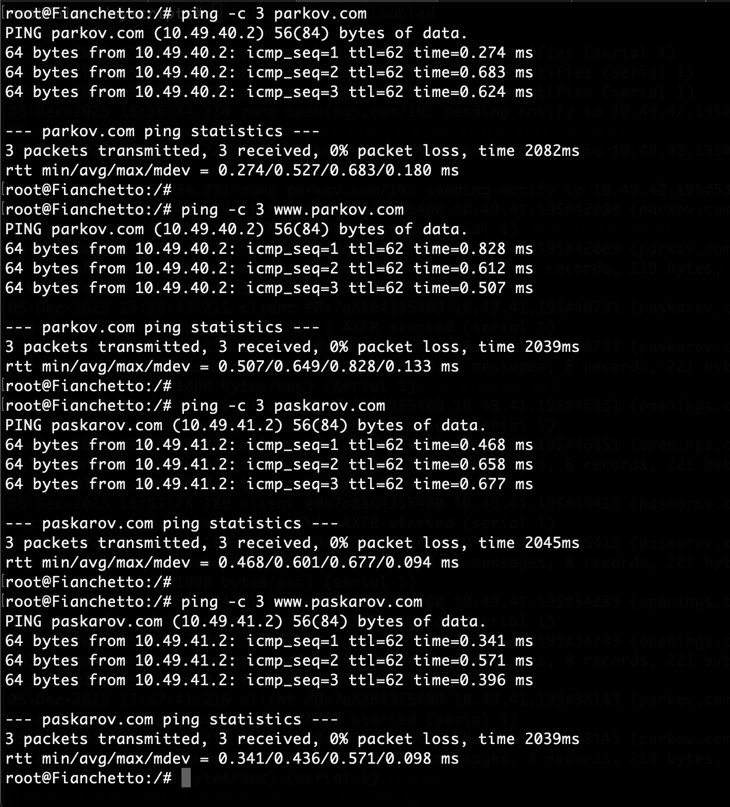

- Explanation

  Untuk mengerjakan soal ini, kita akan melakukan konfigurasi DNS menggunakan `bind9` pada node DNS kita, Caro-Kann sebagai master. Berikut adalah konfigurasi `named.conf` yang digunakan pada Caro-Kann:

  ```conf
  options {
      directory "/myscripts/dns";
      listen-on { any; };
      allow-query { any; };
      allow-transfer { 10.49.41.195; }; # transfer ke slave (Alekhine)
      dnssec-validation no;
  };

  zone "parkov.com" IN {
      type master;
      file "db.parkov.com";
  };

  zone paskarov.com IN {
      type master;
      file "db.paskarov.com";
  };
  ```

  juga kita buat file pendukungnya, `db.[zone]` yang sudah dituliskan pada `named.conf` tersebut.
  
  - `db.parkov.com`
    ```bash
    $TTL 86400
    @   IN  SOA ns1.parkov.com. admin.parkov.com. (
            1		    ; serial 
            3600        ; refresh
            1800        ; retry
            604800      ; expire
            86400       ; minimum
    )

    @   IN  NS ns1.parkov.com.
    ns1 IN  A   10.49.41.194

    @   IN  NS  ns2.parkov.com.
    ns2 IN  A   10.49.42.195

    @   IN A 10.49.40.2       # Slav
    www IN CNAME @
    ```

    Pada setup ini, ns1 merujuk ke Master (Caro-Kann) dan ns2 merujuk ke Slave (Alekhine) dan selebihnya diarahkan kepada node webserver yang bersangkutan.

  - `db.paskarov.com`
    ```bash
    $TTL 86400
    @   IN  SOA ns1.paskarov.com. admin.paskarov.com. (
            1           ; serial 
            3600        ; refresh
            1800        ; retry
            604800      ; expire
            86400       ; minimum
    )

    @   IN  NS ns1.paskarov.com.
    ns1 IN  A   10.49.41.194

    @   IN  NS  ns2.paskarov.com.
    ns2 IN  A   10.49.42.195

    @   IN A 10.49.41.2       # Sicilian
    www IN CNAME @
    ```

<br>

## Soal 6

> Konfigurasikan juga **Alekhine** sebagai **DNS Slave** yang bekerja untuk membantu **Caro-Kann.** Lakukan pengujian dengan **mematikan Caro-Kann** lalu coba ping ke domain dan subdomain tersebut (pilih salah satu saja).

> _Configure **Alekhine** as a **DNS Slave** to assist **Caro-Kann**. Perform testing by **disabling Caro-Kann** and then pinging the domain and subdomain (choose only one)._

**Answer:**

- Screenshot

  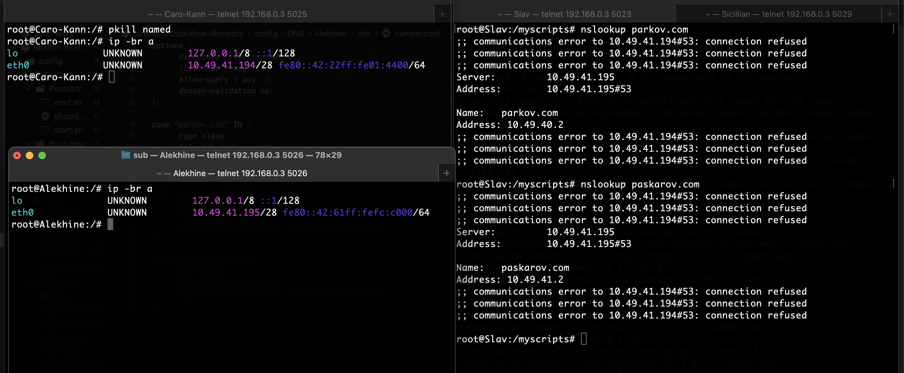

  > Pengujian nslookup merujuk ke IP Alekhine

- Explanation

  Kita buat `named.conf` pada DNS Slave Alekhine dengan isinya sebagai berikut:

  ```conf
  options {
        directory "/myscripts/dns";
        listen-on { any; };
        allow-query { any; };
        dnssec-validation no;
  };

  zone "parkov.com" IN {
        type slave;
        file "db.parkov.com";
        masters { 10.49.41.194; }; # master Caro-Kann 
  };

  zone "paskarov.com" IN {
        type slave;
        file "db.paskarov.com";
        masters { 10.49.41.194; }; # master Caro-Kann
  };
  ```

  > Pada slave tidak perlu dilakukan pembuatan file `db.[zone]` karena akan secara otomatis diterima dari transfer Master-Slave

  Tidak lupa untuk menjalankannya

  ```bash
  named -g -c /myscripts/dns/named.conf
  ```

  Kemudian untuk pengujian, kita matikan named pada Caro-Kann dengan menggunakan

  ```bash
  service named stop
  ```

<br>

## Soal 7

> Konfigurasikan **Sicilian** agar berfungsi sebagai **web server nginx** yang akan menyajikan [halaman berikut](https://drive.google.com/file/d/1eX0ZjRKprx8T34XFAssrpc7ZE1j6Jv0j/view). Konfigurasikan juga agar **Sicilian** bisa menyimpan custom access log ke file **/tmp/access.log** dan error log ke file **/tmp/error.log.**

> _Configure **Sicilian** to function as an **nginx web server**that will serve [this page](https://drive.google.com/file/d/1eX0ZjRKprx8T34XFAssrpc7ZE1j6Jv0j/view). Also, configure **Sicilian** to save custom access logs to **/tmp/access.log** and error logs to **/tmp/error.log.**_

**Answer:**

- Screenshot

  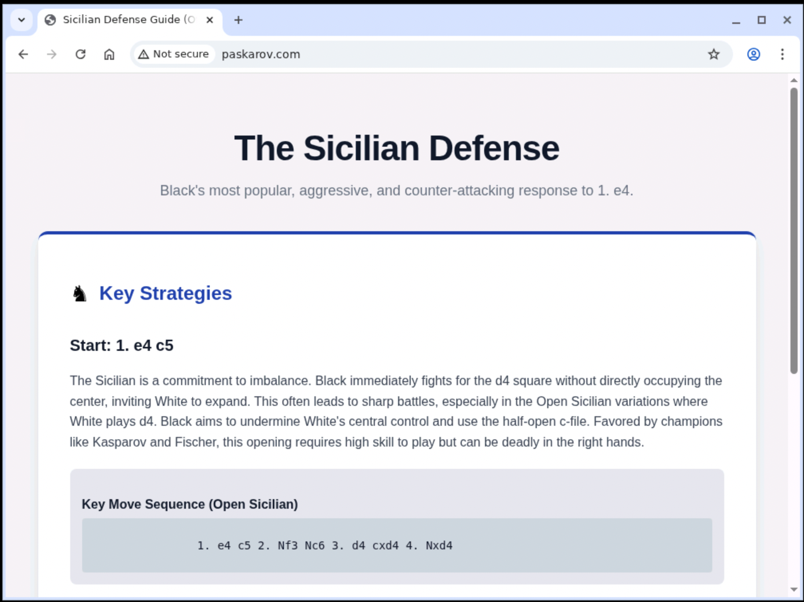

- Explanation

  Pada kasus ini kita hanya perlu membuat konfigurasi nginx beserta `file.html` yang hendak ditampilkan pada website tersebut. Maka dari itu, kita hanya perlu menjalankan [nginx.conf](config/Web/Sicillian/web/nginx.conf) ini:

  ```conf
  user www-data;
  worker_processes auto;
  worker_cpu_affinity auto;
  pid /tmp/nginx.pid;
  error_log /tmp/error.log;

  events { worker_connections 768; }

  http {
      server {
          listen 80;
          server_name paskarov.com;

          access_log /tmp/access.log no6;
          root /myscripts/web;
          index sicilian.html;
          
          location / {
          try_files $uri $uri/ =404;
          }
      }
  }
  ```

<br>

## Soal 8

> Buatlah custom access log ke file **/tmp/access.log.** Untuk keperluan logging, gunakan format log seperti di bawah:
> - Tanggal dan waktu akses dalam format standar log.
> - Nama node yang sedang diakses.
> - Alamat IP klien yang mengakses website.
> - Metode HTTP dan URI yang diakses oleh klien.
> - Status respons HTTP yang diberikan oleh server.
> - Jumlah byte yang dikirimkan dalam respons.
> - Waktu yang dihabiskan oleh server untuk menangani permintaan.> 
> - Contoh format log yang sesuai:  
[01/Oct/2024:11:30:45 +0000] Jarkom Node Sicilian Access from 192.168.1.15 using method "GET /resep/bayam HTTP/1.1" returned status 200 with 2567 bytes sent in 0.038 seconds

> _Webserver: Create a custom access log to the file **/tmp/access.log.** For logging purposes, use the log format shown below:_
> - _The date and time of access in standard log format._
> - _The name of the node being accessed._
> - _The IP address of the client accessing the website._
> - _The HTTP method and URI accessed by the client._
> - _The HTTP response status returned by the server._
> - _The number of bytes sent in the response._
> - _The time spent by the server processing the request._
> - _Example of appropriate log format:  
[01/Oct/2024:11:30:45 +0000] Jarkom Node Sicilian Access from 192.168.1.15 using method "GET /resep/bayam HTTP/1.1" returned status 200 with 2567 bytes sent in 0.038 seconds_

**Answer:**

- Screenshot

  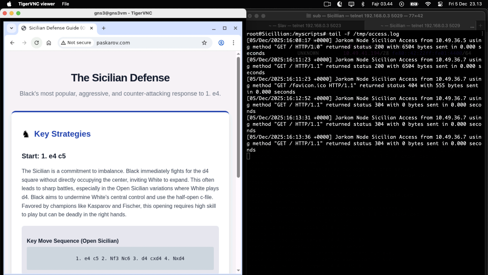

- Explanation

  Kita gunakan fitur log format pada nginx dengan bentuknya sesuai permintaan soal, maka dari itu kita gunakan syntax tersebut dengan struktur seperti ini:

  ```conf
  http {
    log_format  no6 '[$time_local] Jarkom Node Sicilian Access from $remote_addr using method "$request" returned status $status with $body_bytes_sent bytes sent in $request_time seconds';

    server {
        access_log /tmp/access.log no6;
        
        # ... config server
    }
  }
  ``` 

<br>

## Soal 9

> Konfigurasikan juga **Slav** agar berfungsi sebagai **web server nginx** yang menyajikan [halaman berikut](https://drive.google.com/file/d/1h8ik1Zcubntp0dvHt9NHYqSZLSTG6FuZ/view) dan **hanya** bisa diakses melalui port **8000** dan **8888.**

> _Configure **Slav** to function as an **nginx web server** that serves [this page](https://drive.google.com/file/d/1h8ik1Zcubntp0dvHt9NHYqSZLSTG6FuZ/view?usp=drive_link) and is **only** accessible via ports **8000** and **8888.**_

**Answer:**

- Screenshot

  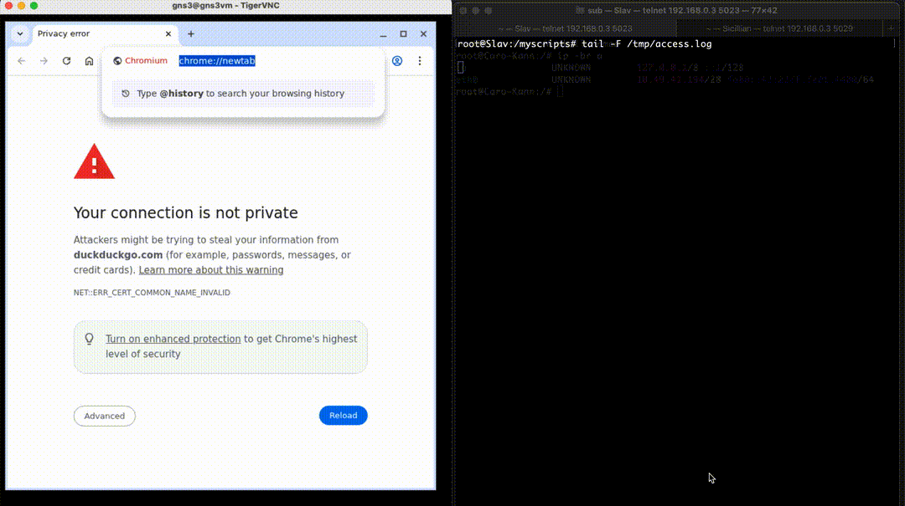

- Explanation

  Kurang lebih sama seperti konfigurasi nginx pada node Sicilian, perbedaannya terletak pada port yangg digunakan. Maka dari itu, kita hanya perlu mengubah 1 bagian ini sehingga terbentuk [nginx.conf](config/Web/Slav/web/nginx.conf)

  ```conf
  http {
      # ... config

      server {
          listen 8000;
          listen 8888;

          # ... config server
      }
  }
  ```

<br>

## Soal 10

> Untuk memudahkan akses, buatlah satu domain lagi dengan nama **openings.com** yang mengarah ke **Petrov.** Lalu, konfigurasikan juga **Petrov** sebagai **Reverse Proxy** yang akan melakukan forward request ke server yang sesuai berdasarkan URL profile yang diminta oleh klien dengan ketentuan sebagai berikut:
> - Request untuk “openings.com/**sicilian**” harus dialihkan ke web server **Sicilian.**
> - Request untuk “openings.com/**slav**” harus dialihkan ke web server **Slav.**

> _To facilitate access, create another domain with the name **openings.com** that points to **Petrov.** Then, configure **Petrov** as a **Reverse Proxy** that will forward requests to the appropriate server based on the profile URL requested by the client with the following conditions:_
> - _Requests for “openings.com/**sicilian**” must be forwarded to web server **Sicilian.**_
> - _Request for “openings.com/**slav**” must be forwarded to web server **Slav.**_

**Answer:**

- Screenshot

  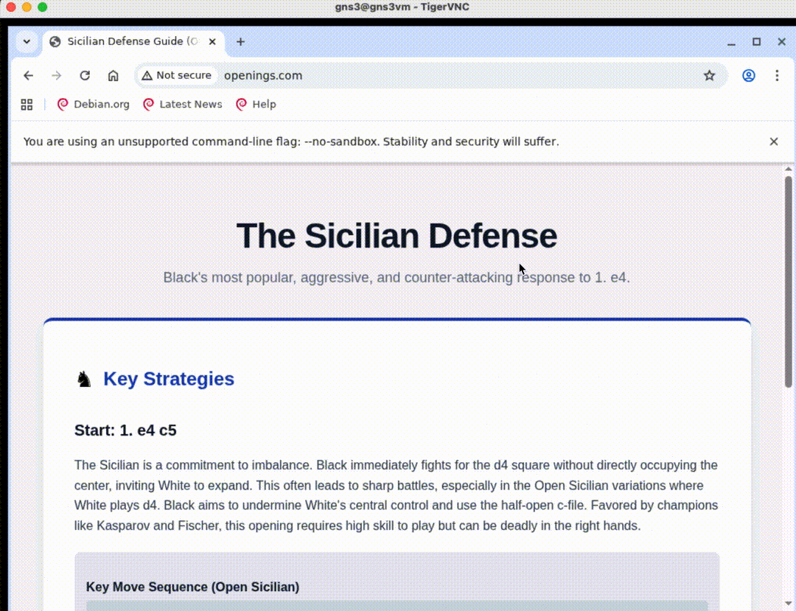

- Explanation

  Pada kasus ini kita perlu untuk melakukan konfigurasi proxy pass pada node Petrov, kita hanya perlu untuk melakukan proxy_pass pada permintaan server yang telah ditentukan, yakni /sicilian dan /slav, maka dari itu:

  ```conf
  http {
    # http ..

      server {
          # server ...

          location = /sicilian {
              proxy_pass http://10.49.41.2/;
              proxy_set_header Host $host;
              proxy_set_header X-Real-IP $remote_addr;
          }

          location = /slav {
              proxy_pass http://10.49.40.2:8888/;
              proxy_set_header Host $host;
              proxy_set_header X-Real-IP $remote_addr;
          }
      }
  }
  ```

  Dengan struktur tersebut, maka percabangannya
  - `openings.com/sicilian`, proxy_pass menuju ke IP web sicilian (port 80)
  - `openings.com/slav`, proxy_pass menuju ke IP web Slav (port 8888)

<br>

## Soal 11

> Tambahkan juga konfigurasi agar request untuk “openings.com/**random**” akan mengalihkan request ke webserver **Sicilian** dan **Slav** dengan algoritma _round-robin_.

> _Additionally, configure requests for "openings.com/**random**" to be redirected to the **Sicilian** and **Slav** web servers using a round-robin algorithm._

**Answer:**

- Screenshot

  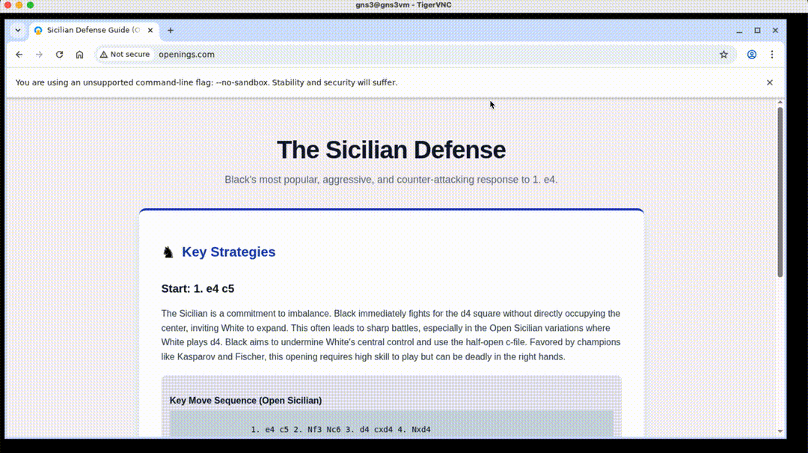

- Explanation

  Untuk menyelesaikan permasalahan tersebut, maka kita bisa menggunakan aturan rewrite pada konfigurasi nginx dengan struktur implementasinya:

  ```conf
  http {
    # http ..

    upstream roundrobinx {
        server 10.49.41.2;
        server 10.49.40.2:8000;
    }

      server {
          # server ...

          location = / {
              proxy_pass http://roundrobinx/;
              proxy_set_header Host $host;
              proxy_set_header X-Real-IP $remote_addr;
          }

          location = /sicilian {
              proxy_pass http://10.49.41.2/;
              proxy_set_header Host $host;
              proxy_set_header X-Real-IP $remote_addr;
          }

          location = /slav {
              proxy_pass http://10.49.40.2:8888/;
              proxy_set_header Host $host;
              proxy_set_header X-Real-IP $remote_addr;
          }

          location / {
              rewrite ^ / last;
          }
      }
  }
  ```

  Dengan struktur seperti ini, maka permintaan ke `openings.com` akan mengarah ke roundrobin antara 2 server tersebut. Berikut percabangannya
  - `openings.com/sicilian`, seperti soal sebelumnya
  - `openings.com/slav`, seperti soal sebelumnya
  - `openings.com/whateverInputPossible` akan ditulis ulang sehingga sama saja diarahkan ke `openings.com`. Pada akhirnya akan menuju ke konfigurasi roundrobin yang sudah dibuat.  

<br>

## Soal 12

> Anatoly Parkov berencana untuk melakukan ekspansi secara besar-besaran. Maka dari itu, hapus seluruh konfigurasi Static Routing dan ubah agar seluruh router menggunakan Dynamic Routing. Gunakan protokol RIP!

> _Anatoly Parkov plans to perform a great expansion. Therefore, remove all Static Routing configurations and configure all routers to use Dynamic Routing. Use the RIP protocol!_

**Answer:**

- Screenshot

  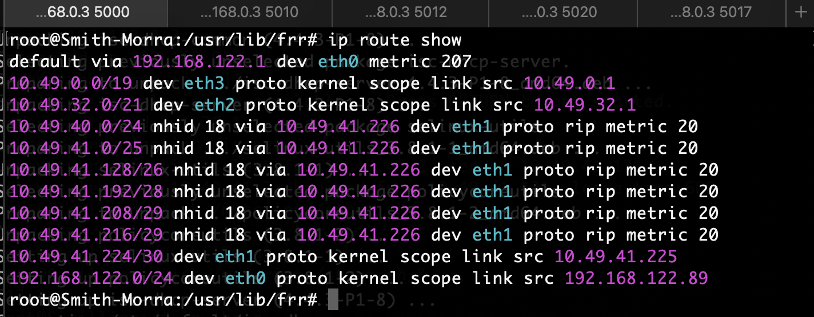

- Explanation

  Pada kasus ini, karena Anatoly menyusahkan, saya membuat sebuah script untuk menghilangkan ip-route, memanggil dependency yang diperlukan untuk menjalankan frr, kemudian melakukan vtysh. Salah satu contohnya pada Smith-Morra:

  ```bash
  #!/bin/sh

  ip route del 10.49.40.0/24
  ip route del 10.49.41.0/25
  ip route del 10.49.41.128/26
  ip route del 10.49.41.192/28
  ip route del 10.49.41.208/29
  ip route del 10.49.41.216/29

  cd /usr/lib/frr
  ./zebra -d
  ./ripd -d
  ./mgmtd -d
  vtysh -c "conf t
  router rip
  network 10.49.41.224/30
  network 10.49.32.0/21
  network 10.49.0.0/19
  default-information originate
  exit
  exit"
  ```

  > Hal yang sama dilakukan untuk router lain, bisa dilihat di bawah ini:
  > [Smith-Morra](config/Router/Smith-Morra/dynamic.sh), [Fianchetto](config/Router/Fianchetto/dynamic.sh), [Lucena](config/Router/Lucena/dynamic.sh), [Zwischenzug](config/Router/Zwischenzug/dynamic.sh), [Zugzwang](config/Router/Zugzwang/dynamic.sh)

  Pada intinya kita menghapus semua ip route yang sudah dibuat sebelumnyya, kemudian menyalakan protokol rip dan menjalankan konfigurasinya. Pada dynamic routing vtysh, kita hanya perlu memasukkan network apa saja yang *directly connected* dengan router tersebut.

<br>

## Soal 13

> Untuk meningkatkan keamanan, konfigurasikan firewall **Smith-Morra** untuk melakukan pembatasan koneksi SSH ke server DNS. Drop semua packet SSH yang berasal dari seluruh client yang memiliki tujuan ke **Caro-Kann** atau **Alekhine.**

> _To increase security, configure the **Smith-Morra** firewall to restrict SSH connections to the **DNS server.** Drop all SSH packets from all clients destined for **Caro-Kann** or **Alekhine.**_

**Answer:**

- Screenshot

  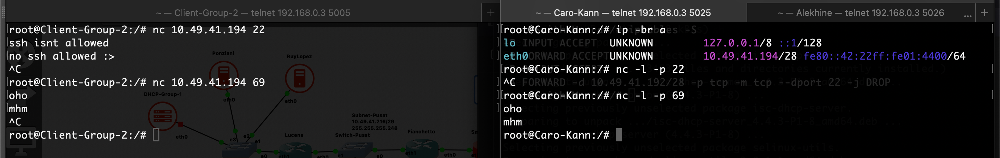

- Explanation

  ```bash
  iptables -A FORWARD -d 10.49.41.192/28 -p tcp --dport 22 -j DROP
  ```

  Pada kasus ini, kita melakukan drop untuk semua permintaan ssh yang diteruskan menuju IP address Carro-Kann  `10.49.41.194` dan Alekhine `10.49.41.195`. Tetapi karena basically salah satu node di situ tidak digunakan, maka untuk mempermudah manajemen iptables, maka kita drop untuk 1 subnet `10.49.41.192/28` tersebut.

<br>

## Soal 14

> Nampaknya, web server juga manusia sehingga hanya ingin bekerja di hari kerja. Maka dari itu, semua client hanya bisa mengakses **Sicilian** dan **Slav** pada hari Senin-Jumat pada pukul 09:00-17:00.

> _Apparently, web servers are humans too, so they only want to work on weekdays. Therefore, all clients can only access **Sicilian** and **Slav** on Monday through Friday, 9:00 AM to 5:00 PM._

**Answer:**

- Screenshot

  > Before perubahan tanggal
  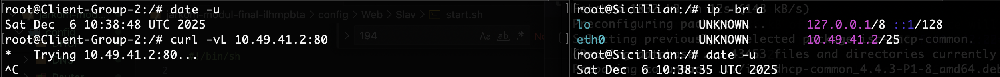

  > Setelah before (``date -s "yesterday"``)
  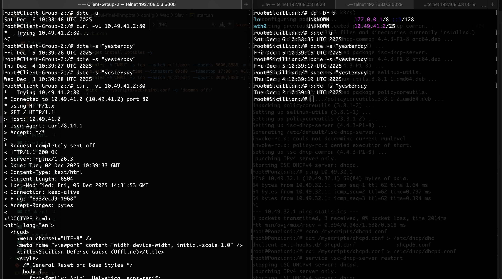

- Explanation

  Pada kasus ini, karena terdapat client yang satu subnet dengan Sicilian dan Slav, maka kita buat aturannya di dalam dirinya sendiri (tidak di Zwischenzug). Maka dari itu, kita install iptables

  ```bash
  apt-get update
  apt-get install iptables -y
  ```

  Kemudian berikan aturan khusus pada Sicilian dan Slav untuk menerima access pada hari senin-jumat pada jam 9-17, selebihnya drop.

  - Sicilian
    ```bash
    iptables -A INPUT -p tcp --dport 80 -m time --weekdays Mon,Tue,Wed,Thu,Fri -m time --timestart 09:00 --timestop 17:00 -j ACCEPT
    iptables -A INPUT -p tcp --dport 80 -j DROP
    ```

  - Slav
  Karena kebetulan slav menggunakan port 8000 dan 8888, maka sedikit berbeda dengan aturan iptables pada Sicilian
    ```bash
    iptables -A INPUT -p tcp --match multiport --dports 8000,8888 -m time --weekdays Mon,Tue,Wed,Thu,Fri -m time --timestart 09:00 --timestop 17:00 -j ACCEPT
    iptables -A INPUT -p tcp --match multiport --dports 8000,8888 -j DROP
    ```

<br>

## Soal 15

> Terakhir, Gerry Paskarov berpesan untuk selalu melakukan logging, sehingga konfigurasikan fitur logging untuk melakukan log terhadap seluruh paket yang di-DROP pada firewall **Smith-Morra.**
> _Finally, Gerry Paskarov advises to always perform logging, so configure a logging feature to log all packets dropped on the **Smith-Morra** firewall._

**Answer:**

- Screenshot

  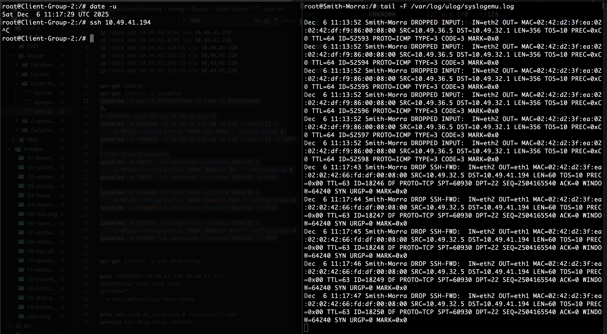

- Explanation

  Pada kasus ini, untuk melakukkan logging untuk semua log yang di drop, kita akan menggunakan sistem log eksternal yakni `ulog`

  ```bash
  apt-get install -y ulogd2
  service ulogd2 start
  ```
  kemudian kita flush `iptables -F` dan tulis ulang semua aturan iptables kita dengan urutan yang tepat agar alur kerjanya sesuai (karena aturannya berjalan sesuai baris dari atas ke bawah)

  ```bash
  # NAT
  iptables -t nat -A POSTROUTING -o eth0 -j MASQUERADE

  # FORWARD: drop SSH to 10.49.41.192/28
  iptables -A FORWARD -d 10.49.41.192/28 -p tcp --dport 22 \
      -j NFLOG --nflog-prefix "DROP SSH-FWD: " --nflog-group 0
  iptables -A FORWARD -d 10.49.41.192/28 -p tcp --dport 22 -j DROP

  # DROP INVALID packets
  iptables -A INPUT   -m conntrack --ctstate INVALID \
      -j NFLOG --nflog-prefix "DROP INVALID IN: " --nflog-group 0
  iptables -A INPUT   -m conntrack --ctstate INVALID -j DROP

  iptables -A FORWARD -m conntrack --ctstate INVALID \
      -j NFLOG --nflog-prefix "DROP INVALID FWD: " --nflog-group 0
  iptables -A FORWARD -m conntrack --ctstate INVALID -j DROP

  iptables -A OUTPUT  -m conntrack --ctstate INVALID \
      -j NFLOG --nflog-prefix "DROP INVALID OUT: " --nflog-group 0
  iptables -A OUTPUT  -m conntrack --ctstate INVALID -j DROP
  ```

  Sehingga secara otomatis ini akan melakukan loggin terhadap paket yang di drop baik itu aturan yang sudah dideklarasikan dan paket lainnya yang kebetulan di drop pada router Smith-Morra.

<br>
  
## Problems

## Revisions (if any)
